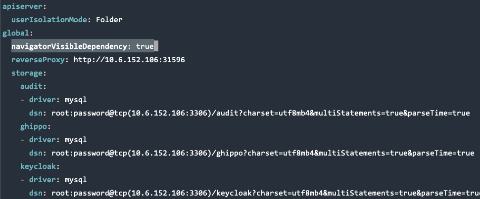
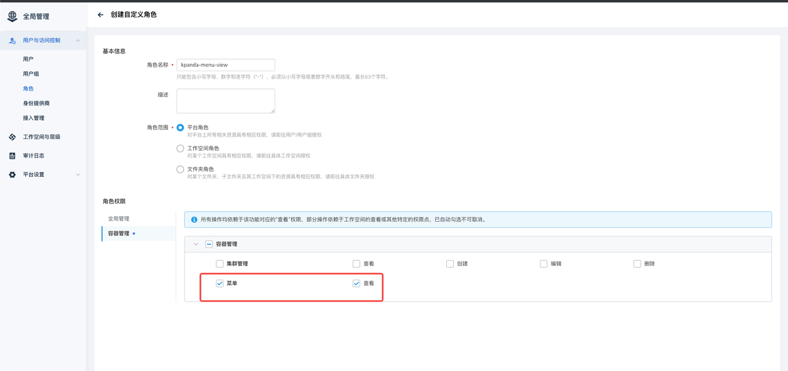
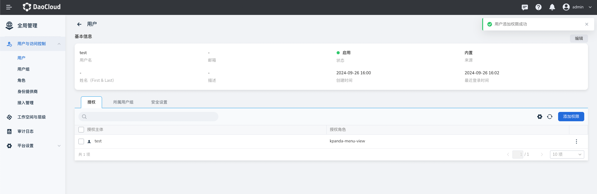
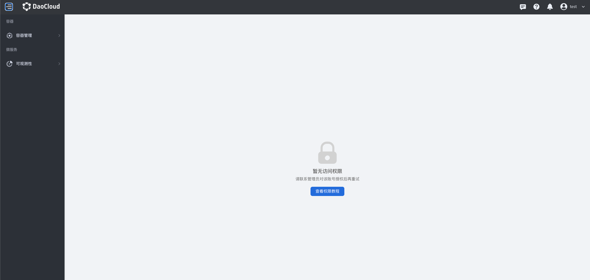

# 导航栏菜单根据权限显示/隐藏

在现有的权限体系下, 全局管理可以根据用户的权限控制导航栏的菜单是否展示，
但是由于容器管理的授权信息未同步到全局管理，导致全局管理无法准确判断容器管理菜单是否需要展示。

本文通过配置实现了：
将容器管理及可观测性的菜单在 **全局管理无法判断的部分, 默认不显示** ，
通过 **白名单** 授权的方式，实现菜单的隐藏与显示（通过容器管理页面授权的集群或命名空间权限，全局管理均无法感知和判断）。

例如：A 用户在容器管理是 cluster A 的 Cluster Admin 角色，
这种情况下全局管理无法判断是否有权限展示容器管理菜单。
通过本文档配置后，用户 A 默认不可见容器管理菜单，需要 **显式地在全局管理授权** 才可以看到容器管理菜单。

## 前提条件

已开启基于权限显示/隐藏菜单的功能，开启方法如下：

* 新安装的环境, 使用 `helm install` 时增加 `--set global.navigatorVisibleDependency=true` 参数
* 已有环境，`helm get values ghippo -n ghippo-system -o yaml` 备份 values, 随后修改 bak.yaml 并添加 `global.navigatorVisibleDependency: true`



再使用以下命令升级全局管理：

```shell
helm upgrade ghippo ghippo-release/ghippo \  
  -n ghippo-system \  
  -f ./bak.yaml \  
  --version ${version}
```

## 配置导航栏

在 kpanda-global-cluster 中 apply 如下 YAML：

```yaml
apiVersion: ghippo.io/v1alpha1  
kind: GProductNavigator  
metadata:  
  name: kpanda-menus-custom  
spec:  
  category: container  
  gproduct: kpanda  
  iconUrl: ./ui/kpanda/kpanda.svg  
  isCustom: true  
  localizedName:  
    en-US: Container Management  
    zh-CN: 容器管理  
  menus:  
    - iconUrl: ''  
      isCustom: true  
      localizedName:  
        en-US: Clusters  
        zh-CN: 集群列表  
      name: Clusters  
      order: 80  
      url: ./kpanda/clusters  
      visible: true  
      visibleDependency:  
        permissions:  
          - kpanda.cluster.*  
          - kpanda.menu.get  
    - iconUrl: ''  
      isCustom: true  
      localizedName:  
        en-US: Namespaces  
        zh-CN: 命名空间  
      name: Namespaces  
      order: 70  
      url: ./kpanda/namespaces  
      visible: true  
      visibleDependency:  
        permissions:  
          - kpanda.cluster.*  
          - kpanda.menu.get  
    - iconUrl: ''  
      isCustom: true  
      localizedName:  
        en-US: Workloads  
        zh-CN: 工作负载  
      name: Workloads  
      order: 60  
      url: ./kpanda/workloads/deployments  
      visible: true  
      visibleDependency:  
        permissions:  
          - kpanda.cluster.*  
          - kpanda.menu.get  
    - iconUrl: ''  
      isCustom: true  
      localizedName:  
        en-US: Permissions  
        zh-CN: 权限管理  
      name: Permissions  
      order: 10  
      url: ./kpanda/rbac/content/cluster  
      visible: true  
      visibleDependency:  
        permissions:  
          - kpanda.cluster.*  
          - kpanda.menu.get  
  name: 容器管理  
  order: 50  
  url: ./kpanda/clusters  
  visible: true  
  
---
apiVersion: ghippo.io/v1alpha1  
kind: GProductNavigator  
metadata:  
  name: insight-menus-custom  
spec:  
  category: microservice  
  gproduct: insight  
  iconUrl: ./ui/insight/logo.svg  
  isCustom: true  
  localizedName:  
    en-US: Insight  
    zh-CN: 可观测性  
  menus:  
    - iconUrl: ''  
      isCustom: true  
      localizedName:  
        en-US: Overview  
        zh-CN: 概览  
      name: Overview  
      order: 9  
      url: ./insight/overview  
      visible: true  
      visibleDependency:  
        permissions:  
          - kpanda.cluster.*  
          - kpanda.menu.get  
    - iconUrl: ''  
      isCustom: true  
      localizedName:  
        en-US: Dashboard  
        zh-CN: 仪表盘  
      name: Dashboard  
      order: 8  
      url: ./insight/dashboard  
      visible: true  
      visibleDependency:  
        permissions:  
          - kpanda.cluster.*  
          - kpanda.menu.get  
    - iconUrl: ''  
      isCustom: true  
      localizedName:  
        en-US: Infrastructure  
        zh-CN: 基础设施  
      name: Infrastructure  
      order: 7  
      url: ./insight/clusters  
      visible: true  
      visibleDependency:  
        permissions:  
          - kpanda.cluster.*  
          - kpanda.menu.get  
    - iconUrl: ''  
      isCustom: true  
      localizedName:  
        en-US: Metrics  
        zh-CN: 指标  
      name: Metrics  
      order: 6  
      url: ./insight/metric/basic  
      visible: true  
      visibleDependency:  
        permissions:  
          - kpanda.cluster.*  
          - kpanda.menu.get  
    - iconUrl: ''  
      isCustom: true  
      localizedName:  
        en-US: Logs  
        zh-CN: 日志  
      name: Logs  
      order: 5  
      url: ./insight/logs  
      visible: true  
      visibleDependency:  
        permissions:  
          - kpanda.cluster.*  
          - kpanda.menu.get  
    - iconUrl: ''  
      isCustom: true  
      localizedName:  
        en-US: Trace Tracking  
        zh-CN: 链路追踪  
      name: Trace Tracking  
      order: 4  
      url: ./insight/topology  
      visible: true  
      visibleDependency:  
        permissions:  
          - kpanda.cluster.*  
          - kpanda.menu.get  
    - iconUrl: ''  
      isCustom: true  
      localizedName:  
        en-US: Alerts  
        zh-CN: 告警  
      name: Alerts  
      order: 3  
      url: ./insight/alerts/active/metrics  
      visible: true  
      visibleDependency:  
        permissions:  
          - kpanda.cluster.*  
          - kpanda.menu.get  
    - iconUrl: ''  
      isCustom: true  
      localizedName:  
        en-US: Collect Management  
        zh-CN: 采集管理  
      name: Collect Management  
      order: 2  
      url: ./insight/agents  
      visible: true  
      visibleDependency:  
        permissions:  
          - kpanda.cluster.*  
          - kpanda.menu.get  
    - iconUrl: ''  
      isCustom: true  
      localizedName:  
        en-US: System Management  
        zh-CN: 系统管理  
      name: System Management  
      order: 1  
      url: ./insight/system-components  
      visible: true  
      visibleDependency:  
        permissions:  
          - kpanda.cluster.*  
          - kpanda.menu.get  
  name: 可观测性  
  order: 30  
  url: ./insight  
  visible: true  
  
---
apiVersion: ghippo.io/v1alpha1  
kind: GProductResourcePermissions  
metadata:  
  name: kpanda  
spec:  
  actions:  
    - localizedName:  
        en-US: Create  
        zh-CN: 创建  
      name: create  
    - localizedName:  
        en-US: Delete  
        zh-CN: 删除  
      name: delete  
    - localizedName:  
        en-US: Update  
        zh-CN: 编辑  
      name: update  
    - localizedName:  
        en-US: Get  
        zh-CN: 查看  
      name: get  
    - localizedName:  
        en-US: Admin  
        zh-CN: 管理  
      name: admin  
  authScopes:  
    - resourcePermissions:  
        - actions:  
            - name: get  
            - dependPermissions:  
                - action: get  
              name: create  
            - dependPermissions:  
                - action: get  
              name: update  
            - dependPermissions:  
                - action: get  
              name: delete  
          resourceType: cluster  
        - actions:  
            - name: get  
          resourceType: menu  
      scope: platform  
    - resourcePermissions:  
        - actions:  
            - name: admin  
              tips:  
                - en-US: >-  
                    If the workspace is bound to a cluster, it will be assigned  
                    the Cluster Admin role upon authorization.  
                  zh-CN: 若工作空间绑定了集群，授权后还将被映射为对应集群的 Cluster Admin 角色  
          resourceType: cluster  
        - actions:  
            - name: get  
              tips:  
                - en-US: >-  
                    If the workspace is bound to a namespace, it will be  
                    assigned the NS View role upon authorization.  
                  zh-CN: 若工作空间绑定了命名空间，授权后还将被映射为对应命名空间的 NS View 角色  
            - name: update  
              tips:  
                - en-US: >-  
                    If the workspace is bound to a namespace, it will be  
                    assigned the NS Edit role upon authorization.  
                  zh-CN: 若工作空间绑定了命名空间，授权后还将被映射为对应命名空间的 NS  Edit 角色  
            - name: admin  
              tips:  
                - en-US: >-  
                    If the workspace is bound to a namespace, it will be  
                    assigned the NS Admin role upon authorization.  
                  zh-CN: 若工作空间绑定了命名空间，授权后还将被映射为对应命名空间的 NS Admin 角色  
          resourceType: namespace  
      scope: workspace  
  gproduct: kpanda  
  resourceTypes:  
    - localizedName:  
        en-US: Cluster Management  
        zh-CN: 集群管理  
      name: cluster  
    - localizedName:  
        en-US: Menu  
        zh-CN: 菜单  
      name: menu  
    - localizedName:  
        en-US: Namespace Management  
        zh-CN: 命名空间  
      name: namespace
```

## 通过自定义角色实现上述效果

!!! note

    仅容器管理模块的菜单需要单独配置菜单权限，其他模块会根据用户的权限自动显示/隐藏

创建一个自定义角色，包含的权限点为容器管理的菜单查看权限，后续授权给需要查看容器管理菜单的用户。





效果如下，可以看到容器管理和可观测性的导航栏菜单：


