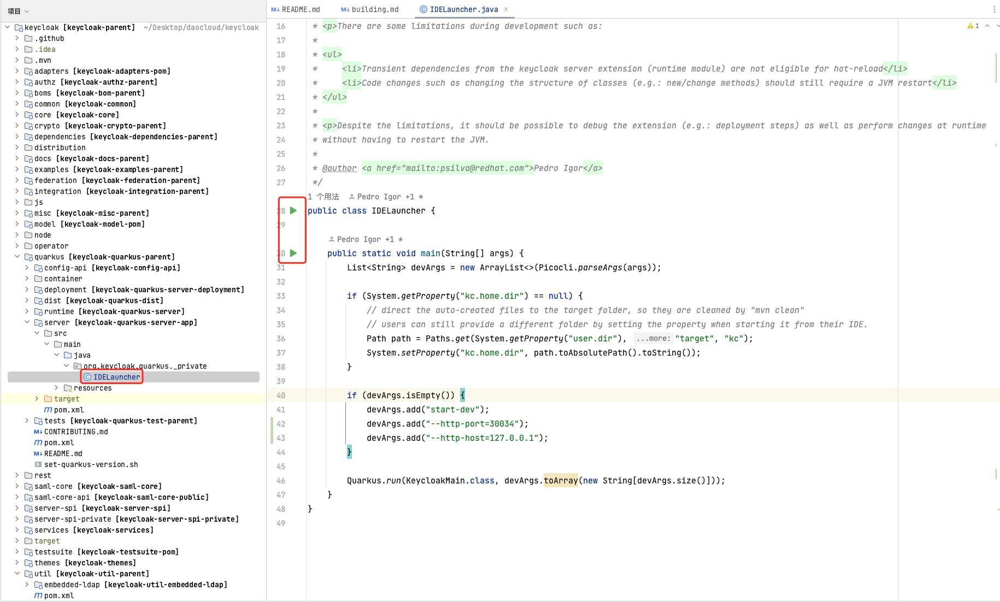
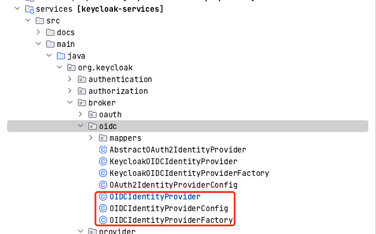

# Keycloak 自定义 IdP

要求：keycloak >= v20

已知问题 keycloak >= v21，删除了旧版 theme 的支持，可能会在 v22 修复。
参见 [Issue #15344 ](https://github.com/keycloak/keycloak/issues/15344)。

此次 demo 使用 Keycloak v20.0.5。

## 基于 source 开发

### 配置环境

参照 [keycloak/building.md](https://github.com/keycloak/keycloak/blob/main/docs/building.md) 配置环境。

参照 [keycloak/README.md](https://github.com/keycloak/keycloak/blob/main/quarkus/README.md) 运行以下命令：

```sh
cd quarkus
mvn -f ../pom.xml clean install -DskipTestsuite -DskipExamples -DskipTests
```

### 从 IDE 运行



### __添加 service 代码__ 

#### 如果可从 keycloak 继承部分功能

在目录 __services/src/main/java/org/keycloak/broker__ 下添加文件：

文件名需要是 __xxxProvider.java__ 和 __xxxProviderFactory.java__ 


**[xxxProviderFactory.java](./examples/xxxProviderFactory.java) 示例：**

留意 __PROVIDER_ID = "oauth";__ 这个变量，后面定义 html 会用到。

**[xxxProvider.java](./examples/xxxProvider.java) 示例**

#### 如果不能从 keycloak 继承功能

参考下图中的三个文件编写你的代码：



**添加 xxxProviderFactory 到 resource service**

在 __services/src/main/resources/META-INF/services/org.keycloak.broker.provider.IdentityProviderFactory__ 
添加 xxxProviderFactory，这样刚刚编写的能工作了：


**添加 html 文件**

复制 __themes/src/main/resources/theme/base/admin/resources/partials/realm-identity-provider-oidc.html__ 
文件到（改名为 __realm-identity-provider-oauth.html__ ，还记得上文中需要留意的变量吗）
 __themes/src/main/resources/theme/base/admin/resources/partials/realm-identity-provider-oauth.html__ 

到此所有的文件都添加完成了，开始调试功能。

## 打包成 jar 作为插件运行

新建一个 java 项目，并将上面的代码复制到项目中，如下所示：


参见 [pom.xml](./examples/pom.xml)。

运行 __mvn clean package__ ，打包完成得到 __xxx-jar-with-dependencies.jar__ 文件。

下载 [keycloak Release 20.0.5](https://github.com/keycloak/keycloak/releases/tag/20.0.5) zip 包并解压。


将 __xxx-jar-with-dependencies.jar__ 复制到 __keycloak-20.0.5/providers__ 目录中。

运行以下命令查看功能是否完整：

```sh
bin/kc.sh start-dev
```
