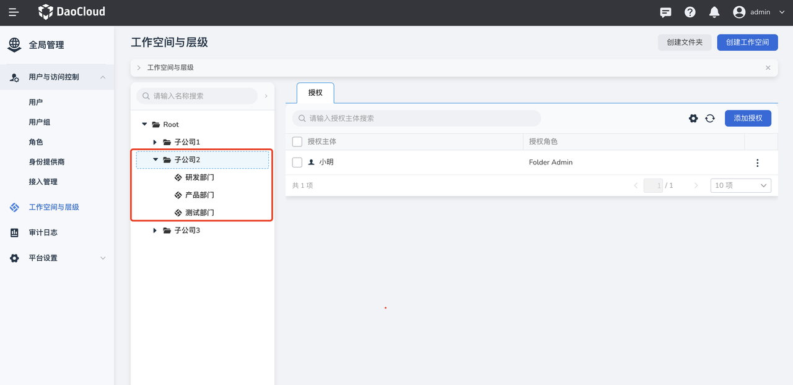
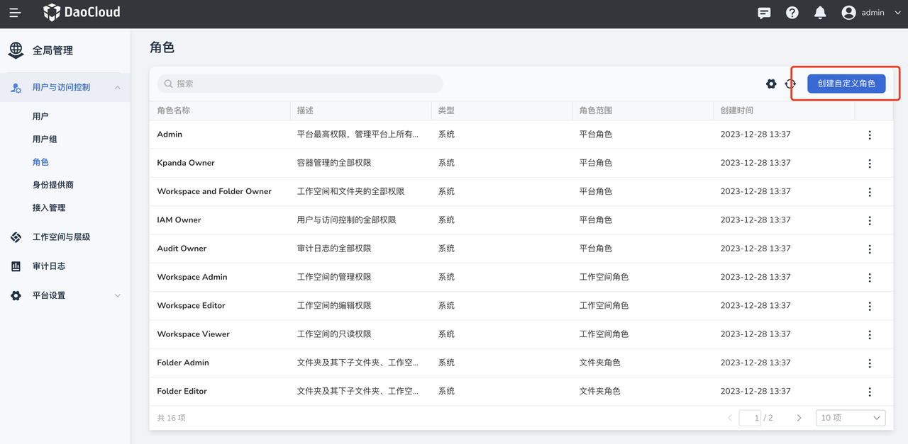
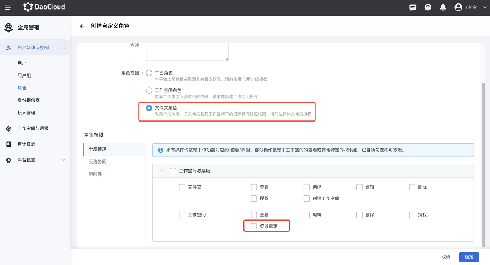
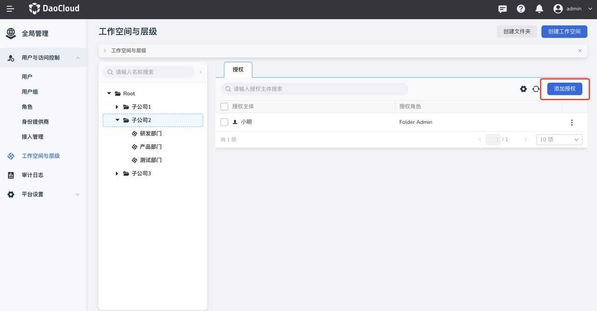
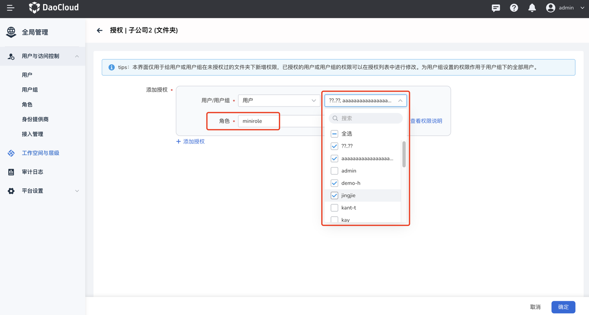
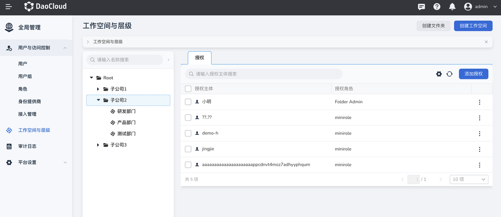

---
hide:
  - toc
---

# 超大型企业的架构管理

伴随业务的持续扩张，公司规模不断壮大，子公司、分公司纷纷设立，有的子公司还进一步设立孙公司，
原先的大部门也逐渐细分成多个小部门，从而使得组织结构的层级日益增多。这种组织结构的变化，也对 IT 治理架构产生了影响。

具体操作步骤如下：

1. 开启 Folder/WS 之间的隔离模式

    请参考[开启 Folder/WS 之间的隔离模式](../install/user-isolation.md)。

2. 按照实际情况规划企业架构

    在多层级组织架构下，建议将二级文件夹作为隔离单元，进行“子公司”之间的用户/用户组/资源之间的隔离。
    隔离后“子公司”之间的用户/用户组/资源互不可见。

    

3. 创建用户/打通用户体系

    由主平台管理员 Admin 在平台统一[创建用户](../user-guide/access-control/user.md)或通过 LDAP/OIDC/OAuth2.0
    等[身份提供商](../user-guide/access-control/ldap.md)能力将用户统一对接到 DCE 5.0。

4. 创建文件夹角色

    在 Folder/WS 的隔离模式下，需要平台管理员 Admin 通过 **授权** 首先将用户邀请到各个子公司，“子公司管理员（Folder Admin）”才能够对这些用户进行管理，
    如二次授权或者编辑权限。建议简化平台管理员 Admin 的管理工作，创建一个无实际权限的角色来辅助平台管理员 Admin 实现通过“授权”将用户邀请到子公司的操作。
    而子公司用户的实际权限下放到各个子公司管理员（Folder Admin）自行管理。

    !!! note

        资源绑定权限点单独使用不生效，因此符合上述通过“授权”将用户邀请到子公司的操作，再由子公司管理员 Folder Admin 自行管理的要求。

    

    

5. 给用户授权

    平台管理员通过“授权”将用户按照实际情况邀请到各个子公司，并任命子公司管理员。

    

    将子公司普通用户授权为 “minirole”，将子公司管理员授权为 Floder Admin。

    

    

6. 子公司管理员自行管理用户/用户组

    子公司管理员 Folder Admin 登录平台后只能看到自己所在的“子公司 2”，
    并能够通过创建文件夹、创建工作空间调整架构，通过添加授权/编辑权限为子公司 2 中的用户赋予其他权限。

    

    在添加授权时，子公司管理员 Folder Admin 只能看到被平台管理员通过“授权”邀请进来的用户，而不能看到平台上的所有用户，
    从而实现 Folder/WS 之间的用户隔离，用户组同理（平台管理员视角能够看到并授权平台上所有的用户和用户组）。

    

!!! note

    超大型企业与大/中/小型企业的主要区别在于 Folder 和工作空间中用户/用户组之间是否可见。
    超大型企业里子公司与子公司之间用户/用户组不可见 + 权限隔离；
    大/中/小型企业部门之间的用户相互可见 + 权限隔离。
