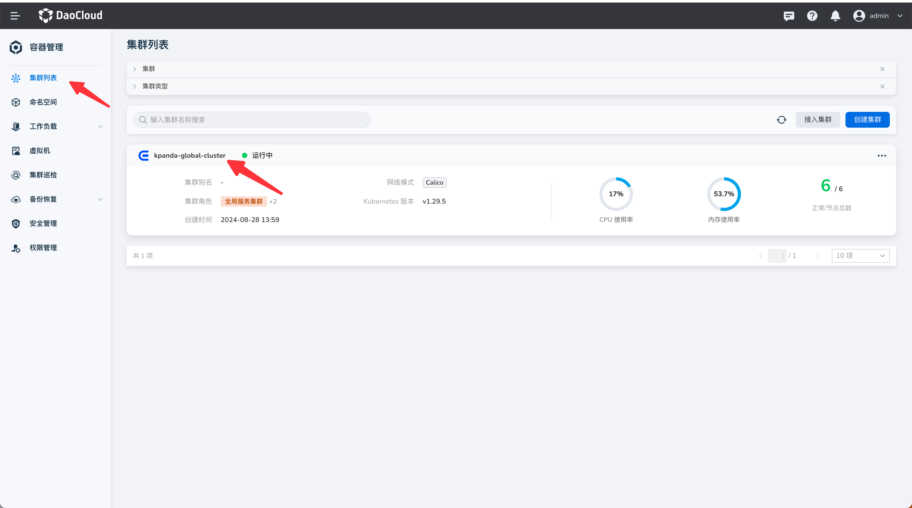
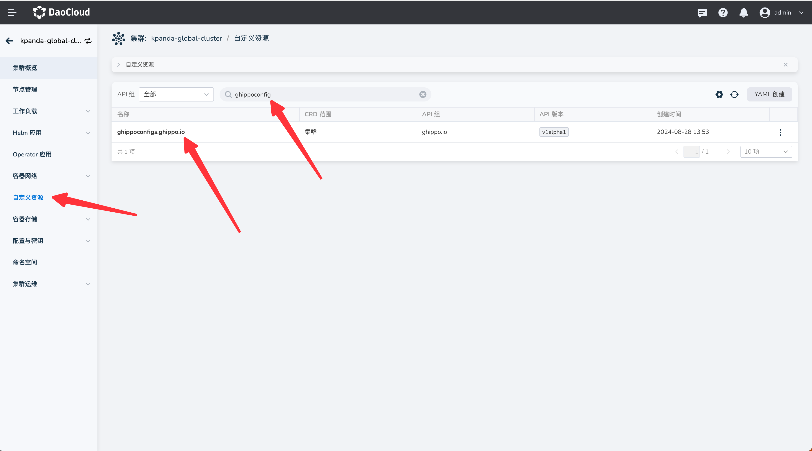
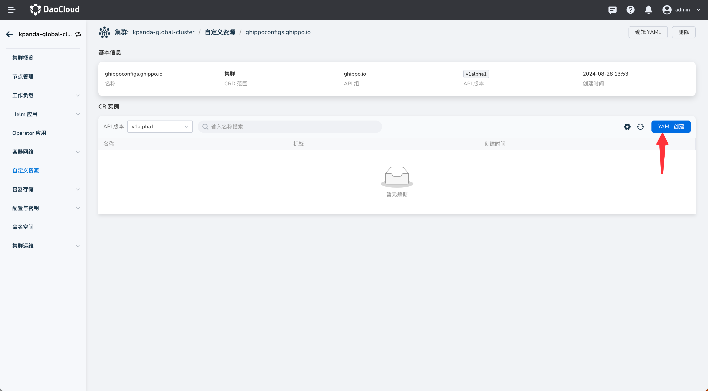

# 系统消息

系统消息是用于通知所有用户，在特定时间显示在 DCE 界面顶部的功能

## 配置系统消息

通过在 global 集群 apply 系统消息的 yaml 即可创建系统消息，消息的显示时间由 yaml 中的时间字段决定。
系统消息仅在 start、end 字段配置的时间范围之内才会显示。

1. 选择 global 集群

   

2. 选择左侧导航栏的自定义资源，搜索 ghippoconfig ，点击搜索出来的 ghippoconfigs.ghippo.io

   

3. 点击 yaml 创建，或修改已存在的 yaml

   

以下是 yaml 的具体例子

```yaml
apiVersion: ghippo.io/v1alpha1
kind: GhippoConfig
metadata:
  name: system-message
spec:
  message: "this is a message"
  start: 2024-01-02T15:04:05+08:00
  end: 2024-07-24T17:26:05+08:00
```

