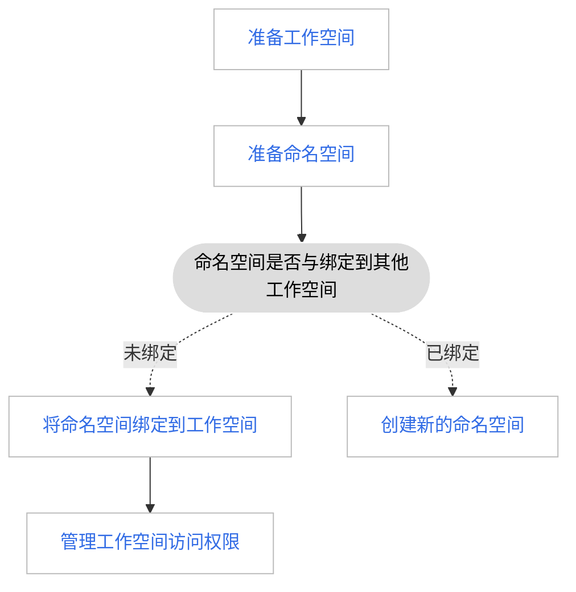

# 工作空间（租户）绑定跨集群的命名空间

工作空间（租户）下绑定来自不同集群的命名空间，能够使工作空间（租户）灵活纳管平台上任意集群下的 Kubernetes Namespace。
同时平台提供了权限映射能力，能够将用户在工作空间的权限映射到绑定的命名空间身上。

当工作空间（租户）下绑定一个或多个跨集群的命名空间时，管理员无需再次给工作空间中的成员授权，
成员们在工作空间上的角色将根据以下映射关系自动映射完成授权，避免了多次授权的重复性操作：

- Workspace Admin 对应 Namespace Admin
- Workspace Editor 对应 Namespace Editor
- Workspace Viewer 对应 Namespace Viewer

以下是一个例子：

| 用户   | 工作空间    | 角色            |
| ------ | ----------- | --------------- |
| 用户 A | Workspace01 | Workspace Admin |

将一个命名空间绑定到工作空间后：

| 用户   | 所属范畴    | 角色            |
| ------ | ----------- | --------------- |
| 用户 A | Workspace01 | Workspace Admin |
|        | Namespace01 | Namespace Admin |

## 实现方案

将来自不同集群的不同命名空间绑定到同一工作空间（租户），给工作空间（租户）下的成员使用流程如图。

!!! tip

    一个命名空间只能被一个工作空间绑定。

## 准备工作空间

工作空间是为了满足多租户的使用场景，基于集群、集群命名空间、网格、网格命名空间、多云、多云命名空间等多种资源形成相互隔离的资源环境。
工作空间可以映射为项目、租户、企业、供应商等多种概念。

1. 使用 admin/folder admin 角色的用户登录 DCE 5.0，点击左侧导航栏底部的 __全局管理__ 。

    

1. 点击左侧导航栏的 __工作空间与层级__ ，点击右上角的 __创建工作空间__ 按钮。

    

1. 填写工作空间名称、所属文件夹等信息后，点击 __确定__ ，完成创建工作空间。

    

提示：若平台中已存在创建好的命名空间，点击某个工作空间，在 __资源组__ 页签下，点击 __绑定资源__ ，可以直接绑定命名空间。

## 准备命名空间

命名空间是更小的资源隔离单元，将其绑定到工作空间后，工作空间的成员就可以进行管理和使用。

参照以下步骤准备一个还未绑定到任何工作空间的命名空间。

1. 点击左侧导航栏底部的 __容器管理__ 。

    

1. 点击目标集群的名称，进入 __集群详情__ 。

    

1. 在左侧导航栏点击 __命名空间__ ，进入命名空间管理页面，点击页面右侧的 __创建__ 按钮。

    

1. 填写命名空间的名称，配置工作空间和标签（可选设置），然后点击 __确定__ 。

    !!! info

        工作空间主要用于划分资源组并为用户（用户组）授予对该资源的不同访问权限。有关工作空间的详细说明，可参考[工作空间与层级](../user-guide/workspace/workspace.md)。

    

1. 点击 __确定__ ，完成命名空间的创建。在命名空间列表右侧，点击 __⋮__ ，可以从弹出菜单中选择 __绑定工作空间__ 。

    

## 将命名空间绑定到工作空间

除了在命名空间列表中绑定外，也可以返回 __全局管理__ ，按照以下步骤绑定工作空间。

1. 依次点击 __全局管理__ -> __工作空间与层级__ -> __资源组__ ，点击某个工作空间名称后，点击 __绑定资源__ 按钮。

    

1. 选中要绑定的工作空间（可多选），点击 __确定__ 完成绑定。

    

## 为工作空间添加成员并授权

1. 在 __工作空间与层级__ -> __授权__ 中，点击某个工作空间名称后，点击 __添加授权__ 按钮。

    

1. 选择要授权的 __用户/用户组__ 、 __角色__ 后，点击 __确定__ 完成授权。

    
