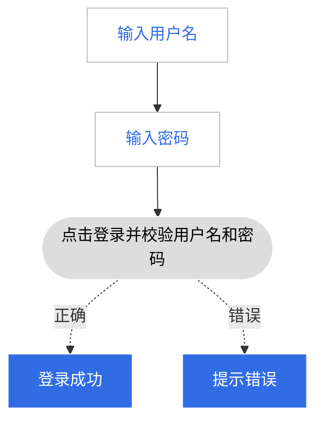

---
hide:
  - toc
---

# 登录

用户在使用一个新系统前，在这个系统中是没有任何数据的，系统也无法识别这个新用户。为了标识用户身份、绑定用户数据，用户需要一个能唯一标识用户身份的帐号。

DCE 5.0 在 __用户与访问控制__ 中通过管理员创建新用户的方式为用户分配一个附有一定权限的账号。该用户产生的所有行为都将关联到自己的帐号。

用户通过账号/密码进行登录，系统验证身份是否合法，如果验证合法，则用户成功登录。

!!! note

    如果用户登录后 24 小时内无任何操作，将自动退出登录状态。如果登录的用户始终活跃，将持续处于登录状态。

用户登录的简单流程如下图。

用户登录界面如下图。具体登录画面，请与实际产品为准。

