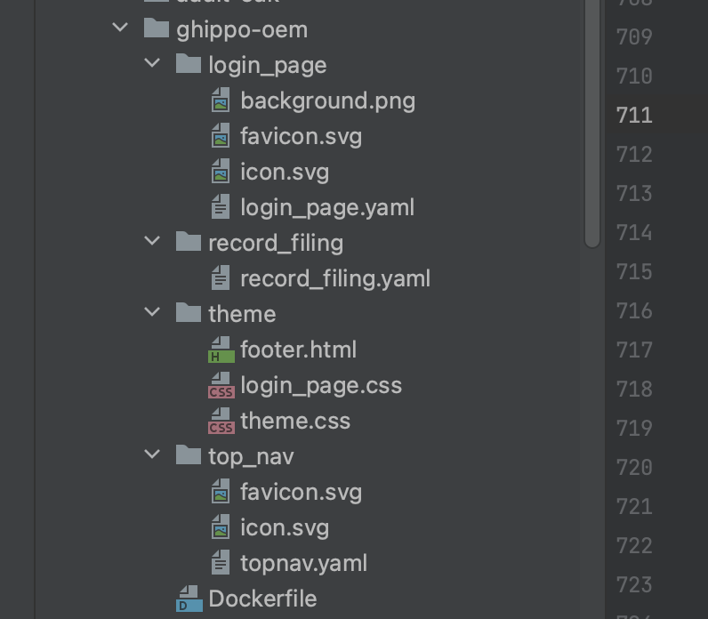
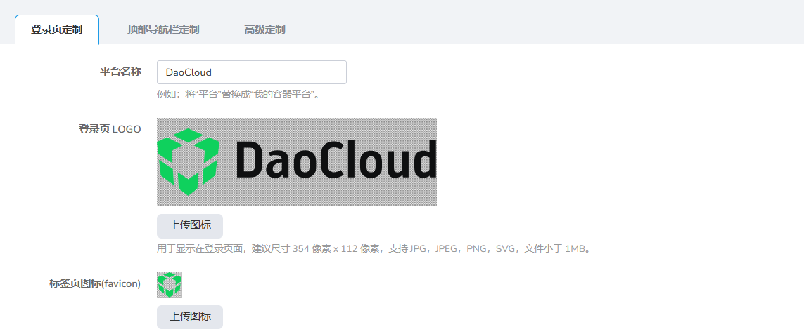
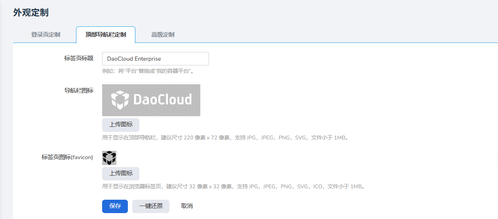

# 未安装时使用 OEM

## 配置图片以及文案

用户需要自行创建目录结构，目录结构如下图：



`login_page` 中的文件对应登录页的 OEM 设置。



若无需要，`record_filing`（版权信息）和 `theme`（自定义样式）中的文件均可为空白文件，但是文件必须创建。

`top_nav` 中的文件对应顶部导航栏设置。



- `login_page/favicon.*`：标签页图标。
- `login_page/icon.*`：登录页图标。
- `top_nav/favicon.*`：标签页图标。
- `top_nav/icon.*`：导航栏图标。

图标不能更换文件名，必须为 `favicon.*`、`icon.*`，文件类型可以为 `svg`、`jpg`、`png` 等。

在 `.yaml` 文件中通过修改对应的值配置相关文案。

`record_filing`：

```yaml
enabled: false
icp:
  copyright: "© 2009-2023 daocloud.com 版权所有"
  names:
    - name: "沪A2-20080101"
      link: false
police:
  - name: "沪B2-20080101-4"
    link: false
```

`topnav.yaml`：

```yaml
TabName: "DaoCloud Enterprise"
```

`login_page.yaml`：

```yaml
PlatformName: "DaoCloud"
Copyright: "Powered By DaoCloud"
TabName: ""
```

`Dockerfile`：

```dockerfile
FROM docker.m.daocloud.io/busybox:1.32
COPY . /daocloud/
```

## 生成镜像并推送

上述操作完成后，执行以下命令生成镜像。将 `xxx` 修改为当前使用的镜像仓库，然后推送到镜像仓库中：

```shell
docker build -t xxx/ghippo/ghippo-oem:v0.0.8 .
docker push xxx/ghippo/ghippo-oem:v0.0.8
```

## 安装 Ghippo 参数

设置 `--set apiserver.oem.enabled=true`，开启 OEM 功能。

通过以下参数配置拉取 OEM 镜像的地址：

- `--set apiserver.oem.image.registry`：配置镜像的 registry。
- `--set apiserver.oem.image.repository`：配置镜像的 repository。
- `--set apiserver.oem.image.tag`：配置镜像的 tag。

以上参数要求与构建的镜像保持一致。后续按照 Ghippo 安装流程即可完成 OEM 配置。
