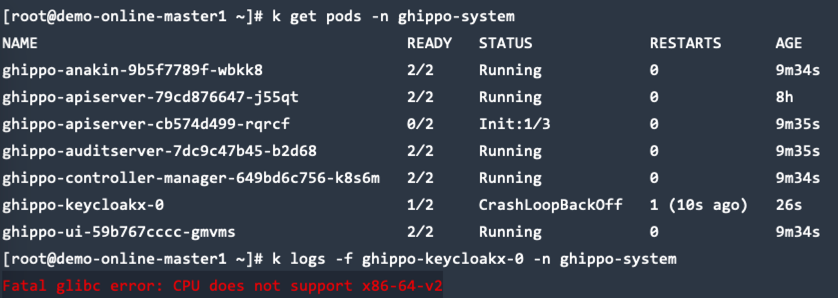

---
hide:
  - toc
---

# 全局管理 FAQ

本页面收录了全局管理（Ghippo）使用过程中常见问题的排查思路与解决方法。

??? "重启集群（虚拟机）后 istio-ingressgateway 无法启动"

    报错提示如下图：

    

    **可能原因：**
    RequestAuthentication CR 的 `jwtsUri` 地址无法访问，
    导致 istiod 无法下发配置给 istio-ingressgateway。（Istio 1.15 可规避此 bug：
    [istio/istio#39341](https://github.com/istio/istio/pull/39341/files)）

    **解决方法：**

    1. 备份 RequestAuthentication ghippo CR。

        ```shell
        kubectl get RequestAuthentication ghippo -n istio-system -o yaml > ghippo-ra.yaml
        ```

    2. 删除 RequestAuthentication ghippo CR。

        ```shell
        kubectl delete RequestAuthentication ghippo -n istio-system
        ```

    3. 重启 Istio。

        ```shell
        kubectl rollout restart deploy/istiod -n istio-system
        kubectl rollout restart deploy/istio-ingressgateway -n istio-system
        ```

    4. 重新 apply RequestAuthentication ghippo CR。

        ```shell
        kubectl apply -f ghippo-ra.yaml
        ```

        !!! warning

            apply RequestAuthentication ghippo CR 之前，请确保 ghippo-apiserver
            和 ghippo-keycloak 已经正常启动。

??? "登录无限循环，报错 401 或 403"

    **可能原因：**
    ghippo-keycloak 连接的 MySQL 数据库出现故障，
    导致 __OIDC Public keys__ 被重置。

    在全局管理 v0.11.1 及以上版本，参照以下步骤，使用 __helm__ 更新全局管理配置文件即可恢复正常。

    ```shell
    # 更新 helm 仓库
    helm repo update ghippo

    # 备份 ghippo 参数
    helm get values ghippo -n ghippo-system -o yaml > ghippo-values-bak.yaml

    # 获取当前部署的 ghippo 版本号
    version=$(helm get notes ghippo -n ghippo-system | grep "Chart Version" | awk -F ': ' '{ print $2 }')

    # 执行更新操作，使配置文件生效
    helm upgrade ghippo ghippo/ghippo \
      -n ghippo-system \
      -f ./ghippo-values-bak.yaml \
      --version ${version}
    ```

??? "Keycloak 无法启动"

    MySQL 已就绪，无报错。安装全局管理后 Keycloak 无法启动（重启超过 10 次）。

    

    **检查项：**

    - 如果数据库是 MySQL，检查 keycloak database 编码是否为 UTF8。
    - 检查从 Keycloak 到数据库的网络，检查数据库资源是否充足，包括但不限于资源限制、存储空间、物理机资源。

    **解决办法：**

    

    1. 检查 MySQL 资源占用是否到达 limit 限制。
    2. 检查 MySQL 中 database keycloak table 的数量是否为 95。
       （Keycloak 不同版本数据库数量可能会不一样，可以与同版本的开发或测试环境的 Keycloak 数据库数量进行比较。）
       如数量少了，则说明数据库表初始化有问题（查询表数量命令：`show tables;`）。
    3. 删除 keycloak database 并重新创建：

        ```sql
        CREATE DATABASE IF NOT EXISTS keycloak CHARACTER SET utf8;
        ```

    4. 重启 Keycloak Pod 即可解决问题。

??? "Keycloak 无法启动且提示 CPU 不支持 x86-64-v2"

    Keycloak 无法正常启动，keycloak pod 运行状态为 `CrashLoopBackOff`，
    并且 keycloak 的 log 出现如下图所示的信息：

    

    **检查项：**

    运行下面的检查脚本，查询当前节点 CPU 的 x86-64 架构的特征级别：

    ```bash
    cat <<"EOF" > detect-cpu.sh
    #!/bin/sh -eu

    flags=$(cat /proc/cpuinfo | grep flags | head -n 1 | cut -d: -f2)

    supports_v2='awk "/cx16/&&/lahf/&&/popcnt/&&/sse4_1/&&/sse4_2/&&/ssse3/ {found=1} END {exit !found}"'
    supports_v3='awk "/avx/&&/avx2/&&/bmi1/&&/bmi2/&&/f16c/&&/fma/&&/abm/&&/movbe/&&/xsave/ {found=1} END {exit !found}"'
    supports_v4='awk "/avx512f/&&/avx512bw/&&/avx512cd/&&/avx512dq/&&/avx512vl/ {found=1} END {exit !found}"'

    echo "$flags" | eval $supports_v2 || exit 2 && echo "CPU supports x86-64-v2"
    echo "$flags" | eval $supports_v3 || exit 3 && echo "CPU supports x86-64-v3"
    echo "$flags" | eval $supports_v4 || exit 4 && echo "CPU supports x86-64-v4"
    EOF

    chmod +x detect-cpu.sh
    sh detect-cpu.sh
    ```

    执行下面命令查看当前 CPU 的特性，如果输出中包含 `sse4_2`，
    则表示你的处理器支持 SSE 4.2。

    ```bash
    lscpu | grep sse4_2
    ```

    **解决方法：**

    需要升级你的虚拟机或物理机 CPU 以支持 x86-64-v2 及以上，
    确保 x86 CPU 指令集支持 SSE 4.2。如何升级请咨询虚拟机平台提供商或物理机提供商。

    详见：[keycloak/keycloak#17290](https://github.com/keycloak/keycloak/issues/17290)

??? "单独升级全局管理时，出现 CRD 未更新的错误"

    若升级失败时包含如下信息，可以参考
    [离线升级](../install/offline-install.md#__tabbed_3_2)中的更新
    ghippo CRD 步骤完成 CRD 安装。

    ```console
    ensure CRDs are installed first
    ```

??? "单独升级全局管理时，出现数据库迁移报错"

    Pod 启动失败，log 中出现如下信息：

    ```console
    init database failed    {"error": "migrate failed: Dirty database version 0. Fix and force version."}
    ```

    **错误原因：**

    因为环境或数据库状态异常或 SQL 语句错误等问题导致 SQL 迁移执行出错，
    但是仅当 Pod 第一次报错的时候输出真正的数据库错误信息，
    后续 Pod 重启后会出现上述错误。

    **解决办法：**

    1. 进入 MySQL，选择启动失败的服务对应的数据库（可能出问题的数据库有 audit、ghippo）。
    2. 修改 `schema_migrations` 表的 `dirty` 字段：

        ```sql
        UPDATE schema_migrations SET dirty = 0;
        ```

    3. 重启失败的服务。

    4. 如重启后 SQL 迁移还是报错，可能是 SQL 语句本身的问题，
       需要报 Bug 并联系开发同学来解决。
