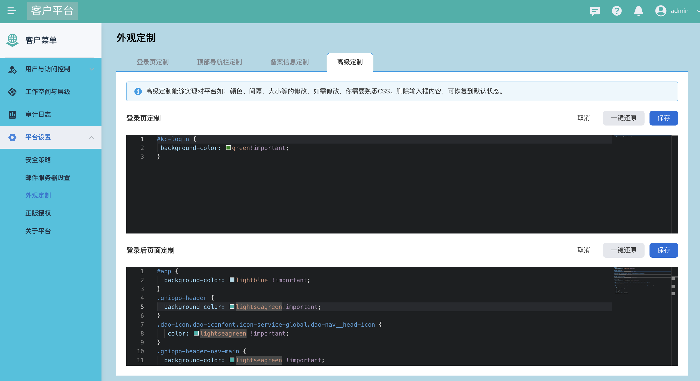

# 用两套 DCE 5.0 模拟 OEM OUT

您可以通过搭建 2 套 DCE 5.0，一套当做客户平台，一套用作 DCE 5.0 来模拟 OEM OUT 场景。
修改登录页背景图、登录后背景颜色可以区分客户平台和 DCE 5.0 平台。

推荐安装 DCE 5.0 社区版即可，建议安装最新版本（请用标准 K8s 进行安装，不可使用 kind 安装）。

以下为使用 2 套 DCE 5.0 的操作建议！

## 用户打通

若使用两套 DCE 5.0 进行操作，建议在客户平台使用`全局管理` -> `用户与访问控制` -> `接入管理`；
将获取到的客户端信息填写到`身份提供商` -> `OIDC`。

注意：仅全局管理 v0.17 及以上版本支持`接入管理`，其他版本需要进入 keycloak 创建 client。

## 对接导航栏

建议下载并使用这个仓库中的内容

```git
git clone https://gitlab.daocloud.cn/henry.liu/gproduct-demo
```

1. 修改如下内容

    

    

2. 按照 readme 进行操作

    如希望接入后默认打开 insight 页面，可将上述链接填写为 DCE 5.0 insight 页面地址。
    并修改 [demo.yaml](./examples/demo.yaml) 文件中相应的接入名称。

这里是对客户平台的操作，因为将 DCE 5.0 用作客户平台，因此不适用于实战。实战中需要大家明白其中的原理，随机应变。

## 样式统一

为区分客户平台，可通过写 css 方式对样式进行调整

示例：

```css
#app {
background-color: lightblue !important;
}
.ghippo-header {
background-color: lightseagreen!important;
}
.dao-icon.dao-iconfont.icon-service-global.dao-nav__head-icon {
color: lightseagreen !important;
}
.ghippo-header-nav-main {
background-color: lightseagreen !important;
}
.dao-nav {
background-color: rgb(20, 194, 224) !important;
}
#app > div.w-full.h-full.flex > nav > li > div > div > div > div > span {
position: relative;
}
#app > div.w-full.h-full.flex > nav > li > div > div > div > div > span::after {
position: absolute;
display: block;
content: '客户菜单';
top: 0;
bottom: 0;
left: 0;
right: 0;
background-color: #f6f8fb;
}
```

调整后样式：


