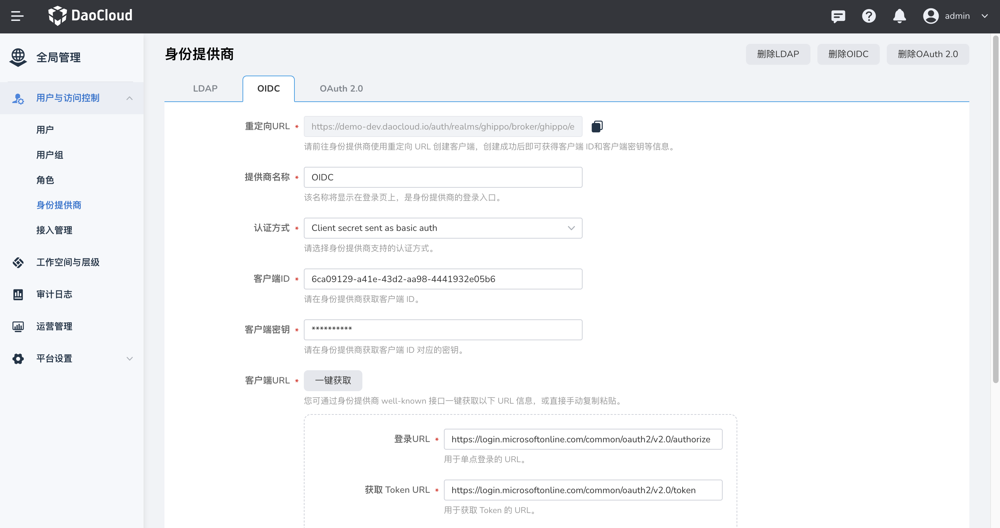

# 如何将DCE5.0集成到客户平台（OEM OUT）

OEM OUT 是指将 DCE5.0 作为子模块接入其他产品，出现在其他产品的菜单中。用户登录其他产品后可直接跳转至 DCE5.0 无需二次登录。实现 OEM OUT 共分为 5 步，分别是：
* 统一域名
* 打通用户体系
* 对接导航栏
* 定制外观
* 打通权限体系(可选)

具体操作演示请参见 [OEM OUT 最佳实践视频教程](../../videos/use-cases.md#dce-50_2)。

## 统一域名

第一步：部署 DCE5.0（假设部署完的访问地址为 `https://10.6.8.2:30343/`）
第二步：客户系统 和 DCE 5 前可以放一个 Nginx 反代来实现同域访问，/路由到客户系统，/dce5（subpath） 路由到 DCE5.0 系统，vi /etc/nginx/conf.d/default.conf示例如下：

```
server {
    listen       80;
    server_name  localhost;
 
    location /dce5/ {
      proxy_pass https://10.6.8.2:30343/;
      proxy_http_version 1.1;
      proxy_read_timeout 300s; # 如需要使用 kpanda cloudtty功能需要这行，否则可以去掉
      proxy_send_timeout 300s; # 如需要使用 kpanda cloudtty功能需要这行，否则可以去掉
 
      proxy_set_header Host $host;
      proxy_set_header X-Real-IP $remote_addr;
      proxy_set_header X-Forwarded-For $proxy_add_x_forwarded_for;
 
      proxy_set_header Upgrade $http_upgrade; # 如需要使用 kpanda cloudtty功能需要这行，否则可以去掉
      proxy_set_header Connection $connection_upgrade; # 如需要使用 kpanda cloudtty功能需要这行，否则可以去掉
    }
     
    location / {
        proxy_pass https://10.6.165.50:30443/; # 假设这是客户系统地址(如意云)
        proxy_http_version 1.1;
 
        proxy_set_header Host $host;
        proxy_set_header X-Real-IP $remote_addr;
        proxy_set_header X-Forwarded-For $proxy_add_x_forwarded_for;
    } }
```
第三步：假设 Nginx 入口地址为 10.6.165.50，按[自定义 DCE 5.0 反向代理服务器地址](../install/reverse-proxy.md)把 
 DCE_PROXY 反代设为 `http://10.6.165.50/dce5`。确保能够通过 `http://10.6.165.50/dce5` 访问 DCE 5.0。客户平台也需要进行反代设置，需要根据不同平台的情况进行处理。


## 打通用户体系

将客户平台与 DCE5.0 平台通过 OIDC/OAUTH 等协议对接，使用户登录客户平台后进入 DCE5.0 时无需再次登录。在拿到客户平台的OIDC信息后填入`全局管理`-`用户与访问控制`-`身份提供商`中



对接完成后，DCE5.0 登录页面将出现 OIDC（自定义） 选项，首次从客户平台进入DCE5.0时选择通过 OIDC 登录，后续将直接进入 DCE5.0 无需再次选择。


## 第三步对接导航栏
对接导航栏是指DCE5.0出现在客户平台的菜单中，用户单击相应的菜单名称能够直接进入 DCE5.0。因此对接导航栏依赖于客户平台，不同平台需要按照具体情况进行处理。

## 定制外观

通过`全局管理` -> `平台设置` -> `外观定制`可以自定义平台背景颜色、logo、名称等，具体操作请参照[外观定制](../user-guide/platform-setting/appearance.md)

## 打通权限体系（可选）
打通权限较为复杂，如有需求请联系全局管理团队。
