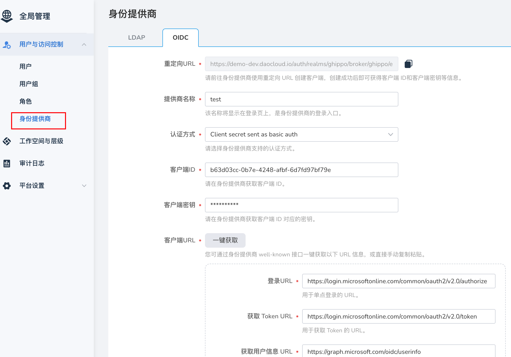

# OEM OUT

OEM OUT 是指 DCE 5.0 作为子模块接入其他产品，出现在其他产品的菜单中。
用户登录其他产品后可直接跳转至 DCE 5.0 无需二次登录。

身份提供商（IdP，Identity Provider）：当 DCE 5.0 需要使用客户系统作为用户源，
使用客户系统登录界面来进行登录认证时，该客户系统被称为 DCE 5.0 的身份提供商。

## 如何实现 OEM OUT

### 打通用户体系

将客户系统作为用户源，实现统一登录认证，这一步是必需的。

1. 在客户系统里建 client（可参考 [Ghippo 配置 oidc](../user-guide/access-control/oidc.md)），得到一些对接参数。
   如果客户系统里需要填 callback url，可填 DCE 5.0 的入口访问地址域名或 IP

1. DCE 5.0 通过 OIDC/OAUTH 等协议在身份提供商界面配置参数（从上一步得到），对接客户的用户系统

   

!!! tip

    如客户支持的对接协议需要 DCE 5.0 作些定制化，可参考[如何定制 DCE 5.0 来对接外部身份提供商 (IdP)](custom-idp.md)

## 把 DCE 5.0 页面嵌入客户系统界面

把 DCE 5.0 的某些功能菜单项插入客户系统的导航栏里，统一将客户系统作为门户（可选）。

### 方法

前提条件：客户系统（例如如意云）支持 iframe 嵌入子模块页面

1. 部署 DCE5（假设部署完的访问地址为 https://10.6.8.2:30343/）

1. 客户系统 和 DCE 5 前可以放一个 Nginx 反代来实现同域访问，`/` 路由到客户系统，`/dce5` 路由到 DCE 5.0 系统。
   参见 [/etc/nginx/conf.d/default.conf 示例](./examples/default2.conf)。

1. 假设 nginx 入口地址为 10.6.165.50，参照[设置 DCE 5.0 反向代理步骤](../install/reverse-proxy.md)把
   DCE_PROXY 设置为 http://10.6.165.50/dce5/。

1. 访问 http://10.6.165.50/dce5/。在 DCE 5.0 中，通过`平台设置` –> `外观定制` -> `高级定制`来更改 DCE 5.0
   的页面样式，尽量使其和客户系统样式一致。

1. 把 DCE 5.0 的访问地址 (http://10.6.165.50/dce5/) 编码到客户系统的 iframe src 里，可在 iframe 中通过编写
   css 修改被嵌入的页面样式。参阅 [App.vue 代码示例](./examples/App.vue)。

## 权限打通(可选)

定制化团队可实现一定制模块，DCE 5.0 可提供 Webhook 注册功能，将每一次的用户登录事件通过 Webhook 的方式通知到定制模块，
定制模块可自行调用如意云和 DCE 5.0 的 [OpenAPI](https://docs.daocloud.io/openapi/)与该用户的权限信息同步。

## 参考文档

- [参考 OEM IN 文档](oem-in.md)
- 参阅 [GProduct-demo 对接 tar 包](./examples/gproduct-demo-main.tar.gz)
