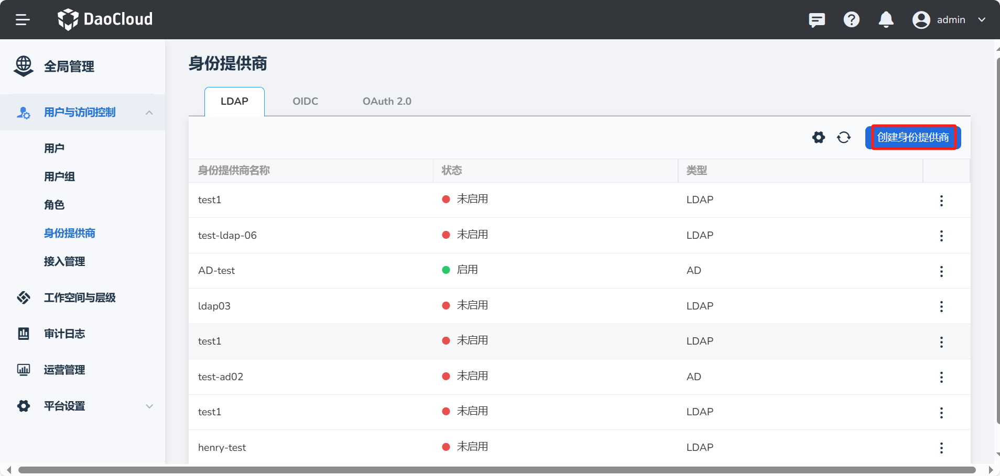

---
hide:
  - toc
---

# LDAP

LDAP 英文全称为 Lightweight Directory Access Protocol，即轻型目录访问协议，这是一个开放的、中立的工业标准应用协议，
通过 IP 协议提供访问控制和维护分布式信息的目录信息。

如果您的企业或组织已有自己的账号体系，同时您的企业用户管理系统支持 LDAP 协议，就可以使用全局管理提供的基于
LDAP 协议的身份提供商功能，而不必在 DCE 5.0 中为每一位组织成员创建用户名/密码。
您可以向这些外部用户身份授予使用 DCE 5.0 资源的权限。

在全局管理中，其操作步骤如下：

1. 使用具有 __admin__ 角色的用户登录 DCE 5.0。点击左侧导航栏左下角的 __全局管理__ -> __用户与访问控制__ 。

    

2. 在左侧导航栏点击 __身份提供商__ ，点击 __创建身份提供商__ 按钮。

    

3. 在 __LDAP__ 页签中，填写以下字段后点击 __保存__ ，建立与身份提供商的信任关系及用户的映射关系。

    

    | 字段 | 描述 | 
    | --- | ---- |
    | 类型（Vendor）                      | 支持 LDAP (Lightweight Directory Access Protocol) 和 AD (Active Directory) | 
    | 身份提供商名称（UI display name）   | 用于区分不同的身份提供商   | 
    | 服务器（Connection URL）            | LDAP 服务的地址和端口号，如 ldap://10.6.165.2:30061      |
    | 用户名称（Bind DN）  |   LDAP 管理员的 DN，Keycloak 将使用该 DN 来访问 LDAP 服务器   | cn=admin,dn=daocloud,dc=com     |
    | 密码（Bind credentials）            |   LDAP 管理员的密码。该字段可以从 vault 中获取其值，使用 ${vault.ID} 格式。         | 
    | 用户 DN（Users DN）                 | 您的用户所在的 LDAP 树的完整 DN。此 DN 是 LDAP 用户的父级。例如，假设您的典型用户的 DN 类似于“uid='john',ou=users,dc=example,dc=com”，则可以是“ou=users,dc=example,dc=com”。 | dc=daocloud,dc=io     |
    | 用户对象类（User object classes）   | LDAP 中用户的 LDAP objectClass 属性的所有值，以逗号分隔。例如：“inetOrgPerson，organizationalPerson”。新创建的 Keycloak 用户将与所有这些对象类一起写入 L​​DAP，并且只要现有 LDAP 用户记录包含所有这些对象类，就会找到它们。  | 
    | 是否启用TLS（Enable StartTLS）      | 启用后将加密 DCE 5.0 与 LDAP 的连接      |
    | 预设权限（Default permission）      | 同步后的用户/用户组默认没有任何权限            | 
    | 全名映射（First/Last name mapping） | 对应 First name 和 Last Name          | 
    | 用户名映射（User name mapping）     | 用户唯一的用户名         | 
    | 邮箱映射（Mailbox mapping） |     用户的邮箱               |      
    
    **高级配置**

    | 字段 | 描述 |
    | --- | --- |
    | 是否启用（Enable or not）    | 默认启用，关闭后该 LDAP 配置不生效     |
    | 自动同步用户（Periodic full sync）     | 默认不启用，启用后可配置同步周期，如每小时同步一次   |
    | 数据同步模式（Edit mode）     | 只读模式不会修改 LDAP 的源数据；写入模式在平台编辑用户信息后，数据将同步回LDAP     |
    | 读取超时（Read timeout）    |当LDAP数据量较大时，调整该数值可以有效避免接口超时     |
    | 用户对象过滤器（User LDAP filter）    | 用于过滤搜索用户的附加 LDAP 过滤器。如果您不需要额外的过滤器，请将其留空。确保它以“(”开头，并以“)”结尾。     |
    |用户名属性（Username LDAP attribute）     | LDAP 属性的名称，映射为 Keycloak 用户名。对于许多 LDAP 服务器供应商来说，它可以是“uid”。对于 Active Directory，它可以是“sAMAccountName”或“cn”。应为您想要从 LDAP 导入到 Keycloak 的所有 LDAP 用户记录填写该属性。    |
    | RDN属性（RDN LDAP attribute）    | LDAP 属性名称，作为典型用户DN的RDN（顶级属性）。通常它与用户名 LDAP 属性相同，但这不是必需的。例如，对于 Active Directory，当用户名属性可能是“sAMAccountName”时，通常使用“cn”作为 RDN 属性。     |
    | UUID属性（UUID LDAP attribute）   | LDAP 属性的名称，用作 LDAP 中对象的唯一对象标识符 (UUID)。对于许多 LDAP 服务器供应商来说，它是“entryUUID”；然而有些是不同的。例如，对于 Active Directory，它应该是“objectGUID”。如果您的 LDAP 服务器不支持 UUID 概念，您可以使用在树中的 LDAP 用户之间应该唯一的任何其他属性。例如“uid”或“entryDN”。   |

4. 在 __同步用户组__ 页签中，填写以下字段配置用户组的映射关系后，再次点击 __保存__ 。

    

    | 字段             | 描述                                                         | 举例值                      |
    | ---------------- | ------------------------------------------------------------ | --------------------------- |
    | 基准 DN          | 用户组在 LDAP 树状结构中的位置                               | ou=groups,dc=example,dc=org |
    | 用户组对象过滤器 | 用户组的对象类，如果需要更多类，则用逗号分隔。在典型的 LDAP 部署中，通常是 “groupOfNames”，系统已自动填入，如需更改请直接编辑。* 表示所有。 | *                           |
    | 用户组名         | cn                                                           | 不可更改                    |

!!! note

    1. 当您通过 LDAP 协议将企业用户管理系统与 DCE 5.0 建立信任关系后，可通过手动同步或自动同步的方式，将企业用户管理系统中的用户或用户组一次性同步至 DCE 5.0。
    1. 同步后管理员可对用户组/用户组进行批量授权，同时用户可通过在企业用户管理系统中的账号/密码登录 DCE 5.0。
    1. 有关实际操作教程，请参阅 [LDAP 操作演示视频](../../../videos/ghippo.md#ldap)。
