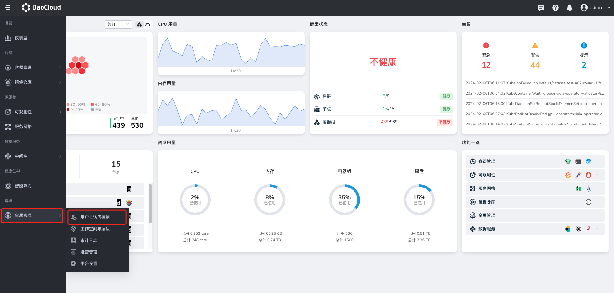
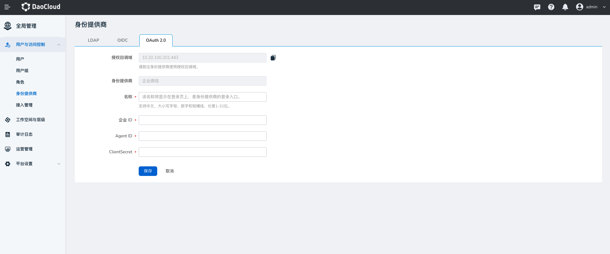
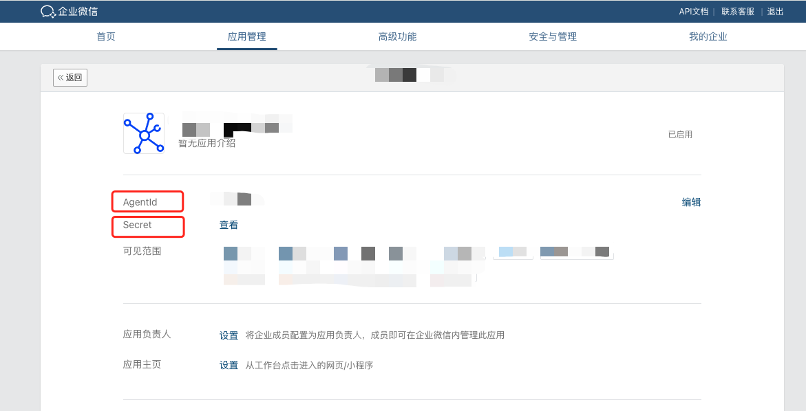

# OAuth 2.0 - 企业微信

如果您的企业或组织中的成员均管理在企业微信中，您可以使用全局管理提供的基于 OAuth 2.0 协议的身份提供商功能，
而不必在 DCE 5.0 中为每一位组织成员创建用户名/密码。 您可以向这些外部用户身份授予使用 DCE 5.0 资源的权限。

## 操作步骤

1. 使用具有 **admin** 角色的用户登录 DCE 5.0。点击左侧导航栏底部的 **全局管理** -> **用户与访问控制** 。

    

2. 在左侧导航栏选择 **身份提供商** ，点击 **OAuth2.0** 页签。填写表单字段，建立与企业微信的信任关系后，点击 **保存** 。

    

## 企业微信中对应的字段

!!! note

    对接前需要在企业微信管理后台中创建自建应用，参阅[如何创建自建应用链接](https://open.work.weixin.qq.com/help2/pc/16892?person_id=1&searchData=)。

    | 字段        | 描述        |
    | ----------- | ---------------|
    | 企业 ID      | 企业微信的 ID  |
    | Agent ID    | 自建应用的 ID     |
    | ClientSecret | 自建应用的 Secret |

企业微信 ID：

Agent ID 和 ClientSecret：

