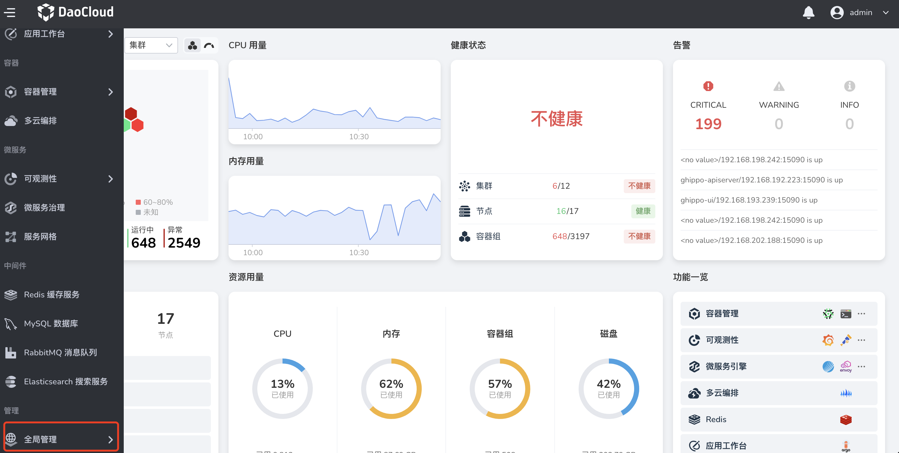

# OIDC

OIDC（OpenID Connect）是建立在 OAuth 2.0 基础上的一个身份层，是基于 OAuth2 协议的身份认证标准协议。

如果您的企业或组织已有自己的账号体系，同时您的企业用户管理系统支持 OIDC 协议，可以使用全局管理提供的基于 OIDC 协议的身份提供商功能，而不必在 DCE 5.0 中为每一位组织成员创建用户名/密码。
您可以向这些外部用户身份授予使用 DCE 5.0 资源的权限。

具体操作步骤如下。

1. 使用具有 `admin` 角色的用户登录 DCE 5.0。点击左侧导航栏底部的`全局管理` -> `用户与访问控制`。

    

2. 在左侧导航栏选择`身份提供商`，点击 `OIDC` 页签。填写表单字段，建立与身份提供商的信任关系后，点击`保存`。

    

    | 字段       | 描述                                                         |
    | ---------- | ------------------------------------------------------------ |
    | 重定向 URL | 重定向到 DCE 5.0 的 URL                                      |
    | 提供商名称 | 显示在登录页上，是身份提供商的入口                           |
    | 认证方式   | 客户端身份验证方法。如果 JWT 使用私钥签名，请下拉选择 `JWT signed with private key`。具体参阅 [Client Authentication](https://openid.net/specs/openid-connect-core-1_0.html#ClientAuthentication)。 |
    | 客户端 ID  | 客户端的 ID                                                  |
    | 客户端密钥 | 客户端密码                                                   |
    | 客户端 URL | 可通过身份提供商 well-known 接口一键获取登录 URL、Token URL、用户信息 URL 和登出 URL |
    | 自动关联   | 开启后当身份提供商用户名/邮箱与 DCE 5.0 用户名/邮箱重复时将自动使二者关联 |

!!! note

    1. 当用户通过企业用户管理系统完成第一次登录 DCE 5.0 后，用户信息才会被同步至 DCE 5.0 的`用户与访问控制` -> `用户列表`。
    1. 初次登录的用户不会被赋予任何默认权限，需要有管理员给其赋权（管理员可以是平台管理员、子模块管理员或资源管理员）。
    1. 有关实际操作教程，请参阅 [OIDC 操作演示视频](../../../videos/ghippo.md#oidc)，也可参考 [Azure OpenID Connect (OIDC) 接入流程](https://learn.microsoft.com/zh-cn/azure/active-directory/develop/v2-protocols-oidc)。

## 用户身份认证交互流程

用户身份认证的交互流程为：

1. 使用浏览器发起单点登录 DCE 5.0 的请求。
1. DCE 5.0 根据登录链接中携带的信息，查找`全局管理` -> `用户与访问控制` -> `身份提供商`中对应的配置信息，构建 OIDC 授权 Request，发送给浏览器。
1. 浏览器收到请求后，转发 OIDC 授权 Request 给企业 IdP。
1. 在企业 IdP 的登录页面中输入用户名和密码，企业 IdP 对提供的身份信息进行验证，并构建携带用户信息的 ID Token，向浏览器发送 OIDC 授权 Response。
1. 浏览器响应后转发 OIDC 授权 Response 给 DCE 5.0。
1. DCE 5.0 从 OIDC 授权 Response 中取出 ID Token，并根据已配置的身份转换规则映射到具体的用户列表，颁发 Token。
1. 完成单点登录，访问 DCE 5.0。
