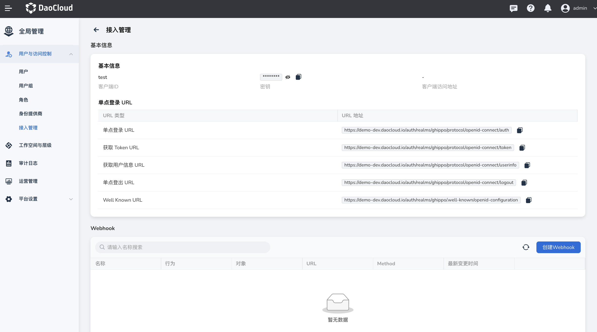
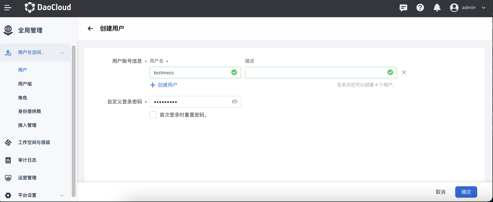
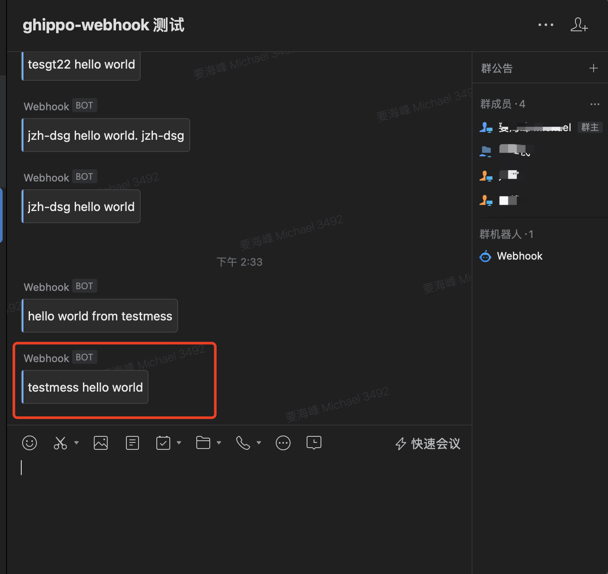

# Webhook 消息通知

DCE 5.0 在接入客户的系统后，可以创建 Webhook，在用户创建/更新/删除/登录/登出之时发送消息通知。

Webhook 是一种用于实现实时事件通知的机制。它允许一个应用程序将数据或事件推送到另一个应用程序，
而无需轮询或持续查询。通过配置 Webhook，您可以指定在某个事件发生时，由目标应用程序接收并处理通知。

Webhook 的工作原理如下：

1. 源应用程序（DCE 5.0）执行某个特定操作或事件。
2. 源应用程序将相关数据和信息打包成 HTTP 请求，并将其发送到目标应用程序指定的 URL（例如企业微信群机器人）。
3. 目标应用程序接收到请求后，根据其中的数据和信息进行相应的处理。

通过使用 Webhook，您可以实现以下功能：

- 实时通知：当某个特定事件发生时，通过 Webhook 及时通知其他应用程序。
- 自动化处理：目标应用程序可以根据收到的 Webhook 请求自动触发事先定义好的操作，无需手动干预。
- 数据同步：通过 Webhook 将数据从一个应用程序传递到另一个应用程序，实现数据的同步更新。

常见的应用场景包括：

- 版本控制系统（例如 GitHub、GitLab）中，当代码仓库发生变动时，自动触发构建和部署操作。
- 电子商务平台中，当订单状态发生变化时，向物流系统发送更新通知。
- 聊天机器人平台中，当接收到用户消息时，通过 Webhook 将消息推送到目标服务器进行处理。

## 配置步骤

DCE 5.0 图形化配置 Webhook 的操作步骤如下：

1. 在`全局管理` -> `用户与访问控制` -> `接入管理`，创建一个客户端 ID。

    

1. 点击某个客户端 ID，进入详情页，点击`创建 Webhook` 按钮。

    

1. 在弹窗中填入字段信息后点击`确定`。

    - 对象：目前仅支持`用户`对象
    - 行为：用户创建/更新/删除/登录/登录时发送 Webhook 消息
    - URL：接收消息的地址
    - Method：视情况选择适用的方法，例如企业微信推荐使用 POST 方法
    - 高级配置：可以用 Json 编写消息体。如果是企业微信群，请参阅[群机器人配置说明](https://developer.work.weixin.qq.com/document/path/91770)

    

1. 屏幕提示 Webhook 创建成功。

    

1. 现在去试着创建一个用户。

    

1. 用户创建成功，可以看到企业微信群收到了一条消息。

    

## 高级配置示例

**系统默认的消息体**

DCE 5.0 预先定义了一些变量，您可以根据自己情况在消息体中使用这些变量。

```json
{
  "id": "{{$$.ID$$}}",
  "email": "{{$$.Email$$}}",
  "username": "{{$$.Name$$}}",
  "last_name": "{{$$.LastName$$}}",
  "first_name": "{{$$.FirstName$$}}",
  "created_at": "{{$$.CreatedAt$$}}",
  "enabled": "{{$$.Enabled$$}}"
}
```

**企业微信群机器人的 Message Body**

```json
{
    "msgtype": "text",
    "text": {
      "content": "{{$$.Name$$}} hello world"
    }
}
```

## 参考文档

- [OEM OUT 文档](../../best-practice/oem/oem-out.md)
- [OEM IN 文档](../../best-practice/oem/oem-in.md)
