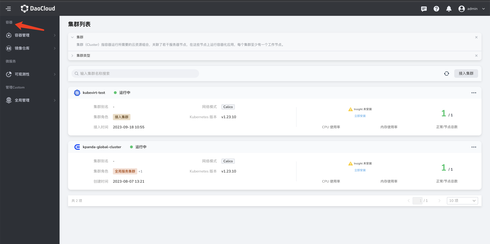
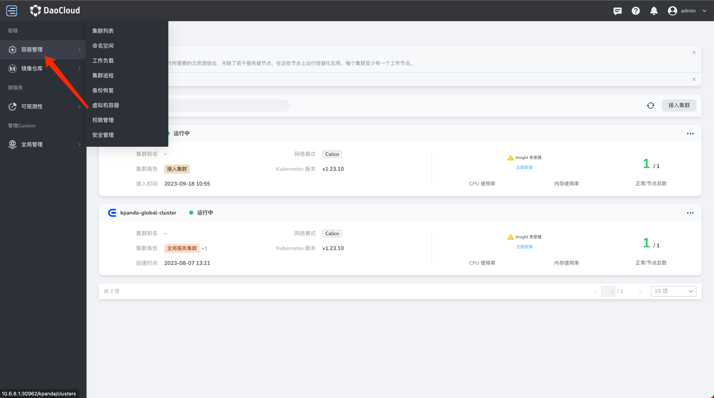

# 自定义导航栏

当前自定义导航栏需要通过手动创建导航栏的yaml，并 apply 到集群中。

## 导航栏分类



若需要新增或重新排序导航栏分类可以通过新增、修改 category yaml 实现。
category 的 yaml 示例如下：

```yaml
apiVersion: ghippo.io/v1alpha1
kind: NavigatorCategory
metadata:
  name: management-custom # 命名规则：由小写的"spec.name"与"-custom"而成
spec:
  name: Management # 若是用于修改category
  isCustom: true
  localizedName: # 定义分类的中英文名称
    zh-CN: 管理管理
    en-US: Management
  order: 100 # 排序，数字越小，越靠上
```

编写好 yaml文件后，通过执行如下命令后，刷新页面即可看到新增、修改的导航栏分类。

```
kubectl apply -f xxx.yaml
```

## 导航栏菜单



若需要新增或重新排序导航栏分类可以通过新增 navigator yaml 实现。

!!! note

    若需要编辑已存在的导航栏菜单（非用户自己新增的 custom 菜单），需要令新增 custom 菜单 gproduct 字段与需要覆盖的菜单的 gproduct 相同，
    新的导航栏菜单会将 menus 中 name 相同的部分执行覆盖，name 不同的地方做新增操作。

navigator 的 yaml示例如下：

```yaml
apiVersion: ghippo.io/v1alpha1
kind: GProductNavigator
metadata:
  name: gmagpie-custom # 命名规则：由小写的"spec.gproduct"与"-custom"而成
spec:
  name: Operations Management
  iconUrl: ./ui/gmagpie/gmagpie.svg
  localizedName: # 定义菜单的中英文名称
    zh-CN: 运营管理
    en-US: Operations Management
  url: ./gmagpie
  parentGProduct: ghippo # 可选, 若添加该字段，则会忽视掉menus字段，并将该菜单作为二级菜单插入到与gproduct为ghippo的一级菜单中
  menus: # 二级菜单
    - name: Access Control
      iconUrl: ./ui/ghippo/menus/access-control.svg
      localizedName:
        zh-CN: 用户与访问控制
        en-US: Access Control
      url: ./ghippo/users
      order: 50 # 排序，数字越小，越靠上
    - name: Workspace
      iconUrl: ./ui/ghippo/menus/workspace-folder.svg
      localizedName:
        zh-CN: 工作空间与层级
        en-US: Workspace and Folder
      url: ./ghippo/workspaces
      order: 40
    - name: Audit Log
      iconUrl: ./ui/ghippo/menus/audit-logs.svg
      localizedName:
        zh-CN: 审计日志
        en-US: Audit Log
      url: ./ghippo/audit
      order: 30
    - name: Settings
      iconUrl: ./ui/ghippo/menus/setting.svg
      localizedName:
        zh-CN: 平台设置
        en-US: Settings
      url: ./ghippo/settings
      order: 10
  gproduct: gmagpie # 定义菜单的标志，用于和parentGProduct字段联动，实现父子关系。
  visible: true # 设置该菜单是否可见，默认为true
  isCustom: true
  order: 20 # 排序，数字越小，越靠上
```
