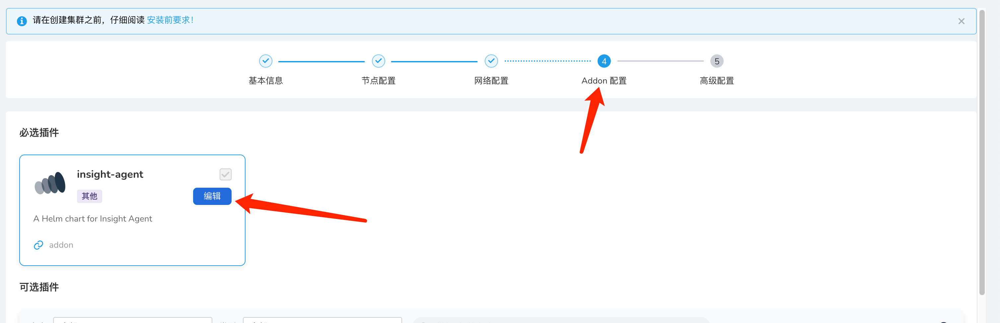
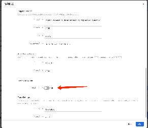
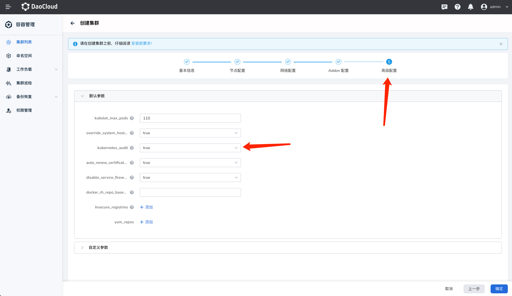
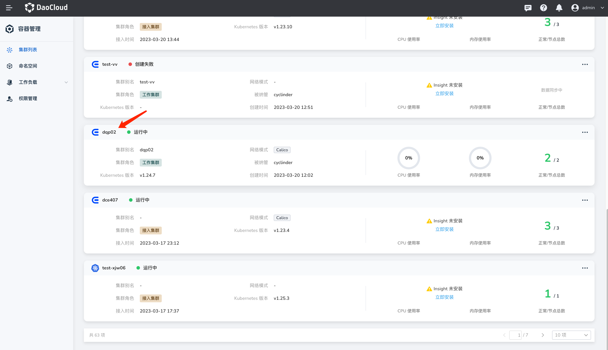
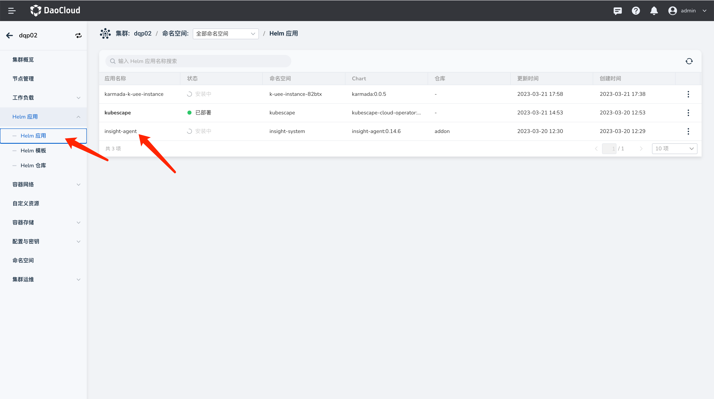
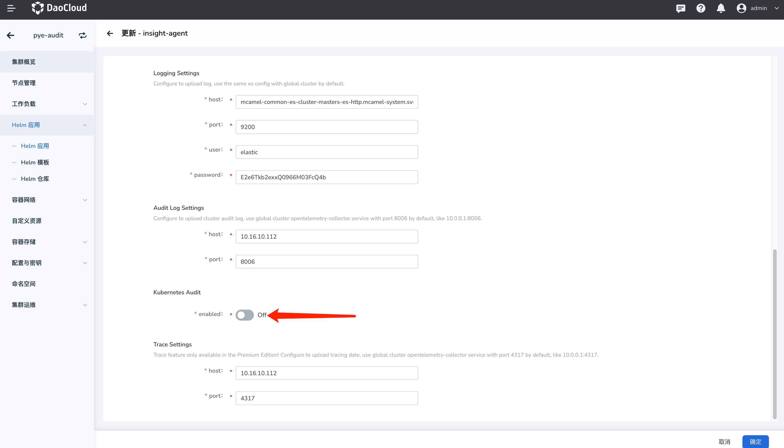
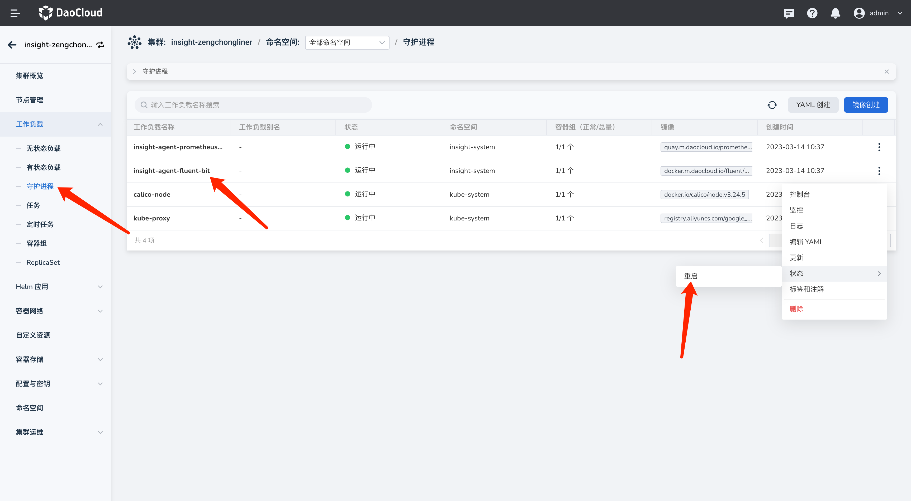

# 开启/关闭采集 k8s 审计日志

## 名称解释

- k8s 审计日志：k8s 本身生成审计日志，开启该功能后，会在指定目录下生成 k8s 审计日志的日志文件
- 采集 k8s 审计日志：通过 insight-agent 采集上述‘k8s 审计日志’的日志文件，’采集 k8s 审计日志‘ 的前提条件是集群开启了上述 ‘k8s 审计日志‘

## dce5.0 安装完成时状态

- 社区版安装管理集群过程中未操作 k8s 审计日志开关
- 商业版管理集群的 k8s 审计日志开关默认开启
    - 如需设置成默认关闭，可修改安装器 clusterConfigt.yaml 来配置（logPath 设置为空 ”“）
- 管理集群的采集 k8s 审计日志开关默认关闭
    - 默认设置不支持配置

## 管理集群采集 k8s 审计日志开关

### 商业版安装环境

#### 确认开启 k8s 审计日志

执行以下命令查看`/var/log/kubernetes/audit` 目录下是否有审计日志生成，若有，则表示 k8s 审计日志成功开启。

```shell
ls /var/log/kubernetes/audit
```

若未开启，请参考[文档的开启关闭 k8s 审计日志](./open-k8s-audit.md)。

#### 开启采集 k8s 审计日志流程

1. 添加 chartmuseum 到 helm repo 中

    ```shell
    helm repo add chartmuseum http://10.5.14.30:8081   # IP需要修改为火种节点的IP地址
    ```

2. 保存当前 insight-agent helm value

    ```shell
    helm get values insight-agent -n insight-system -o yaml > insight-agent-values-bak.yaml
    ```

3. 获取当前版本号 ${insight_version_code}

    ```shell
    insight_version_code=`helm list -n insight-system |grep insight-agent | awk {'print $10'}`
    ```

4. 更新 helm value 配置

    ```shell
    helm upgrade --install --create-namespace --version ${insight_version_code} --cleanup-on-fail insight-agent chartmuseum/insight-agent -n insight-system -f insight-agent-values-bak.yaml --set global.exporters.auditLog.kubeAudit.enabled=true
    ```

5. 重启 insight-system 下的所有 fluentBit pod

    ```shell
    fluent_pod=`kubectl get pod -n insight-system | grep insight-agent-fluent-bit | awk {'print $1'} | xargs`
    kubectl delete pod ${fluent_pod} -n insight-system
    ```

#### 关闭采集 k8s 审计日志

其余步骤和开启采集 k8s 审计日志一致，仅需修改第 4 步：更新 helm value 配置

```shell
helm upgrade --install --create-namespace --version ${insight_version_code} --cleanup-on-fail insight-agent chartmuseum/insight-agent -n insight-system -f insight-agent-values-bak.yaml --set global.exporters.auditLog.kubeAudit.enabled=false
```

### 社区版在线安装环境

#### 确认开启 k8s 审计日志

执行以下命令查看`/var/log/kubernetes/audit` 目录下是否有审计日志生成，若有，则表示 k8s 审计日志成功开启。

```shell
ls /var/log/kubernetes/audit
```

若未开启，请参考[文档的开启关闭 k8s 审计日志](./open-k8s-audit.md)。

#### 开启采集 k8s 审计日志流程

1. 保存当前 value

    ```shell
    helm get values insight-agent -n insight-system -o yaml > insight-agent-values-bak.yaml
    ```

2. 获取当前版本号 ${insight_version_code}，然后更新配置

    ```shell
    insight_version_code=`helm list -n insight-system |grep insight-agent | awk {'print $10'}`
    ```

3. 更新 helm value 配置

    ```shell
    helm upgrade --install --create-namespace --version ${insight_version_code} --cleanup-on-fail insight-agent insight-release/insight-agent -n insight-system -f insight-agent-values-bak.yaml --set global.exporters.auditLog.kubeAudit.enabled=true
    ```

    如果因为版本未找到而升级失败，请检查命令中使用的 helm repo 是否有这个版本。
    若没有，请尝试更新 helm repo 后重试。

    ```shell
    helm repo update insight-release
    ```

4. 重启 insight-system 下的所有 fluentBit pod

    ```shell
    fluent_pod=`kubectl get pod -n insight-system | grep insight-agent-fluent-bit | awk {'print $1'} | xargs`
    kubectl delete pod ${fluent_pod} -n insight-system
    ```

#### 关闭采集 k8s 审计日志

其余步骤和开启采集 k8s 审计日志一致，仅需修改第 3 步:
更新 helm value 配置

```shell
helm upgrade --install --create-namespace --version ${insight_version_code} --cleanup-on-fail insight-agent insight-release/insight-agent -n insight-system -f insight-agent-values-bak.yaml --set global.exporters.auditLog.kubeAudit.enabled=false
```

## 工作集群开关

各工作集群开关独立，按需开启。

### 创建集群时打开采集审计日志步骤

采集 k8s 审计日志功能默认为关闭状态，若需要开启，可以按照如下步骤：





将该按钮设置为启用状态，开启采集 k8s 审计日志功能

通过 dce5.0 创建工作集群时，确认该集群的 k8s 审计日志选择‘true'，这样创建出来的工作集群 k8s 审计日志是开启的



等待集群创建成功后，该工作集群的 k8s 审计日志将被采集

### 接入的集群和创建完成后开关步骤

#### 确认开启 k8s 审计日志

执行以下命令查看`/var/log/kubernetes/audit` 目录下是否有审计日志生成，若有，则表示 k8s 审计日志成功开启。

```shell
ls /var/log/kubernetes/audit
```

若未开启，请参考[文档的开启关闭 k8s 审计日志](./open-k8s-audit.md)

#### 开启采集 k8s 审计日志

采集 k8s 审计日志功能默认为关闭状态，若需要开启，可以按照如下步骤

1. 选中已接入并且需要开启采集 k8s 审计日志功能的集群

    

2. 进入 helm 应用管理页面，更新 insight-agent 配置 （若未安装 insight-agent，可以参考文档：[安装 insight-agent](https://docs.daocloud.io/insight/user-guide/quickstart/install-agent/)）

    

3. 开启\关闭采集 k8s 审计日志按钮

    

4. 接入集群的情况下开关后仍需要重启 fluent-bit pod 才能生效

    

