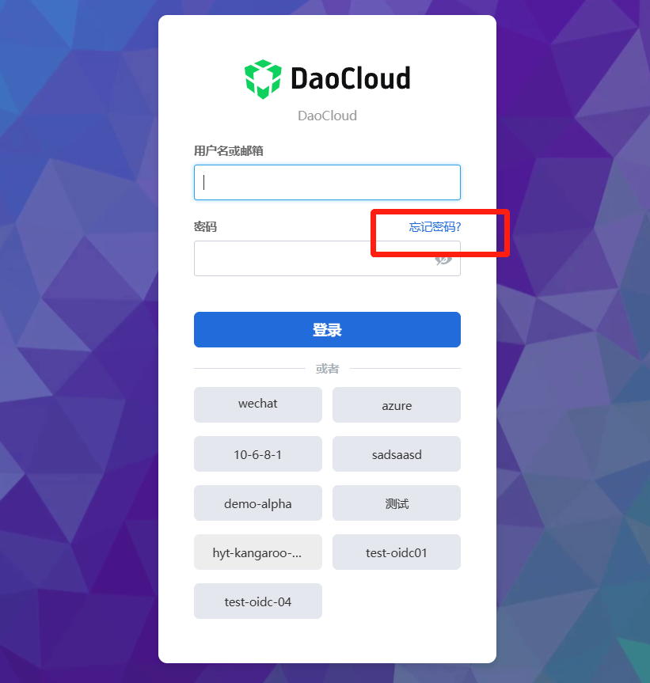
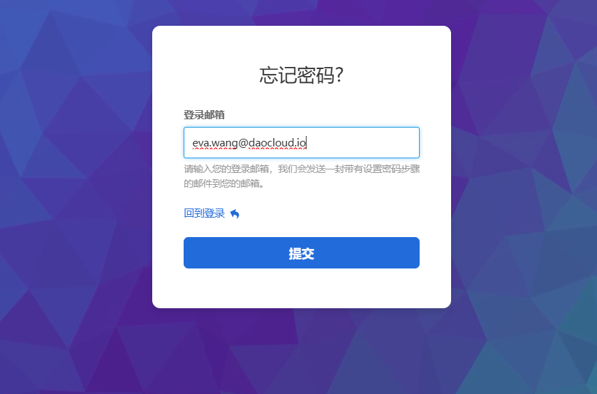
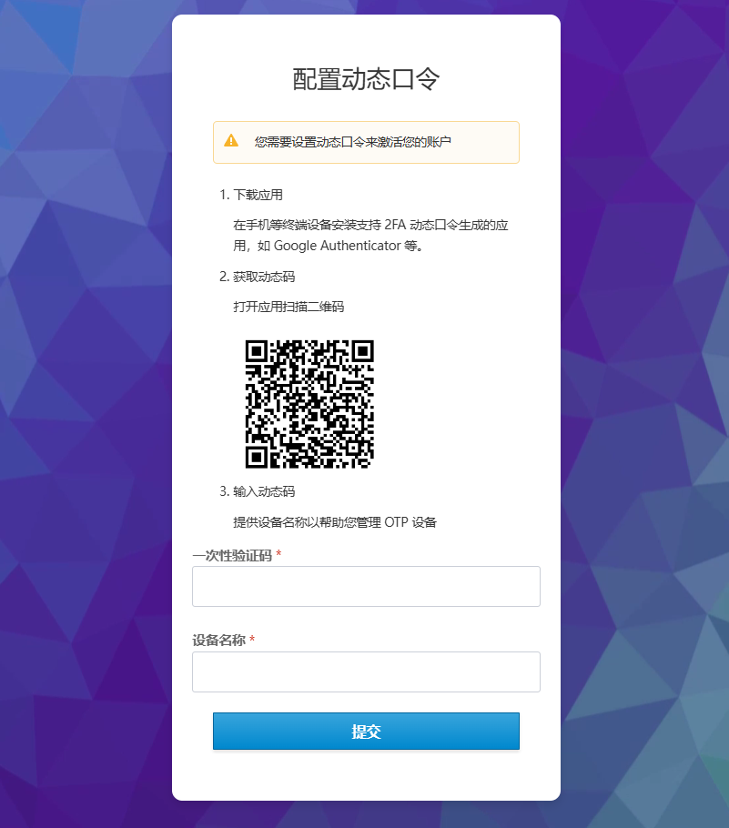
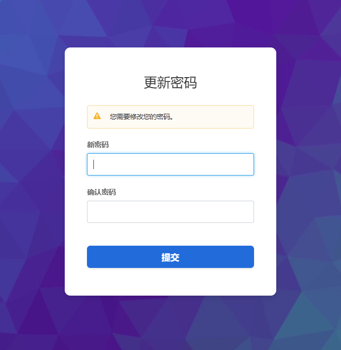
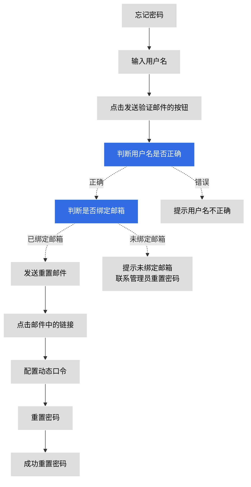

# 密码重置

如果您忘记密码，可以按本页面说明重置密码。

## 重置密码步骤

管理员最初创建一个用户时，会为其设置用户名和密码。
该用户登录后，在 __个人中心__ 填写邮箱并修改密码。
若该用户未设置邮箱，则只能联系管理员进行密码重置。

1. 如果用户忘记了密码，可以在登录界面点击 __忘记密码__ 。

    

1. 输入登录邮箱，点击 __提交__ 。

    

1. 在邮箱中找到密码重置邮件，点击下方链接进行密码重置，链接时效 5 分钟。

    

1. 在手机等终端设备安装支持 2FA 动态口令生成的应用（如 Google Authenticator），按照页面提示配置动态口令以激活账户，点击 __提交__ 。

    

1. 设置新密码，点击 __提交__ 。设置新密码的要求与创建用户时的密码规则一致。

    

1. 修改密码成功，直接跳转首页。

## 重置密码流程

整个密码重置的流程示意图如下。

