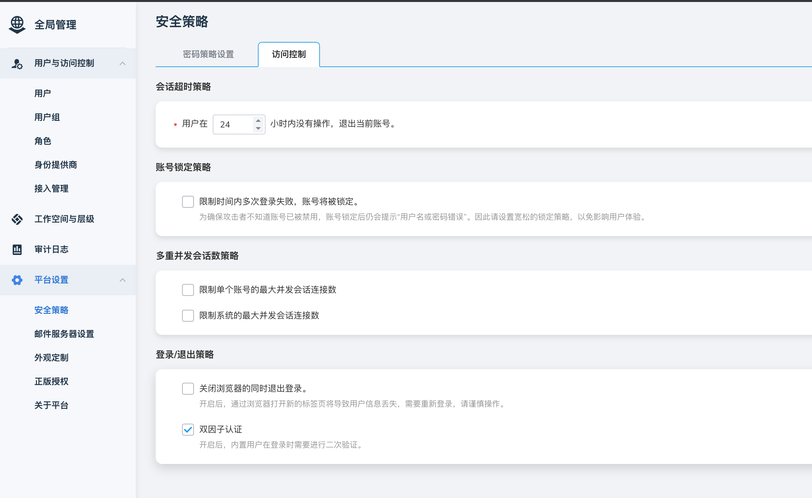
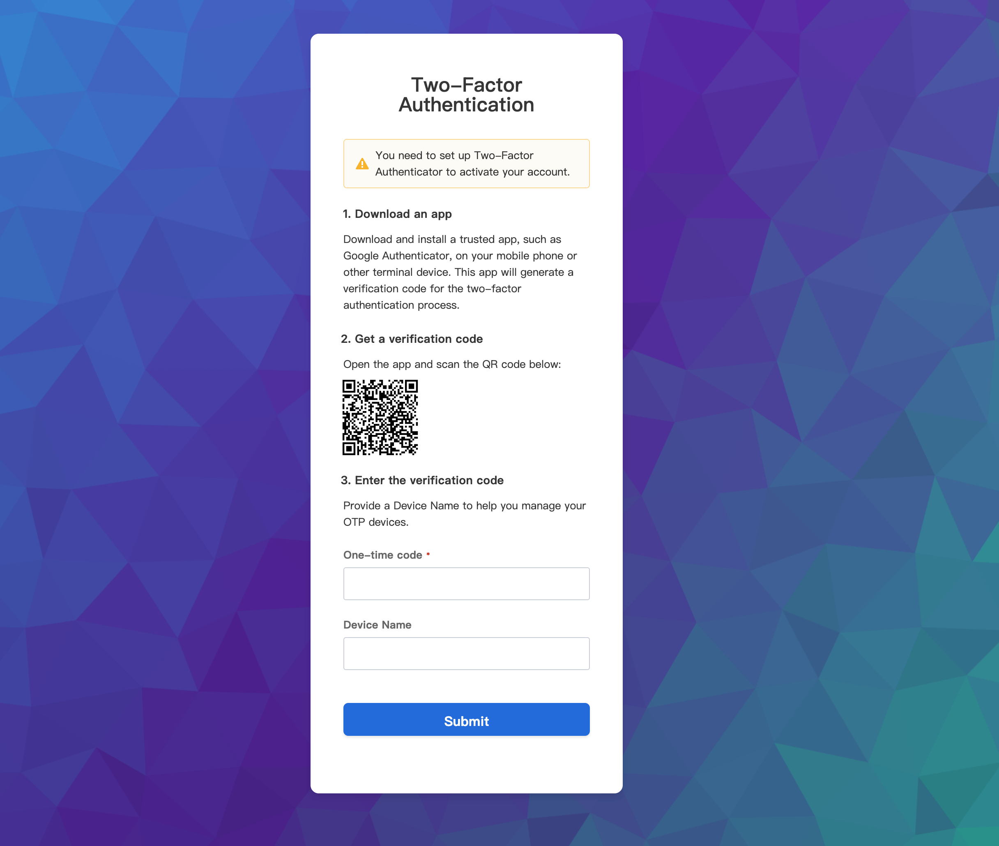
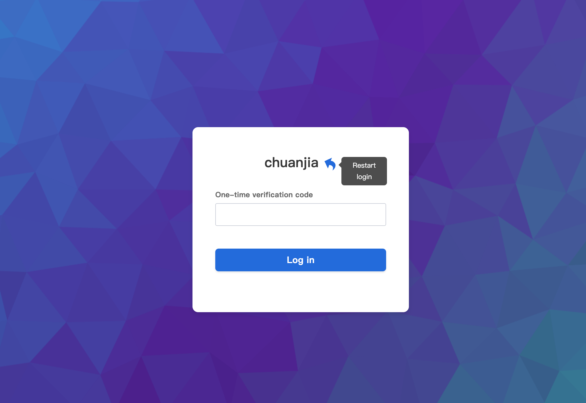

---
hide:
  - toc
---

# 双因子认证

双因子认证（Two-Factor Authentication，简称 2FA）是一种安全验证过程，用于增强用户账户的安全性和可靠性。

## 启用双因子认证

管理员进入 **平台设置** ，选择 **安全策略** ，点击 **启用双因子认证** 。

> 详细介绍参考：[安全策略](../platform-setting/security.md)

!!! note

    启用双因子认证后，用户在登录时需要进行二次验证。

## 初始登录

当双因子认证启用后，用户第一次登录时需要初始化双因子认证配置，具体操作参考下图指引，需提前在手机等终端设备安装支持 2FA 动态口令生成的应用，如 Google Authenticator 等。

在支持 2FA 动态口令生成的应用添加成功后，会有一个 30 秒刷新的 6 位 动态口令，输入后点击 **提交** 后登录成功。

## 后续登录

后续登录时，进入登录页面，输入用户名密码后，打开 Google Authenticator 等动态口令生成应用，输入动态口令，点击登录后登录成功。

如若忘记动态口令，可联系管理员重置。
