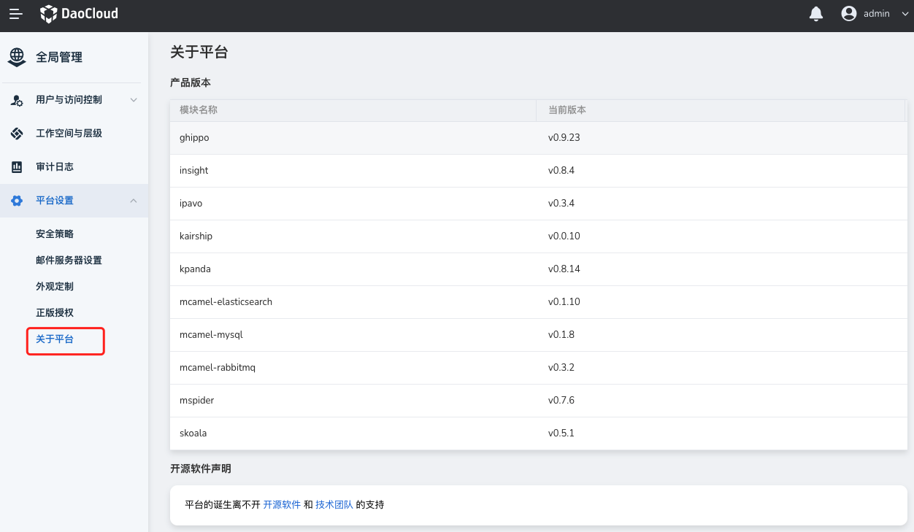

---
hide:
  - toc
---

# 关于平台

 __关于平台__ 主要呈现平台各个子模块当前更新的版本，声明了平台使用的各个开源软件，并以动画视频的方式致谢了平台的技术团队。

查看步骤：

1. 使用具有 __Admin__ 角色的用户登录 DCE 5.0。点击左侧导航栏底部的 __全局管理__ 。

    

2. 点击 __平台设置__ ，选择 __关于平台__ ，查看产品版本、开源软件声明和技术团队。

    

    **License 声明**

    

    **技术团队**

    
