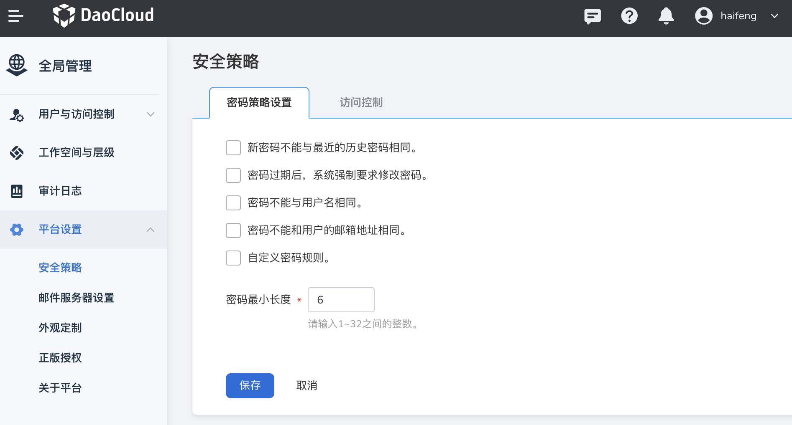

# 安全策略

DCE 5.0 在图形界面上提供了基于密码和访问控制的安全策略。

**密码策略**

- 新密码不能与最近的历史密码相同。
- 密码过期后，系统强制要求修改密码。
- 密码不能与用户名相同。
- 密码不能和用户的邮箱地址相同。
- 自定义密码规则。
- 自定义密码最小长度。

**访问控制策略**

- 会话超时策略：用户在 x 小时内没有操作，退出当前账号。
- 账号锁定策略：限制时间内多次登录失败，账号将被锁定。
- 登录/退出策略：关闭浏览器的同时退出登录。

进入全局管理后，在左侧导航栏点击 __平台设置__ -> __安全策略__ ，即可设置密码策略和访问控制策略。

