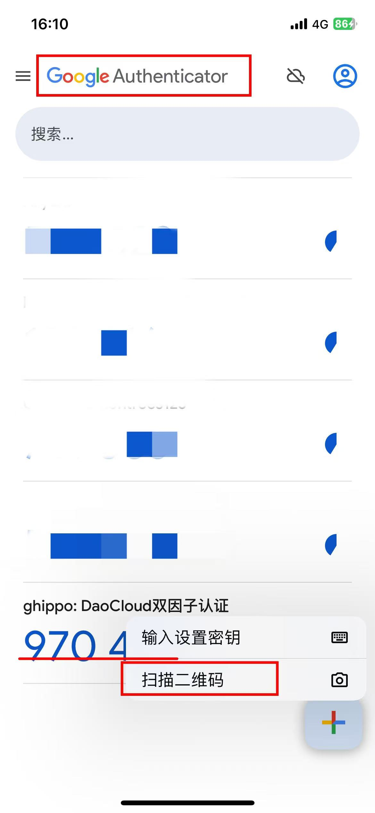

# 安全策略
  
DCE 5.0 在图形界面上提供了基于密码和访问控制的安全策略。
  
## 密码策略
  
- 新密码不能与最近的历史密码相同。
- 密码过期后，系统强制要求修改密码。
- 密码不能与用户名相同。
- 密码不能和用户的邮箱地址相同。
- 自定义密码规则。
- 自定义密码最小长度。
  
## 访问控制策略
  
- 会话超时策略：用户在 x 小时内没有操作，退出当前账号。
- 账号锁定策略：限制时间内多次登录失败，账号将被锁定。
- 限制单个账号的最大并发会话连接数：为了防止单个用户占用过多的服务器资源，或者为了防止恶意用户通过创建大量并发连接来攻击系统，
  通过设定一个上限，系统可以确保每个用户只能建立一定数量的并发连接，从而保护服务器的稳定性和安全性。
  注意：单个账号达到最大并发数后，必须手动登出其他设备才能登录新设备，可能会带来操作不便，请谨慎开启。
  （关闭页面不属于登出行为，需手动单击“退出登录”）
- 限制系统的最大并发会话连接数：对整个系统（而非单个账号）在同一时间内能够处理或允许的最大会话连接数量进行限制，
  从而保护系统资源不被过度消耗，确保系统的稳定性和性能
- 关闭浏览器的同时退出登录：开启后，通过浏览器打开新的标签页将导致用户信息丢失，需要重新登录，请谨慎操作。
- 双因子认证：（Two-Factor Authentication，简称2FA）是一种安全验证过程，用于增强用户账户的安全性和可靠性。
  在这个过程中，提供用户名密码和动态口令两种不同的认证因素来证明自己的身份，从而增加攻击者访问用户设备和在线账户的难度。
  
进入全局管理后，在左侧导航栏点击 __平台设置__ -> __安全策略__ ，即可设置密码策略和访问控制策略。
  

### 双因子认证

开启双因子认证后，用户在登录时需要进行二次验证。

**第一次登录**

1. 开启双因子认证后，用户第一次登录时需要在手机等终端设备安装支持 2FA 动态口令生成的应用，如 Google Authenticator 等。

    

2. 打开应用扫描二维码

    

3. 输入动态码，点击 **提交** 后登录成功。

**第二次登录**

进入登录页面，输入用户名密码后，打开 Google Authenticator 等动态口令生成应用，输入动态口令，点击登录后登录成功。

