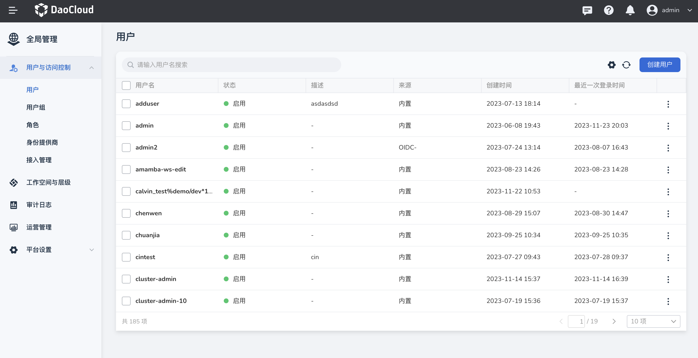

---
hide:
  - toc
---

# 计费计量

计量计费在报表的基础上，对资源的使用数据做了进一步的计费处理。支持用户手动设置 CPU、内存、存储的单价以及货币单位等，设置后系统将自动统计出集群、节点、容器组、命名空间、工作空间在一段时间内的花费情况，时间段用户可自由调整，可按照周、月、季度、年筛选调整后导出 Excel 或 Csv 格式的计费报表。

## 计费规则及生效时间

- 计费规则：默认按照请求值和使用量的最大值计费。
- 生效时间：次日生效，以次日凌晨时获取的单价和数量计算当天产生的费用。

## 功能特性

- 支持自定义设置 CPU 、内存、存储的计费单位，以及货币单位。
- 支持自定义查询一年内的计费数据，根据所选时间段自动计算出该时间段内的计费情况。
- 支持以 CSV 和 Excel 两种格式导出计费报表。
- 支持开启/关闭单个计费报表，开启/关闭后，平台将在 20 分钟内开始/停止采集数据，往期已经采集到的数据还将正常显示。
- 支持对 CPU 、内存总量、存储、总计计费数据的选择性展示。

## 报表维度

目前支持以下几种报表：

- 集群计费报表：展示某段时间内全部集群的 CPU 计费、内存计费、存储计费及总体计费情况，以及该段时间内该集群下的节点数量，可通过点击节点数量快捷进入节点计费报表，并查看该段时间内该集群下的节点计费情况。
- 节点计费报表：展示某段时间内全部节点的 CPU 计费、内存计费、存储计费及总体计费情况，以及节点的 IP、类型和所属集群。
- 容器组报表：展示某段时间内全部容器组的 CPU 计费、内存计费、存储计费及总体计费情况，以及容器组的所属命名空间、所属集群和所属工作空间。
- 工作空间计费报表：展示某段时间内全部工作空间的 CPU 计费、内存计费、存储计费及总体计费情况，以及命名空间数量和容器组数量，可通过点击命名空间数量快捷进入命名空间计费报表，并查看该段时间内该工作空间下命名空间的计费情况；同样的方式可查看该段时间内该工作空间下的容器组的计费情况。
- 命名空间计费报表：某段时间内全部命名空间的 CPU 计费、内存计费、存储计费及总体计费情况，以及容器组数量、所属集群、所属工作空间，可通过点击容器组数量快捷进入容器组计费报表，并查看该段时间内该命名空间下的容器组的计费情况。

## 操作步骤

1. 使用具有 __admin__ 角色的用户登录 DCE 5.0。点击左侧导航栏底部的 __全局管理__ -> __运营管理__ 。

    
   
2. 进入运营管理后切换不同菜单可查看集群、节点、容器组等计费报表。

    