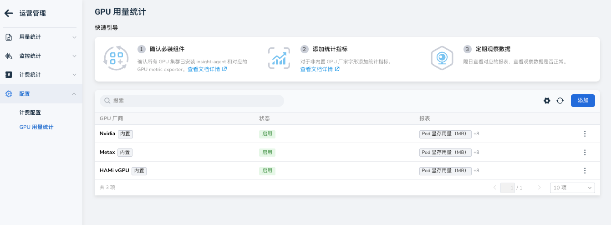
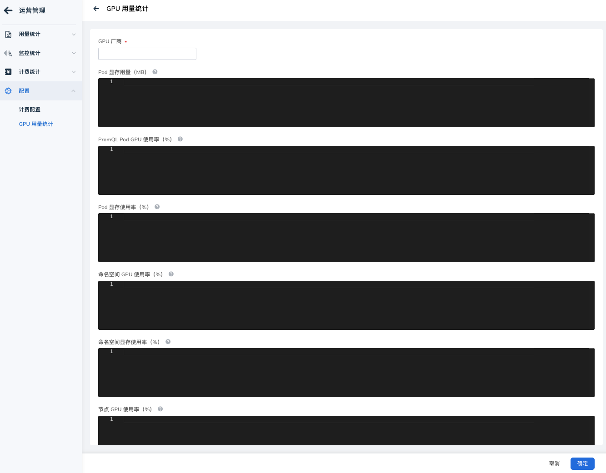
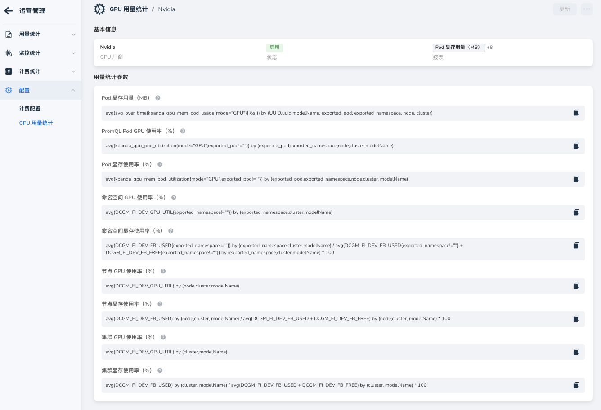

# GPU 指标自定义配置

运营管理支持自定义 GPU 指标的采集规则。可以根据 GPU 厂商（如 NVIDIA、AMD、华为）及其 Exporter 提供的原始指标，通过 PromQL 公式计算并展示以下性能数据：

- GPU 使用率
- 显存使用量
- 显存利用率

支持从 Pod、Namespace、Node、Cluster 维度进行聚合统计。

## 操作指南

### 1. 进入配置页面

1. 登录运营管理控制台。
2. 在左侧导航栏选择 __配置管理__ -> __GPU 配置__ 。

### 2. 新增或编辑配置

1. 点击 __创建__ 或点击已有配置右侧的 __编辑__ 。
2. 在表单中填写基本信息：
    - __厂商__：输入 GPU 厂商标识（如 `nvidia`）。
    - __状态__：开启或关闭该配置。
3. 在指标列表中为每一项编写 PromQL 公式。

!!! tip

    代码编辑器支持实时语法校验。如果公式有误，编辑器下方会显示具体错误。

### 3. 指标说明

配置公式时可参考下表：

| 指标名称 | 说明 | 推荐公式示例 (NVIDIA DCGM) |
| :--- | :--- | :--- |
| **Pod 显存占用** | 单个 Pod 的显存使用量 (Bytes) | `sum(DCGM_FI_DEV_FB_USED) by (pod) * 1024 * 1024` |
| **Pod GPU 利用率** | 单个 Pod 的 GPU 算力使用率 (%) | `avg(DCGM_FI_DEV_GPU_UTIL) by (pod)` |
| **Pod 显存利用率** | 单个 Pod 的显存使用百分比 (%) | `sum(DCGM_FI_DEV_FB_USED) / sum(DCGM_FI_DEV_FB_TOTAL) * 100` |

!!! note

    实际公式需根据环境中的 Prometheus 指标名称（如 `DCGM_FI_DEV_...`）和标签（`pod`, `namespace` 等）进行调整。

### 4. 验证与保存

- 确认 PromQL 语法无误后，点击 __确定__ 保存。
- 系统后台会自动同步，采集任务在下一周期生效。

## 常见问题

**Q: 配置后报表没有数据？**

- 检查 Prometheus 中是否有原始指标。
- 检查公式中的标签是否对齐（例如 `pod` vs `pod_name`）。
- 确认配置状态为“开启”。

**Q: 可以配置多个厂商吗？**

可以。支持为不同厂商分别创建规则，系统会根据节点的标签自动匹配。
