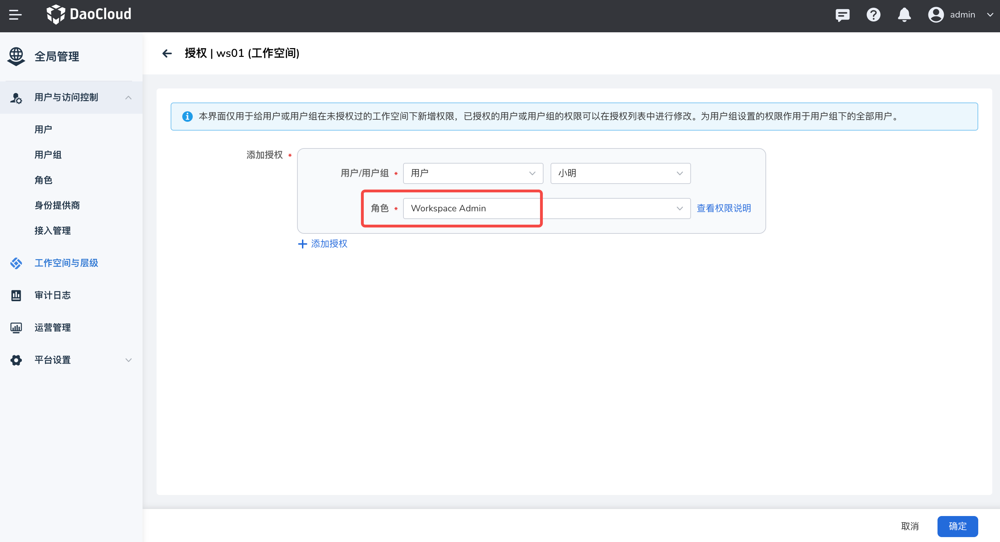
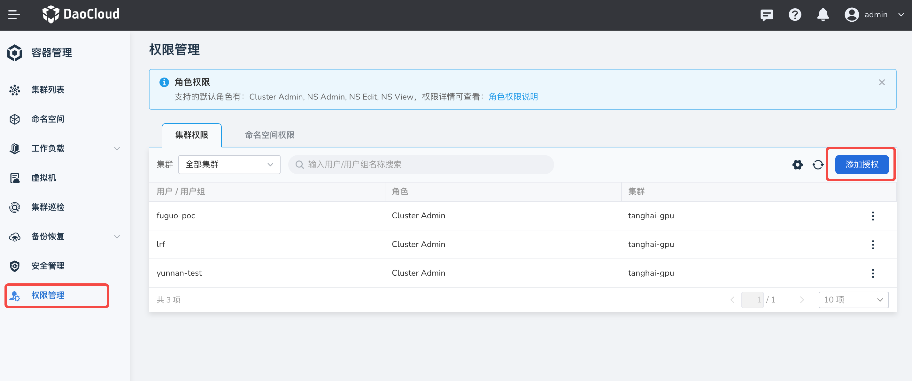
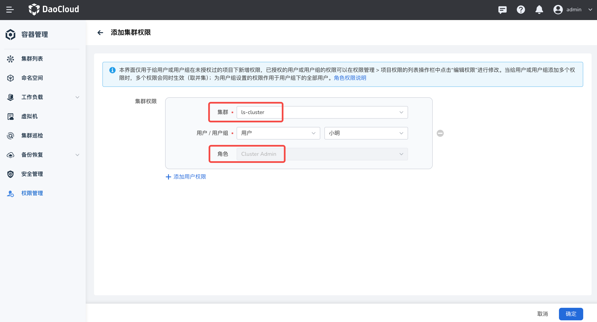
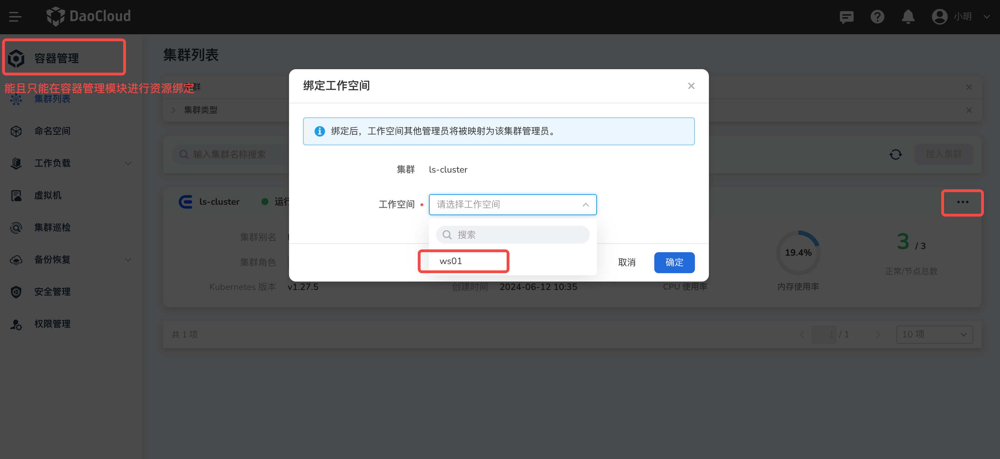
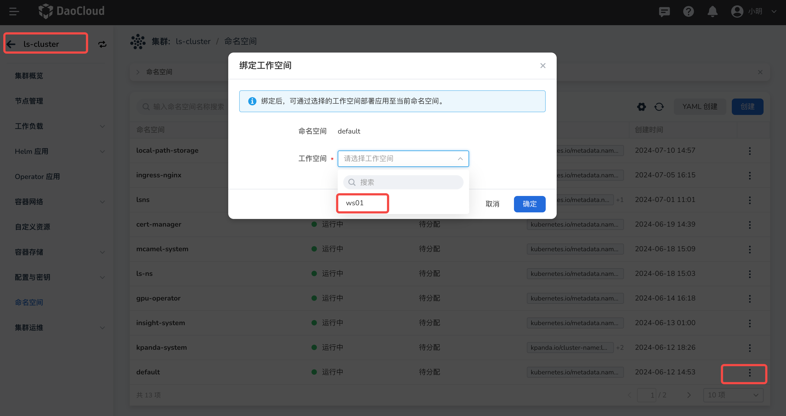

# 资源绑定权限说明

假如用户小明（“小明”代表任何有资源绑定需求的用户，以下不再赘述）已经具备了工作空间的管理员 WS admin 角色或通过自定义角色授权，
同时自定义角色中包含工作空间的“资源绑定”权限点，希望将集群或者命名空间绑定到该工作空间中。

## 授权说明

将集群/命名空间资源绑定到工作空间，不仅需要工作空间的“资源绑定”权限，还需要相应的资源权限 Cluster admin。

## 操作步骤

使用平台管理员 admin 角色，在 **工作空间** -> **授权** 页面给小明授予 `Workspace Admin` 角色。
若使用自定义角色，请务必包含工作空间下的“资源绑定”权限点。

同时，在 **容器管理** -> **授权管理** 页面，通过 **添加授权** 将小明授权为 Cluster Admin。

以上已完成对小明的授权。

使用小明的账号登录平台，小明将可以在 **容器管理** -> **集群列表** 页面，通过 **绑定工作空间** 功能，
将该集群绑定到自己的工作空间中。

!!! note

    小明能且只能在容器管理模块将集群或者该集群下命名空间绑定到工作空间，无法在全局管理完成此操作。

绑定命名空间到工作空间也至少需要 Workspace Admin + Cluster Admin 权限。

