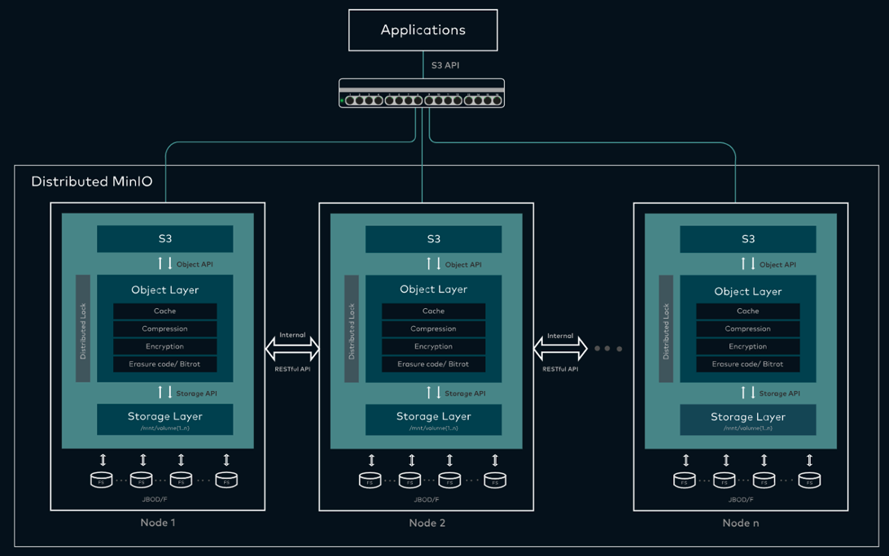
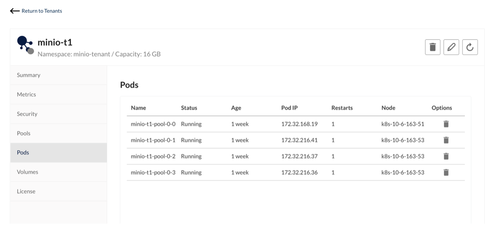
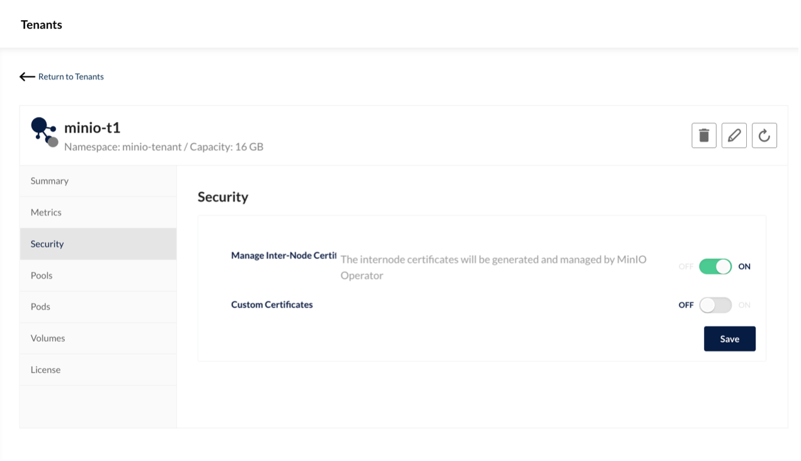
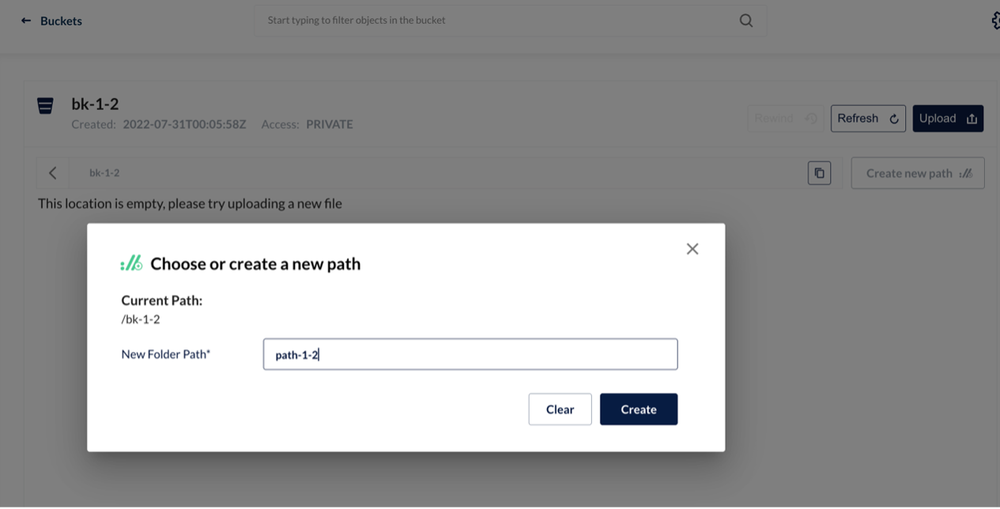
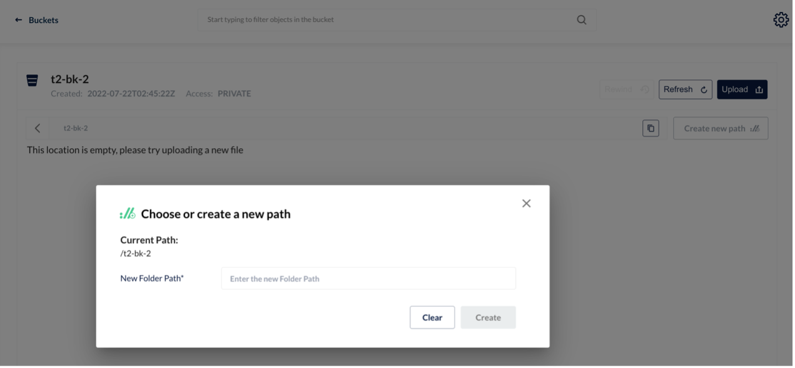
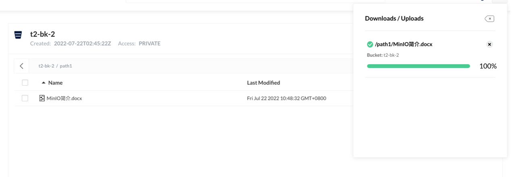
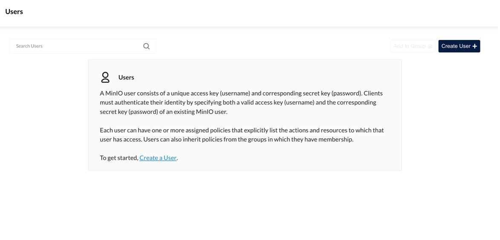
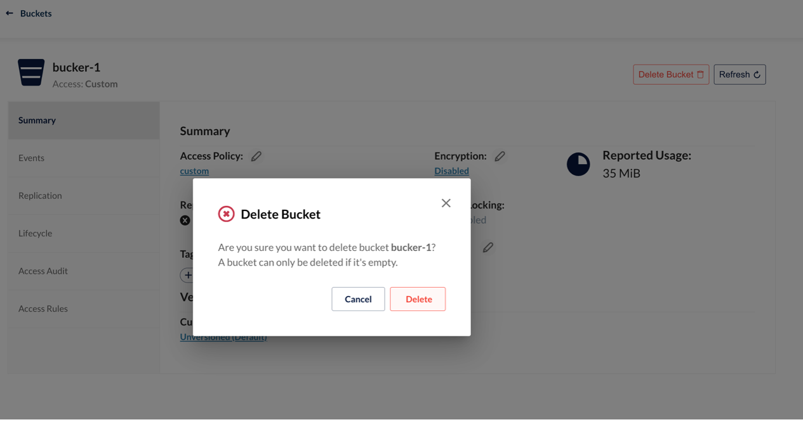
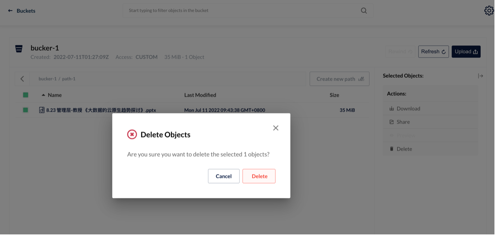

---
sidebar_position: 3
sidebar_label: "Minio"
---

# MinIO

## MinIO 简介

MinIO 是一款高性能、分布式、兼容 S3 的多云对象存储系统套件。MinIO 原生支持 Kubernetes，能够支持所有公有云、私有云及边缘计算环境。
MinIO 是 GNU AGPL v3 开源的软件定义产品，能够很好地运行在标准硬件如 X86 等设备上。


MinIO 的架构设计从一开始就是针对性能要求很高的私有云标准，在实现对象存储所需要的全部功能的基础上追求极致的性能。
MinIO 具备易用性、高效性及高性能，能够以更简单的方式提供具有弹性扩缩能力的云原生对象存储服务。

MinIO 在传统对象存储场景（如辅助存储、灾难恢复和归档）方面表现出色，同时在机器学习、大数据、私有云、混合云等方面的存储技术上也独树一帜，包括数据分析、高性能应用负载、原生云应用等。

### MinIO 架构设计

MinIO 为云原生架构设计，可以作为轻量级容器运行并由外部编排服务如 Kubernetes 管理。
MinIO 整个服务包约为不到 100 MB 的静态二进制文件，即使在很高负载下也可以高效利用 CPU 和内存资源并可以在共享硬件上共同托管大量租户。
对应的架构图如下：



MinIO 用作云原生应用程序的主要存储，与传统对象存储相比，云原生应用程序需要更高的吞吐量和更低的延迟，而这些都是 MinIO 能够达成的性能指标，读/写速度高达 183 GB/秒和 171 GB/秒。

MinIO 极致的高性能离不开底层存储基础平台。本地存储在众多的存储协议中具有最高的读写性能无疑能为 MinIO 提供性能保障。
HwameiStor 正是满足云原生时代要求的储存系统。它具有高性能、高可用、自动化、低成本、快速部署等优点，可以替代昂贵的传统 SAN 存储。

MinIO 可以在带有本地驱动器（JBOD/JBOF）的标准服务器上运行。
集群为完全对称的体系架构，即所有服务器的功能均相同，没有名称节点或元数据服务器。

MinIO 将数据和元数据作为对象一起写入从而无需使用元数据数据库。
MinIO 以内联、严格一致的操作执行所有功能，包括擦除代码、位 rotrot 检查、加密等。

每个 MinIO 集群都是分布式 MinIO 服务器的集合，每个节点一个进程。
MinIO 作为单个进程在用户空间中运行，并使用轻量级的协同例程来实现高并发。
将驱动器分组到擦除集（默认情况下，每组 16 个驱动器），然后使用确定性哈希算法将对象放置在这些擦除集上。

MinIO 专为大规模、多数据中心云存储服务而设计。
每个租户都运行自己的 MinIO 集群，该集群与其他租户完全隔离，从而使租户能够免受升级、更新和安全事件的任何干扰。
每个租户通过联合跨地理区域的集群来独立扩展。


### 以 HwameiStor 为底座搭建 MinIO 的优势

以 HwameiStor 为底座搭建 MinIO 存储方案，构建智、稳、敏全面增强本地存储，具备以下优势。

- 自动化运维管理

  可以自动发现、识别、管理、分配磁盘。 根据亲和性，智能调度应用和数据。自动监测磁盘状态，并及时预警。

- 高可用的数据

  使用跨节点副本同步数据， 实现高可用。发生问题时，会自动将应用调度到高可用数据节点上，保证应用的连续性。

- 丰富的数据卷类型

  聚合 HDD、SSD、NVMe 类型的磁盘，提供非低延时，高吞吐的数据服务。

- 灵活动态的线性扩展

  可以根据集群规模大小进行动态的扩容，灵活满足应用的数据持久化需求。

- 丰富的应用场景，广泛适配企业需求，适配高可用架构中间件

  类似 Kafka、ElasticSearch、Redis 等这类中间件自身具备高可用架构，同时对数据的 IO 访问有很高要求。
  HwameiStor 提供的基于 LVM 的单副本本地数据卷，可以很好地满足它们的要求。

- 为应用提供高可用数据卷

  MySQL 等 OLTP 数据库要求底层存储提供高可用的数据存储，当发生问题时可快速恢复数据，同时也要求保证高性能的数据访问。
  HwameiStor 提供的双副本的高可用数据卷，可以很好地满足此类需求。

- 自动化运维传统存储软件

  MinIO、Ceph 等存储软件，需要使用 Kubernetes 节点上的磁盘，可以采用 PVC/PV 的方式，
  通过 CSI 驱动自动化地使用 HwameiStor 的单副本本地卷，快速响应业务系统提出的部署、扩容、迁移等需求，实现基于 Kubernetes 的自动化运维。

## 测试环境

按照以下步骤依次部署 Kubernetes 集群、HwameiStor 本地存储和 MinIO。

### 部署 Kubernetes 集群

本次测试使用了三台虚拟机节点部署了 Kubernetes 集群：1 Master + 2 Worker 节点，kubelet 版本为 1.22.0。


### 部署 HwameiStor 本地存储

在 Kubernetes 上部署 HwameiStor 本地存储。


两台 Worker 节点各配置了五块磁盘（SDB、SDC、SDD、SDE、SDF）用于 HwameiStor 本地磁盘管理。


查看 local storage node 状态。


创建了 storagClass。


## 分布式多租户源码部署安装（minio operator）

本节说明如何部署 minio operator，如何创建租户，如何配置 HwameiStor 本地卷。

### 部署 minio operator

参照以下步骤部署 minio operator。

1. 复制 minio operator 仓库到本地。

    ```sh
    git clone <https://github.com/minio/operator.git>
    ```

    

    

2. 进入 helm operator 目录：`/root/operator/helm/operator`。

    

3. 部署 minio-operator 实例。

    ```sh
    helm install minio-operator \
    --namespace minio-operator \
    --create-namespace \
    --generate-name .
    --set persistence.storageClass=local-storage-hdd-lvm .
    ```

4. 检查 minio-operator 资源运行情况。

    

### 创建租户

参照以下步骤创建一个租户。

1. 进入 `/root/operator/examples/kustomization/base` 目录。如下修改 tenant.yaml。

    

2. 进入 `/root/operator/helm/tenant/` 目录。如下修改 `values.yaml` 文件。

    

3. 进入 `/root/operator/examples/kustomization/tenant-lite` 目录。如下修改 `kustomization.yaml` 文件。

    

4. 如下修改 `tenant.yaml` 文件。

    

5. 如下修改 `tenantNamePatch.yaml` 文件。

    

6. 创建租户：

    ```sh
    kubectl apply –k . 
    ```

7. 检查租户 minio-t1 资源状态：

    

8. 如要创建一个新的租户可以在 `/root/operator/examples/kustomization` 目录下建一个新的 `tenant` 目录（本案例为 `tenant-lite-2`）并对相应文件做对应修改。

    

9. 执行 `kubectl apply –k .` 创建新的租户 `minio-t2`。

    

### 配置 HwameiStor 本地卷

依次运行以下命令来配置本地卷。

```sh
kubectl get statefulset.apps/minio-t1-pool-0 -nminio-tenant -oyaml
```


```sh
kubectl get pvc –A
```


```sh
kubectl get pvc export-minio6-0 -nminio-6 -oyaml
```


```sh
kubectl get pv
```


```sh
kubectl get pvc data0-minio-t1-pool-0-0 -nminio-tenant -oyaml
```


```sh
kubectl get lv
```


```sh
kubect get lvr
```


## HwameiStor 与 MinIo 测试验证

完成上述配置之后，执行了基本功能测试和多租户隔离测试。

### 基本功能测试

基本功能测试的步骤如下。

1. 从浏览器登录 `minio console：10.6.163.52:30401/login`。

    

2. 通过 `kubectl minio proxy -n minio-operator `获取 JWT。

    

3. 浏览及管理创建的租户信息。

    

    

    

    

    

    

4. 登录 minio-t1 租户（用户名 minio，密码 minio123）。

    

    

5. 浏览 bucket bk-1。

    

    

    

6. 创建新的 bucket bk-1-1。

    

    

    

7. 创建 path path-1-2。

    

    

8. 上传文件成功：

    

    

    

9. 上传文件夹成功：

    

    

    

    

10. 创建只读用户：

    

    

### 多租户隔离测试

执行以下步骤进行多租户隔离测试。

1. 登录 minio-t2 租户。

    

    

2. 此时只能看到 minio-t2 内容，minio-t1 的内容被屏蔽。

    

3. 创建 bucket。

    

    

4. 创建 path。

    

    

5. 上传文件。

    

    

6. 创建用户。

    

    

    

    

    

7. 配置用户 policy。

    

    

8. 删除 bucket。

    

    

    

    

    

    

## 结论

本次测试是在 Kubernetes 1.22 平台上部署了 MinIO 分布式对象存储并对接 HwameiStor 本地存储。在此环境中完成了基本能力测试、系统安全测试及运维管理测试。

全部测试成功通过，证实了 HwameiStor 能够完美适配 MinIO 存储方案。
