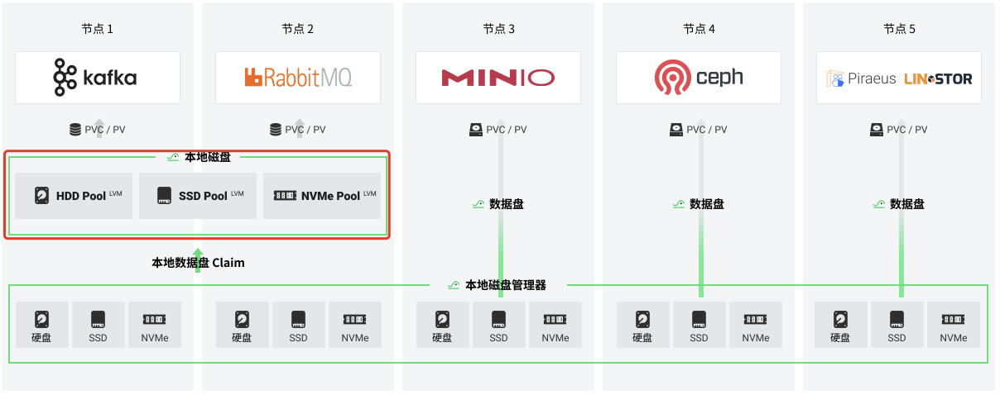

# 本地存储

本地存储 (local Storage, LS) 是 HwameiStor 的一个模块，它旨在为应用提供高性能的本地持久化 LVM 存储卷。

目前支持的本地持久化数据卷类型：`LVM`。

目前支持的本地磁盘类型：`HDD`、`SSD`、`NVMe`。

## 适用场景

HwameiStor 提供两种本地数据卷：LVM、Disk。本地存储作为 HwameiStor 的一部分，负责提供 LVM 本地数据卷，包括高可用 LVM 数据卷、非高可用 LVM 数据卷。

非高可用的 LVM 本地数据卷，适用下列场景和应用：

- 具备高可用特性的***数据库***，例如 MongoDB 等
- 具备高可用特性的***消息中间件***，例如 Kafka、RabbitMQ 等
- 具备高可用特性的***键值存储系统***，例如 Redis 等
- 其他具备高可用功能的应用

高可用的 LVM 本地数据卷，适用下列场景和应用：

- ***数据库***，例如 MySQL、PostgreSQL 等
- 其他需要数据高可用特性的应用

## 使用 Helm Chart 安装部署

本地存储是 HwameiStor 的一部分，必须与本地磁盘管理器一起工作。建议用户 [通过 helm-charts 部署](../install/deploy.md)。

## 独立安装部署方式

开发者可以[独立安装](../install/deploy.md) local-storage，从源代码进行安装，主要用于开发、测试场景。对于这种安装方式，您需要事先安装好[本地磁盘管理器](./ldm.md)。

