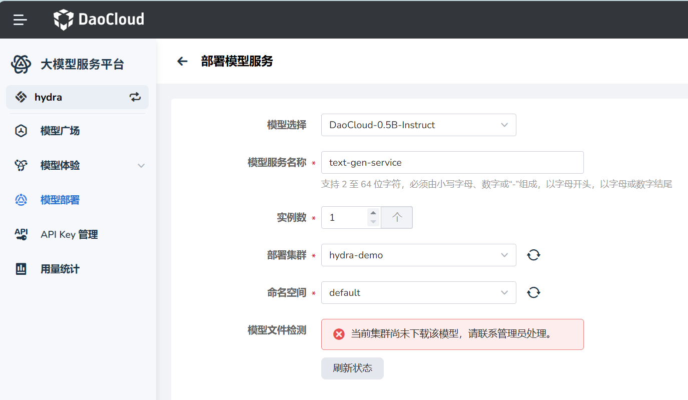

---
hide:
  - toc
---

# 部署新模型

*[Hydra]: 大模型服务平台的开发代号

您可以从[模型广场](../index.md)直接部署模型，也可以从左侧导航进入 **模型部署** 页面来部署模型。部署模型的各项表单参数如下：

| 参数项 |约束 / 说明 |  备注 |
|---|---|---|
| 模型选择 | 选择需要部署的模型（如 DeepSeek-R1），可通过下拉菜单快速选择符合业务需求和任务场景的模型 | 影响模型能力、推理效果与资源消耗|
| 模型服务名称 | 为本次部署的模型服务指定名称 **长度**：2–64 个字符 **字符**：仅支持小写字母、数字、短横线（-） **规则**：必须以小写字母或数字开头和结尾 | 示例：`text-gen-service`、`model-01` |
| 实例数 | 配置需要部署的实例数量 实例说明：实例数越多，并发能力越强，但成本越高 | **默认值**：1 |
| 部署集群 | 选择模型服务要部署到的集群 | 建议优先选择物理距离较近的集群以降低延迟 |
| 命名空间 | 指定模型服务部署到的目标命名空间 | |
| 模型文件检测 | 选择模型、集群和命名空间后，系统将自动执行模型文件检测。 | |

某个模型被成功部署后，用户即可通过对话聊天方式 **[体验和测试模型](../exp.md)** 。
同时，在模型广场中，光标悬浮到该模型的卡片上，将出现 **体验** 按钮，便于快速访问。
