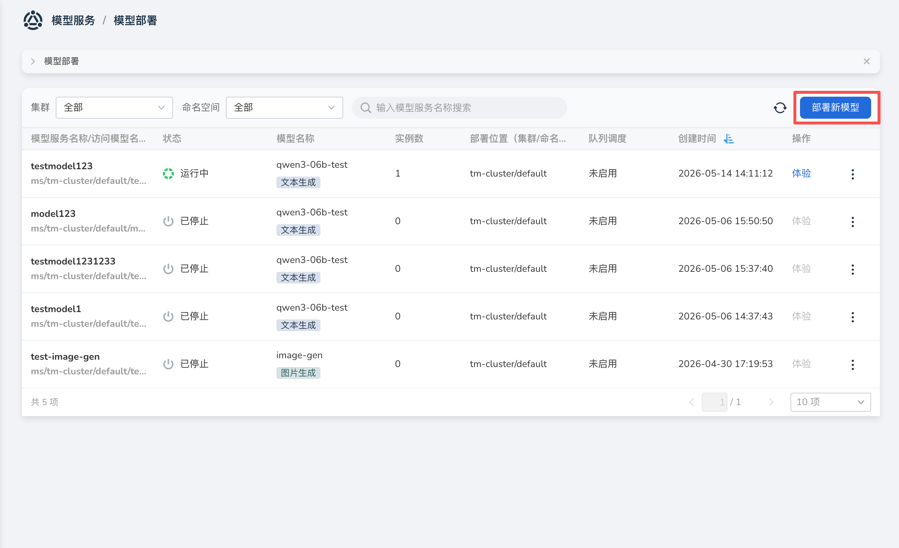
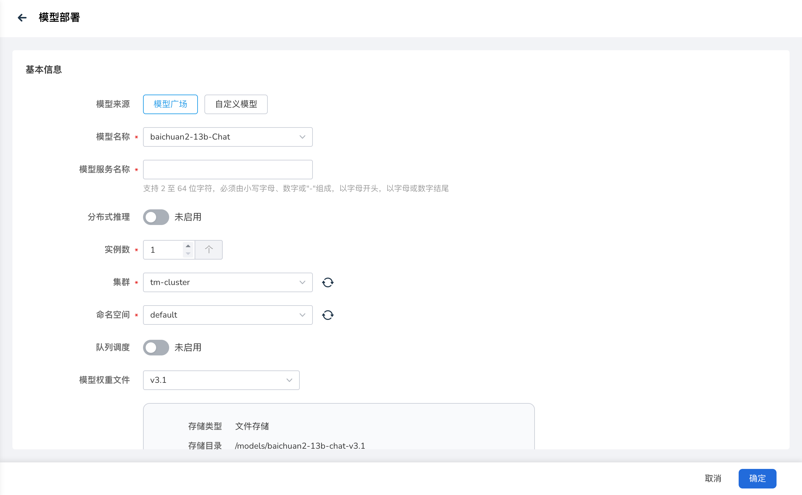

---
hide:
  - toc
---

# 部署新模型

*[Hydra]: 大模型服务平台的开发代号

将所选模型在目标集群上发布为可调用的模型服务，按需填写资源、运行时与实例等部署参数。您可从[模型广场](../index.md)、[模型管理](../model-management/index.md)或左侧导航 **模型服务- 部署新模型** 发起部署，下文说明步骤与参数含义。

## 前提条件

- 目标集群与命名空间可用。
- 若部署自定义模型，已在[创建模型](../model-management/index.md)中完成模型元数据、部署模板或模型权重文件配置。

## 操作步骤

1. 进入大模型服务平台，在左侧导航栏点击 **模型服务**。
2. 在模型服务列表页面点击 **部署新模型**（或在模型广场、模型管理页点击 **部署** 按钮）。
3. 按需填写部署参数，点击 **确定**。

    ## 参数说明

    | 参数项 | 约束 / 说明 | 备注 |
    |---|---|---|
    | 模型来源 | 选择模型来源：模型广场或自定义模型 | 自定义模型需已在模型管理中创建 |
    | 模型选择 | 选择需要部署的模型（如 DeepSeek-R1），可通过下拉菜单快速筛选 | 影响模型能力、推理效果与资源消耗 |
    | 模型服务名称 | 为本次部署的模型服务指定名称 **长度**：2–64 个字符 **字符**：仅支持小写字母、数字、短横线（-） **规则**：必须以小写字母或数字开头和结尾 | 示例：`text-gen-service`、`model-01` |
    | 实例数 | 配置需要部署的实例数量 实例说明：实例数越多，并发能力越强，但成本越高 | **默认值**：1 |
    | 部署集群 | 选择模型服务要部署到的集群 | 建议优先选择物理距离较近的集群以降低延迟 |
    | 命名空间 | 指定模型服务部署到的目标命名空间 | 与集群绑定 |
    | 部署模板 | 选择已配置的部署模板 | 支持快速复用资源与运行配置 |
    | 模型权重文件 | 选择已配置的模型权重文件 | 部署自定义模型时推荐配置 |
    | 运行时框架 | 选择推理运行时框架 | 支持按模型与场景选择 |
    | 分布式推理 | 开启后可配置单实例部署节点数 | 适用于单节点资源不足场景 |
    | 队列调度 | 可配置调度策略、优先级等 | 支持优先级与拓扑感知相关调度能力 |

    

## 部署后操作

模型部署成功后，您可以：

- 在模型服务列表中查看服务状态与详情，参考[管理模型服务](./inference-manage.md)。
- 通过在线体验验证服务可用性，参考[在线体验](../exp.md)。
- 按 API 方式调用模型，参考[模型调用](../api-call.md)。
