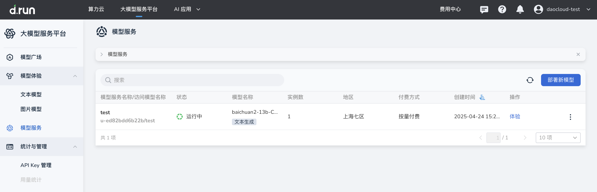

# 模型服务概览

*[Hydra]: 大模型服务平台的开发代号

模型服务是一项将开源或微调后的大语言模型快速部署为可调用服务的解决方案。
通过模型部署，将复杂的模型管理简化为标准化的服务形式，满足即开即用的需求。

- 模型服务允许用户调用所选模型执行任务，如文本生成、图像理解、图像生成。
- 支持模型在线体验。
- 支持 API 调用与服务运维管理。

## 常见操作入口

- 部署新模型：参考[部署新模型](./deploy.md)。
- 管理已部署服务：参考[管理模型服务](./inference-manage.md)。
- 获取 API Key：参考[API Key 管理](../apikey.md)。
- 查看模型调用说明：参考[模型调用](../api-call.md)。
