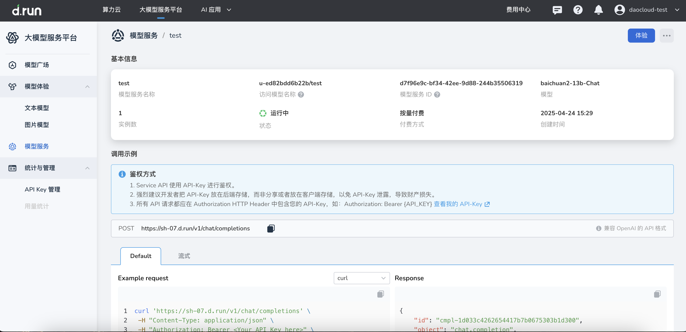
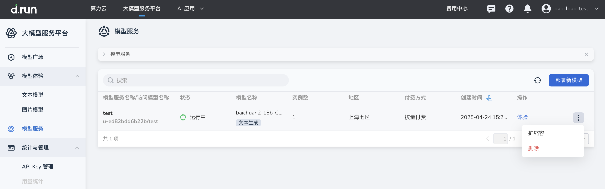
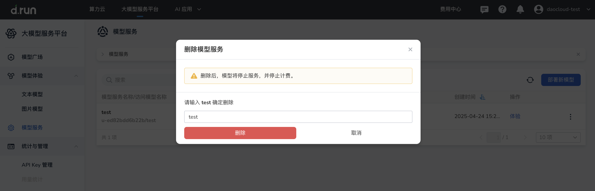
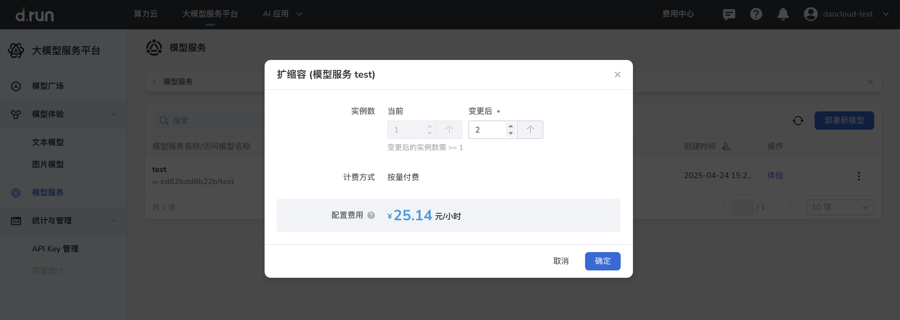

---
hide:
  - toc
---

# 管理模型服务

*[Hydra]: 大模型服务平台的开发代号

本文介绍如何查看与管理已部署的模型服务，包括服务详情、启停、扩缩容和删除等操作。

## 查看模型服务列表

1. 进入大模型服务平台，在左侧导航栏点击 **模型服务**。
2. 在模型服务列表中可查看服务状态、实例数、部署位置等信息。
3. 点击目标服务名称（服务需处于运行中），进入服务详情页面。

## 查看服务详情

在服务详情页面，可查看：

- 服务基本信息（名称、状态、部署位置、访问地址等）。
- API 调用信息与鉴权方式。
- 部署配置（资源配置、运行配置、调度配置）。

## 启动与停止服务

1. 在模型服务列表中，点击目标服务右侧 **┇** 菜单。
2. 选择 **启动服务** 或 **停止服务**。
3. 操作完成后，在列表中查看服务状态变化。

## 模型服务扩缩容

如果在模型使用过程中发现资源不足或出现卡顿现象，可对模型服务扩缩容。

1. 在模型服务列表中，点击目标服务右侧 **┇** 菜单，选择 **扩缩容**。

    

2. 输入目标实例数后，点击 **确定**。

    

## 删除模型服务

1. 在模型服务列表中，点击目标服务右侧 **┇** 菜单，选择 **删除**。
2. 输入要删除的模型服务名称并确认删除。

    

!!! note

    删除后不可恢复，请谨慎操作。

## 服务调用说明

- 访问鉴权：服务 API 使用 API Key 鉴权，请在请求头中携带 `Authorization: Bearer {API_KEY}`。
- 获取 API Key：参考[API Key 管理](../apikey.md)。
- API 调用示例：参考[模型调用](../api-call.md)。

## 相关操作

- 部署新的模型服务：参考[部署新模型](./deploy.md)。
- 配置自定义模型元数据、模板与权重：参考[创建模型](../model-management/index.md)。