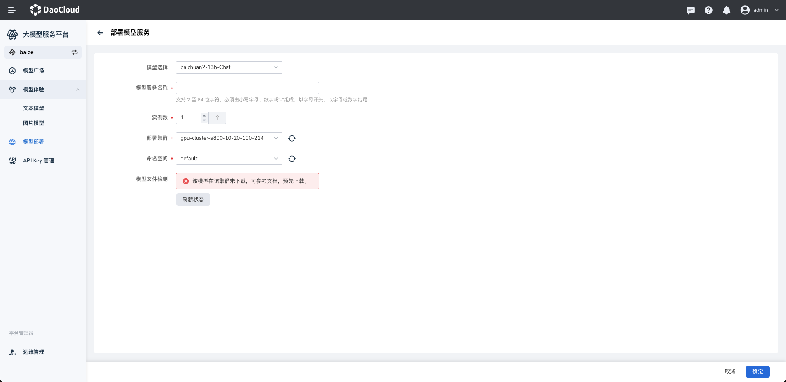
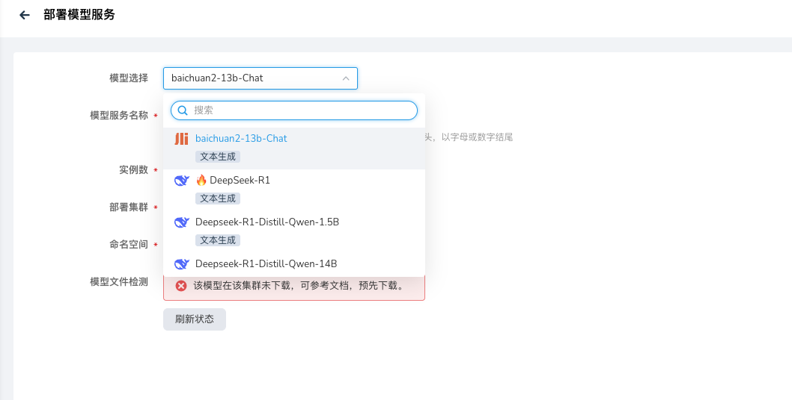

---
hide:
  - toc
---

# 部署新模型

*[Hydra]: 大模型服务平台的开发代号

可以从[模型广场](./index.md)或者[模型部署](./deploy.md)中进行模型部署。各个参数说明如下：

- 选择需要部署的模型（如 DeepSeek-R1），可通过 下拉菜单 快速选择符合您业务需求和任务场景的模型。

    

- 模型服务名称，需满足以下要求

    - 长度限制：2 - 64 个字符
    - 字符限制：仅支持小写字母、数字、短横线（-），且必须以小写字母或数字开头和结尾
    - 示例：text-gen-service 或 model-01

- 区域

    - 选择服务部署的区域（如“上海七区”）
    - 区域选择需根据业务覆盖范围和延迟要求进行选择

- 实例数

    - 配置需要部署的实例数量。默认值：1
    - 实例说明：实例数量越多，服务的并发能力越强，但成本也会相应增加

- 计费方式。Hydra 提供两种计费模式：

    1. 按量付费：

        - 实时按使用量计费，适合短期使用或动态需求的用户
        - 费用公式：实例数 × 每小时费用
        - 示例：1 实例 × 12.57 元/小时 = 12.57 元/小时

    2. 包年包月（暂不支持）：
    
        - 提前购买服务实例，价格相对优惠，适合长期使用的用户
        - 选择此模式后，系统会提示对应的年费或月费价格

- 查看配置费用

    - 页面底部会自动显示配置费用的计算公式及预计费用
    - 示例：

        - 配置费用：12.57 元/小时
        - 计算公式：1（实例数） × 12.57 元/小时
