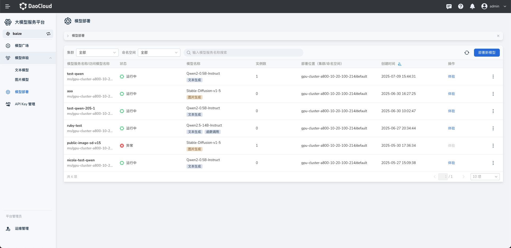
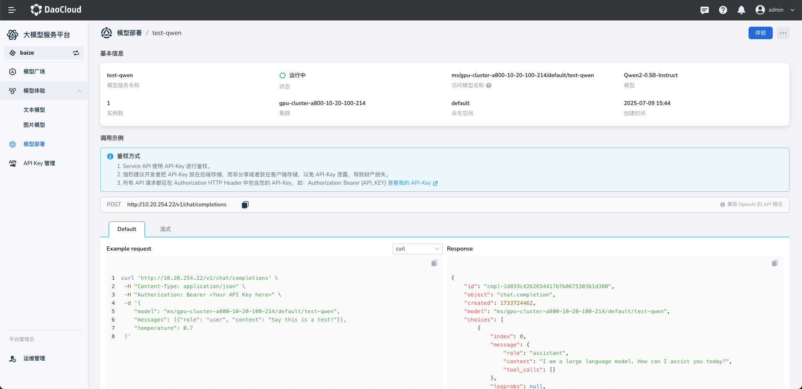
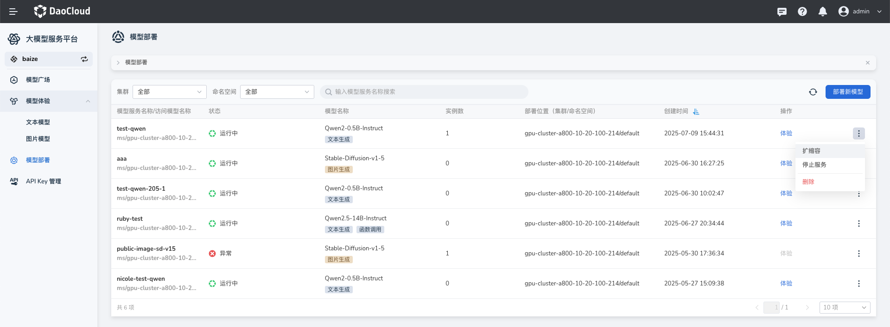
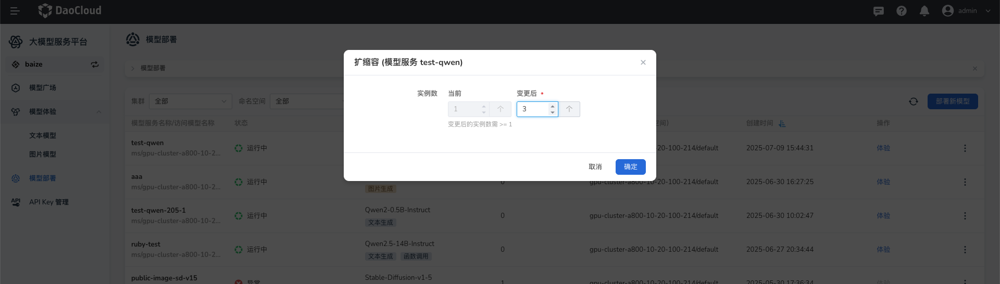
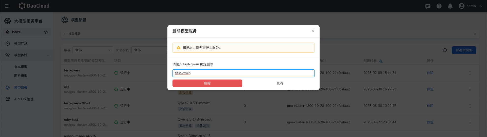

# 模型部署

模型服务是一项将开源或微调后的大语言模型快速部署为可调用服务的解决方案。
通过一键部署，将复杂的模型管理简化为标准化的服务形式，适配主流模型服务的 API 调用能力，满足即开即用的需求。

- 模型服务允许用户调用所选模型执行任务，如文本生成、图像理解、图像生成。
- 支持模型在线体验。



点击模型服务名称，即可进入该服务详情页面。  
模型服务详情中包含了该服务的基本信息、授权方式以及调用示例。



## 基本信息

- 模型服务名称：当前服务的名称，用于标识该模型服务
- 访问模型名称：每个模型服务都有唯一的路径名称，用于调用模型服务
- 模型服务ID：用于账单查询
- 模型：当前服务使用的基座模型
- 实例数：该服务使用实例数
- 状态：当前服务的状态
- 付费方式：当前服务的计费方式

## 鉴权方式

- API-Key 授权：

    - 所有 API 请求均需要在 HTTP Header 中添加 Authorization 字段，用于验证身份
    - 格式：Authorization: Bearer {API_KEY}
    - 您可以通过页面中的“查看我的 API-Key”链接获取密钥

- 安全建议：将 API-Key 存储在后端服务器，避免将密钥暴露在客户端代码中，防止泄露

## 调用 API 示例

- 请求地址：POST 请求地址为 `https://sh-02.d.run/v1/chat/completions`

### 请求示例：使用 curl 调用 API

```shell
curl 'https://sh-02.d.run/v1/chat/completions' \
  -H "Content-Type: application/json" \
  -H "Authorization: Bearer <Your API Key here>" \
  -d '{
    "model": "u-8105f7322477/test",
    "messages": [{"role": "user", "content": "Say this is a test!"}],
    "temperature": 0.7
  }'
```

参数说明：

- model：模型服务的访问路径名称（如 u-8105f7322477/test）。
- messages：对话历史列表，包含用户输入，例如：

    ```json
    [{"role": "user", "content": "Say this is a test!"}]
    ```

- temperature：控制生成结果的随机性，值越高生成越有创意，值越低生成越稳定。

### 响应示例

```json
{
  "id": "cmp-1d033c426254417b7b0675303b1d300",
  "object": "chat.completion",
  "created": 1733724462,
  "model": "u-8105f7322477/test",
  "choices": [
    {
      "index": 0,
      "message": {
        "role": "assistant",
        "content": "I am a large language model. How can I assist you today?"
      },
      "tool_calls": []
    }
  ],
  "usage": {
    "prompt_tokens": 25,
    "completion_tokens": 15,
    "total_tokens": 40
  }
}
```

响应字段说明：

- id：生成结果的唯一标识符。
- model：所调用的模型服务 ID。
- choices：模型生成的结果数组。
    - message：生成的内容。
    - content：模型生成的文本内容。
- usage：本次调用的 Token 使用情况：
    - prompt_tokens：用户输入的 Token 数量。
    - completion_tokens：生成结果的 Token 数量。
    - total_tokens：总使用量。

- 集成开发示例

### Python 示例代码

```python
# Compatible with OpenAI Python library v1.0.0 and above

from openai import OpenAI

client = OpenAI(
    base_url="https://sh-02.d.run/v1/",
    api_key="<Your API Key here>"
)

messages = [
    {"role": "user", "content": "hello!"},
    {"role": "user", "content": "Say this is test?"}
]

response = client.chat.completions.create(
    model="u-8105f7322477/test",
    messages=messages
)

content = response.choices[0].message.content

print(content)
```

### node.js 示例代码

```js
const OpenAI = require('openai');

const openai = new OpenAI({
  baseURL: 'https://sh-02.d.run/v1',
  apiKey: '<Your API Key here>',
});

async function getData() {
  try {
    const chatCompletion = await openai.chat.completions.create({
      model: 'u-8105f7322477/test',
      messages: [
        { role: 'user', content: 'hello!' },
        { role: 'user', content: 'how are you?' },
      ],
    });

    console.log(chatCompletion.choices[0].message.content);
  } catch (error) {
    if (error instanceof OpenAI.APIError) {
      console.error('API Error:', error.status, error.message);
      console.error('Error details:', error.error);
    } else {
      console.error('Unexpected error:', error);
    }
  }
}

getData();
```

## 扩缩容

如果在模型使用过程中，发现资源不足或出现卡顿现象，可以对模型扩容。

在模型服务列表中，点击右侧的 **┇** ，在弹出菜单中选择 **扩缩容**。



输入要增加的实例数，比如 2 个后，点击确定。



## 删除

1. 在模型服务列表中，点击右侧的 **┇** ，在弹出菜单中选择 **删除**
1. 输入要删除的模型服务名称，确认无误后点击 **删除**

    

!!! caution

    删除后，模型将停止服务，并停止计费。
