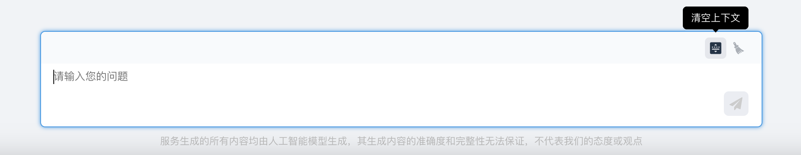
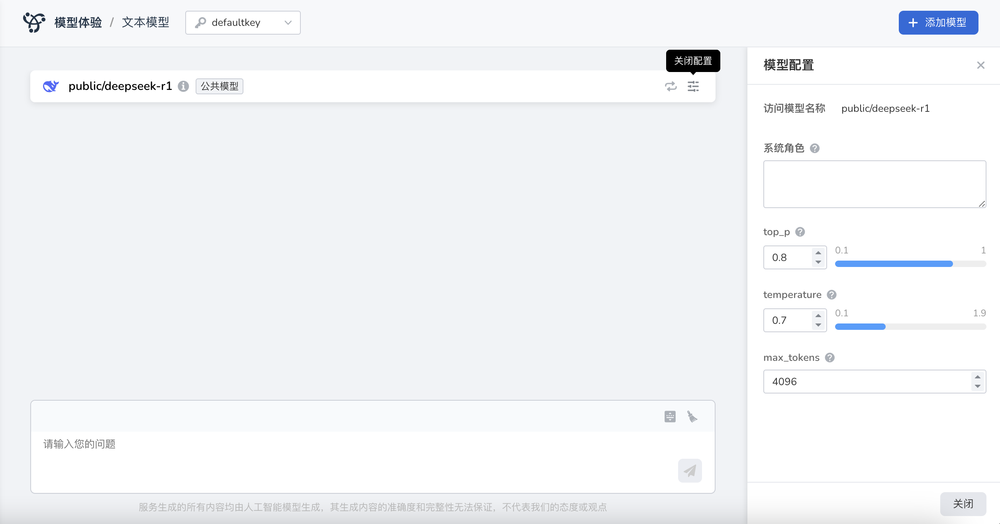

# 模型体验

*[Hydra]: 大模型服务平台的开发代号

Hydra 大部分模型不仅支持用户查看说明信息，还提供模型推理体验功能。
例如，您可以通过与大语言模型进行日常对话，直观感受其能力。

## 体验入口

平台提供了两种便捷的体验入口，您可根据需求灵活选择：

- **入口一** ：在[模型广场](./index.md)页面，选择喜欢的模型，点击 **体验** ，即可进入对应的体验页面。
- **入口二** ：通过左侧菜单栏，点击 **模型体验** ，选择模型类型后即可开启模型体验流程。目前可选 **文本模型** 和 **图片模型** 两种类型的模型体验。

## 体验说明

首次进入 **体验中心** 页面时，系统会推荐目前比较火爆的优质模型供您选择。您可以：

- 点击推荐的模型，直接体验大语言模型的对话功能；
- 或从 **公共模型** 列表中挑选其他感兴趣的模型进行体验；
- 如果你已经部署了自己的大模型，也可以从 **模型服务** 列表中挑选已经部署的模型进行体验。  

## 模型类型

### 文本模型类型

体验中心支持使用预置的对话类模型，也支持选择您自己创建的服务，另外在线体验的模型可以选择 多 个。

### 图片模型类型

体验中心支持使用预置的图像生成模型 Hidream-l1-Dev，也支持选择您自己创建的服务，另外在线体验的模型暂时支持 1 个。

### 完成一次完整的对话

完成一次对话，只需三步：

1. 首次进入，选择一个 API Key，如果没有，可以授权平台自动创建。
1. 需先选择模型：在列表中选择您要体验的模型，点击模型进行体验。您已添加模型，可跳过此步骤，直接体验感兴趣的模型。
1. 如果您对模型的回答不满意，还可以点击 **刷新** 重新生成答案。您还可以点击 **复制** ，复制模型生成的内容。

此外，对话底部还展示了此轮回答调用 token 数的信息，您可以比较模型的性能。

## 对话的更多功能

您可以点击文本对话框中右上角 **清除上下文** ，结束此轮对话，并清空上下文关系，下方对话将不受上方内容影响。

## 模型对比

点击页面右上角的 **添加模型** ，文本生成类型的模型可以最多支持 3 个模型对比。

## 模型切换

在顶部的模型信息栏，点击右侧的 **切换模型** 按钮，可以切换至其他模型。

## 模型参数设置

平台向用户展示了模型的若干可调参数，不同的参数设置会影响模型生成的回答，您可以根据自己的需求进行设置。  
在顶部的模型信息栏，点击右侧的 **模型配置** ，可以调整模型的参数。

每个参数名后面紧跟着 **?** ，将鼠标悬浮在上面，即可展示该参数的详细说明，帮助您理解该参数。

| 参数名 | 参数说明 |
| ----- | ------- |
| System | 系统角色：定义模型的行为准则和背景信息，明确模型需要承担的职责和所扮演的角色。例如“你是一个 AI 助手”。 |
| Temperature | 值越高，输出结果越随机多样；值越低，输出会更加集中且确定。建议仅设置此参数或 top_p 参数中的一个。 |
| TopP | 控制输出文本的多样性，值越大，生成的文本越丰富多样。建议该参数和 Temperature 只设置 1 个。 |
| Max_tokens | 模型可以生成的最大 Token 数，如设置为 0，则表示不限制。普通聊天建议：500-800；短文生成建议：800-2000；代码生成建议：2000-3600；长文生成建议超过 4000。 |
| * | 必须填写内容 |
| 负向 Prompt | 描述你不希望包含在图像中的内容字数限制。 |
| Guidance scale | 决定了文本描述对生成图像的影响力度。较高的数值会使生成的图像更贴近文本描述的内容，而较低的数值则允许图像在保持文本核心要素的同时，展现出更多的创造性和变化。 |
