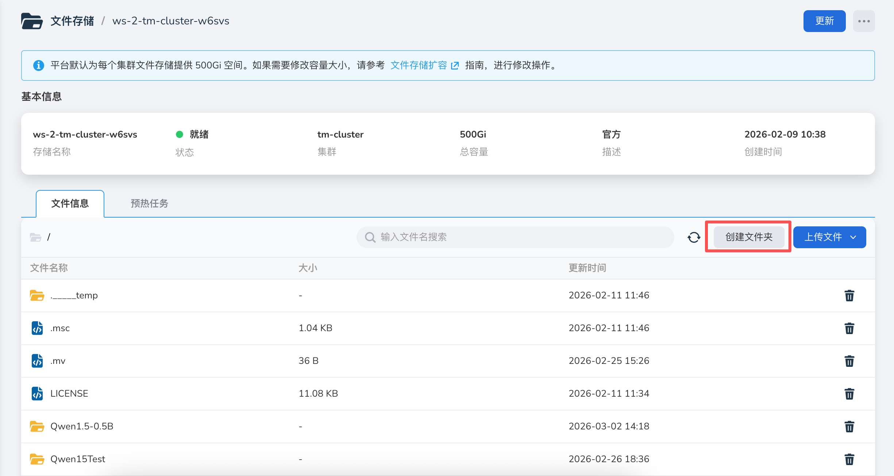
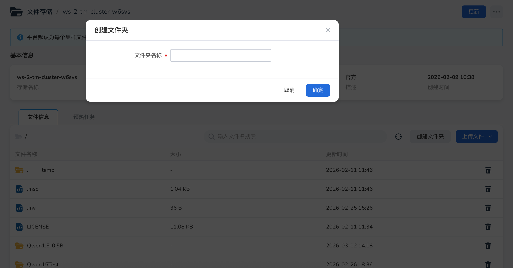
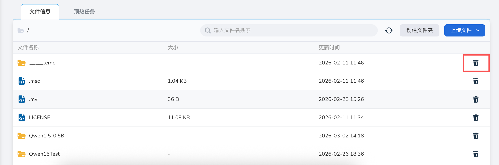
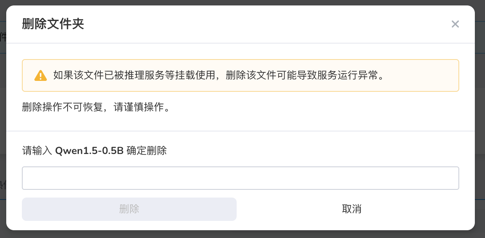

# 管理文件

本文介绍如何管理文件存储中的文件，包括文件夹创建、文件删除等操作。

## 创建文件夹

1. 在文件存储详情页面，选择 **文件信息** tab，点击右上角 **创建文件夹** 按钮。

    

2. 在创建文件夹弹框中，填写文件夹名称，点击 **确定**，即创建文件夹成功，返回到文件存储详情页面。

    

    !!! note

        为了避免文件管理混乱，建议一个模型或者数据集对应一个文件夹。

## 上传文件

平台支持两种方式上传文件到文件存储。

a. 通过 SFTP 工具上传本地文件，操作步骤请参考文件存储详情界面中的上传说明。
b. 通过预热任务加载 Git 仓库、S3 对象存储、HTTP 文件、HuggingFace、ModelScope 等远端文件，操作步骤请参考 [远端文件预热](./file-preheat.md)。

## 删除文件

1. 在文件存储详情页面，选择 **文件信息** tab，点击目标文件或文件夹右侧的 **┇** 菜单，选择 **删除**。

    

2. 在删除文件页面，点击 **确定**，即删除文件成功，返回到文件存储详情页面。

    

    !!! note

        如果该文件已被推理服务等挂载使用，删除该文件可能导致服务运行异常，请谨慎操作。