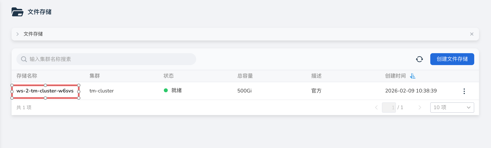
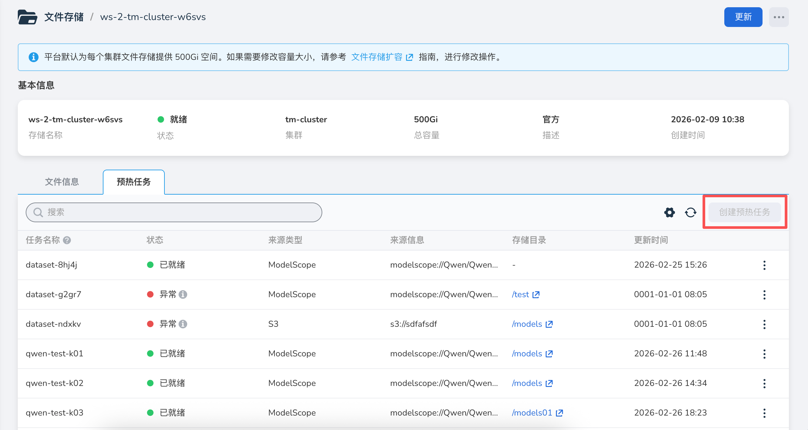
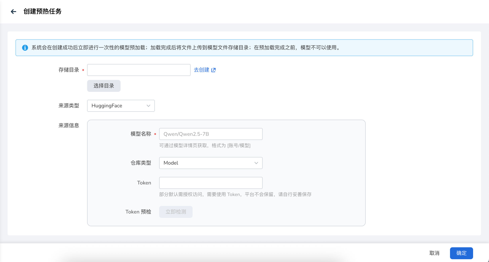
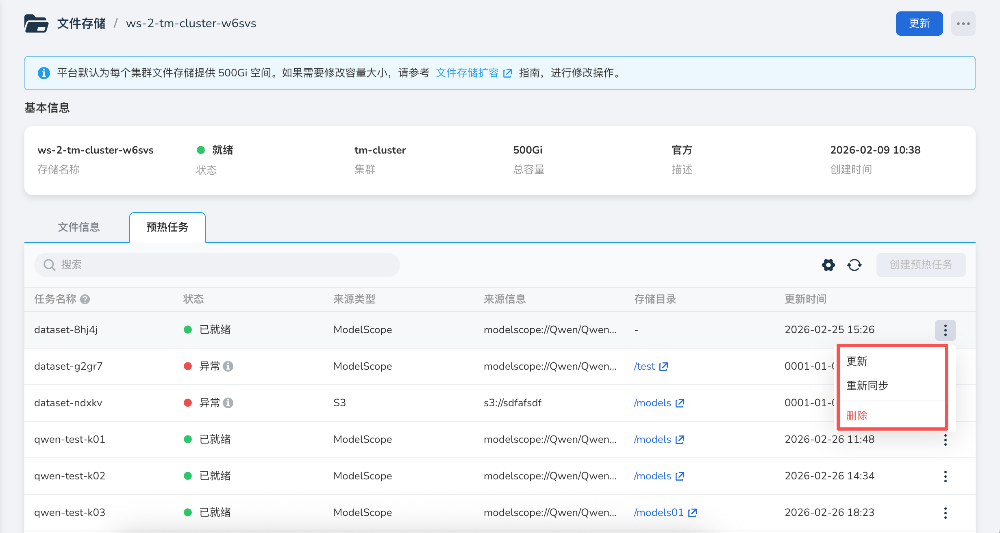

# 远端文件预热

远端文件预热功能用于将远端文件预热到集群环境，以提高模型部署运行效率。

## 前提条件

- 集群文件存储已创建成功，创建步骤请参考 [创建文件存储](./storage.md)。
- 集群已安装预热任务依赖组件 Dataset，安装流程请参考 [安装 Helm 应用](../../kpanda/user-guide/helm/helm-app.md)。

## 操作步骤

1. 进入大模型服务平台，选择左侧导航栏菜单 **文件存储**，在文件存储列表中，单击 **目标文件存储名称**，进入文件存储详情页面。

    

2. 在文件存储详情页面，选择 **预热任务** tab，点击右上角 **创建预热任务** 按钮。

    

3. 在创建预热任务页面，选择文件存储目录、来源类型，填写来源信息，点击 **确定**，即创建预热任务成功，返回到文件存储详情页面。

    

    | 参数项 |约束 / 说明 |  备注 |
    |---|---|---|
    | 文件存储目录 | 选择需要预热的文件存储目录 | 点击 “去创建” 按钮，可以跳转到文件信息 tab 页面，创建文件存储目录|
    | 来源类型 | 选择文件来源类型 | 平台支持 GIT、S3、HTTP、HuggingFace、ModelScope 五种来源类型|
    | 来源信息 | 填写文件来源信息 | 根据来源类型填写 |

4. 执行更多操作。

    - 更新：在预热任务列表中，点击目标预热任务右侧的 **┇** 菜单，选择 **更新**，更新任务参数信息后重新运行预热任务。
    - 重新同步：在预热任务列表中，点击目标预热任务右侧的 **┇** 菜单，选择 **重新同步**，重新同步远端文件。
    - 删除：在预热任务列表中，点击目标预热任务右侧的 **┇** 菜单，选择 **删除**，删除任务不影响已经预热到文件存储中的文件。

    