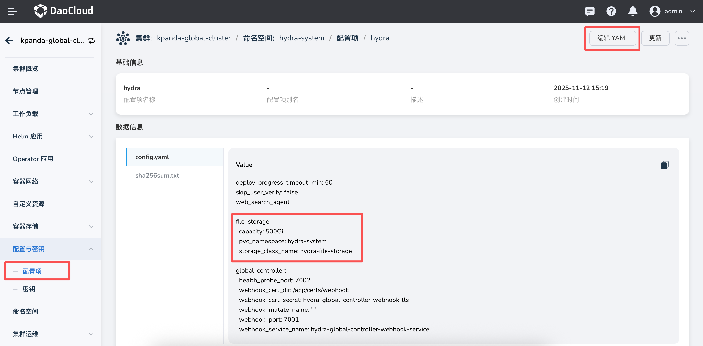
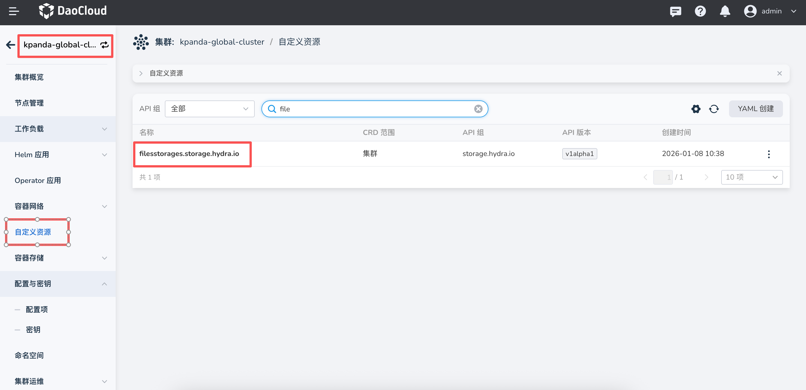
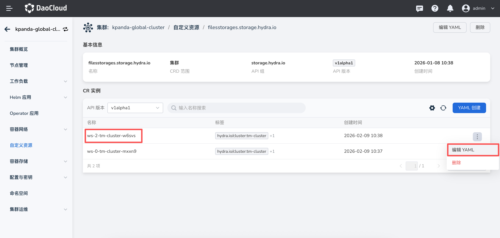
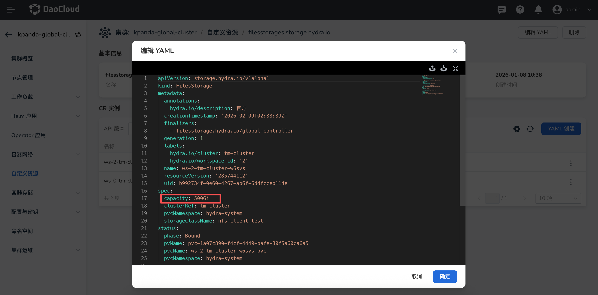

# 文件存储扩容

平台默认为每个集群文件存储提供 500Gi 空间。本文介绍如何对文件存储的存储容量进行扩容。

!!! note

    K8s 中的 “存储容量” 是一个逻辑单位，并非物理单位，它在 K8s 中只用于申请大于指定容量的 PV，文件存储扩容需要 StorageClass 对应的 CSI 插件和底层存储支持。

## 默认存储容量扩容

平台提供两种方式修改默认存储容量。

!!! note

    以下修改方式仅对新创建的文件存储生效，对于已创建的文件存储，请参考下个章节“已创建文件存储扩容”介绍。

方式一：安装 Global 组件时，修改 manifests.yaml 文件中 hydra 的产品设置 values.yaml

    ```yaml
    hydra:
      ...
      variables:
        # 存储服务对应PVC动态创建PV所用到的 StorageClass
        global.config.file_storage.storage_class_name: hydra-file-storage
        # 存储服务对应PVC创建所在的命名空间
        global.config.file_storage.pvc_namespace: hydra-system
        # 存储服务对应PVC创建时申请的存储容量
        global.config.file_storage.capacity: 500Gi
    ```

方式二：如果产品已安装，可以前往 **全局服务集群** -> **配置项与密钥** -> **配置项**，找到 **hydra-system** 命名空间下的 ConfigMap 配置文件 **hydra**，配置定义与上述方式一字段一致

    ```yaml
    file_storage:
      storage_class_name: "hydra-file-storage"
      pvc_namespace: "hydra-system"
      capacity: "500Gi"
    ```

    

## 已创建文件存储扩容

对于已创建的文件存储，如果需要进行扩容操作，请参考下述步骤。

!!! note

    对于是否支持在线扩容（Pod 已挂载并在运行中），需要看底层存储是否支持，否则需要 Pod 停止后才能进行扩容操作。

1. 进入 **容器管理** -> **全局服务集群详情** -> **自定义资源**，找到 **filesstorages.storage.hydra.io** 资源。

    

2. 点击自定义资源名称，进入详情页，根据 **workspace ID** 和 **集群名称**，找到 目标集群 CR 实例，点击 **编辑 YAML** 操作。

    CR 实例名称规则：ws-{工作空间 ID}-{集群名称}-{随即串}

    

3. 在 yaml 文件中，修改 **spec.capacity** 参数即可完成存储容量扩容。

    

