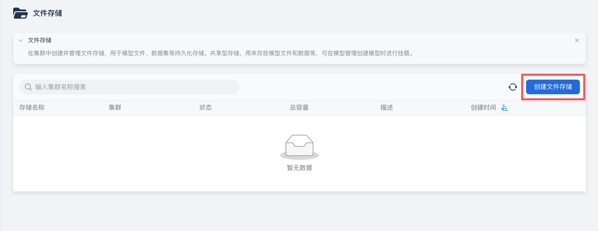
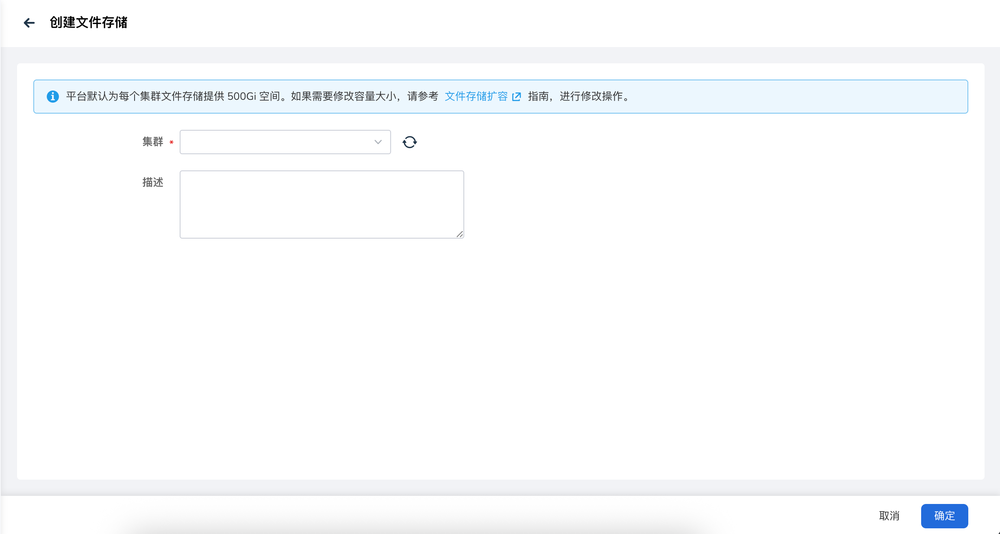
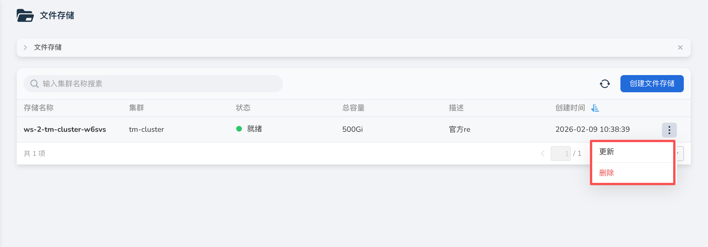

# 创建文件存储

文件存储主要用于存储模型文件、数据集等文件资源。用户可以很方便地将本地文件或远端文件预热到集群环境，以提高模型部署运行效率。
运维管理视图文件存储和普通用户视图文件存储的管理是分开的，但是其管理逻辑相同，相关操作均可参考。

!!! note

    平台默认为每个集群文件存储提供 500Gi 空间。如果需要修改容量大小，请参考 [文件存储扩容](./file-scale.md) 指南，进行修改操作。

## 操作步骤

1. 进入大模型服务平台，选择左侧导航栏菜单 **文件存储**，点击页面右上角的 **创建文件存储** 按钮。

    

2. 在创建页面，选择集群并填写描述信息，点击 **确定**，即创建文件存储成功，返回到文件存储列表。

    

3. 执行更多操作。

    - 更新：在文件存储列表中，点击目标文件存储右侧的 **┇** 菜单，选择 **更新** 。
    - 删除：在文件存储列表中，点击目标文件存储右侧的 **┇** 菜单，选择 **删除**，删除后不可恢复，请谨慎操作。

     