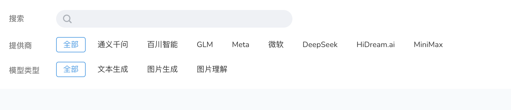
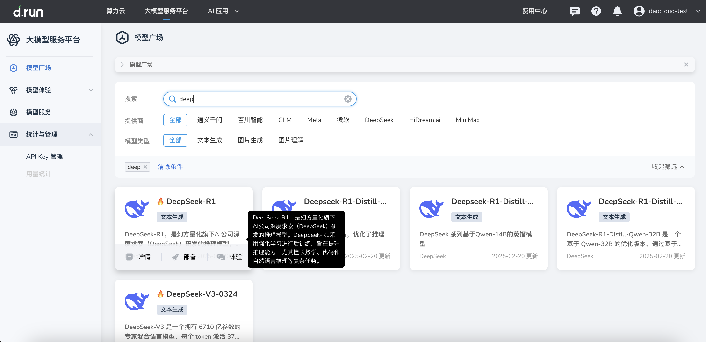
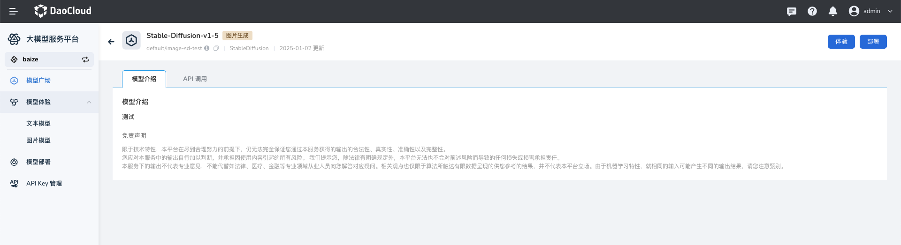
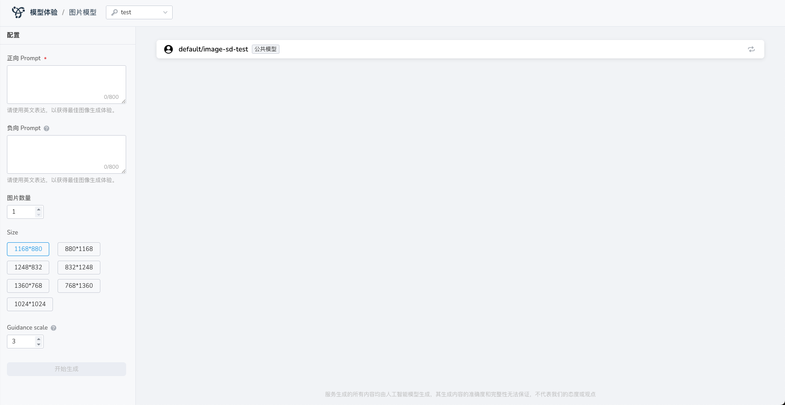

---
hide:
  - toc
---

# 模型广场

*[Hydra]: 大模型服务平台的开发代号

Hydra 模型广场提供多样化的模型选择，涵盖文本生成、图像生成、图片理解等领域，
系统预置了通义千问、Meta、DeepSeek 等主流提供商提供的各类大语言模型。
用户可根据业务需求灵活部署。

## 筛选模型

通过模型广场的标签，可以快速检索模型列表，支持标签多选，也可以随时清空筛选条件。

- 支持的筛选标签有：
    - 提供商：如通义千问、百川智能、GLM、Meta等
    - 模型类型：如文本生成、图片生成、图片理解等
- 也可以输入关键词快速定位某一种模型

## 模型详情

光标悬浮到某个模型卡介绍字段上，即可在右侧黑色框中显示完整模型的概况。

悬浮在模型卡片上，点击 **详情** 图标，可以查看模型介绍。

## 体验模型

在模型卡片上，点击 **体验** 图标，即可使用默认的语料库，开始体验 AI 对话。

也可以从 **模型体验** 页面体验模型。参见[各项说明](./exp.md)。

## 部署模型

可以从 **模型广场** 或者 **模型服务** 页面轻松模型部署。参见[各项参数说明](./deploy/deploy.md)。
