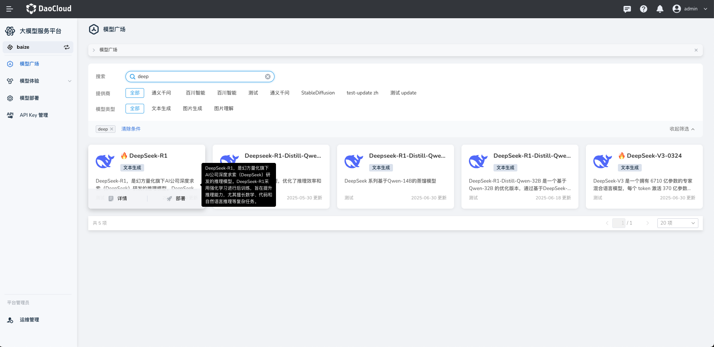

---
hide:
  - toc
---

# 模型广场

*[Hydra]: 大模型服务平台的开发代号

大模型服务平台的模型广场提供了多样化的模型选择，涵盖文本生成、图像生成、图片理解等领域，
系统预置了通义千问、Meta、DeepSeek 等主流提供商提供的各类大语言模型。
用户可根据业务需求灵活部署。

## 筛选模型

通过模型广场的标签，可以快速检索模型列表，支持标签多选，也可以随时清空筛选条件。

- 支持的筛选标签有：
    - 提供商：如通义千问、百川智能、GLM、Meta等
    - 模型类型：如文本生成、图片生成、图片理解等
- 也可以输入关键词快速搜索定位某一种模型

## 模型详情

光标悬浮到某个模型卡片的介绍字段上，会在右侧黑色框中显示完整的模型概况信息。

光标悬浮在模型卡片上，会出现 **部署** 和 **详情** 图标，点击 **详情** 可以查看模型的详细介绍。

## 体验模型

对于已经部署的模型，光标悬浮到模型卡片上，会出现 **体验** 图标。点击此图标可以使用默认的语料库，开始体验 AI 对话。

当然你可以点击左侧导航栏的 **模型体验** ，进入文本或图片模型的体验页面。参见[各项体验说明](./exp.md)。

## 部署模型

在模型卡片上，点击 **部署** 图标可以开始模型的部署。

你也可以点击左侧导航栏的 **模型部署** ，进入模型部署页面来部署模型。参见[各项部署参数说明](./deploy/deploy.md)。
