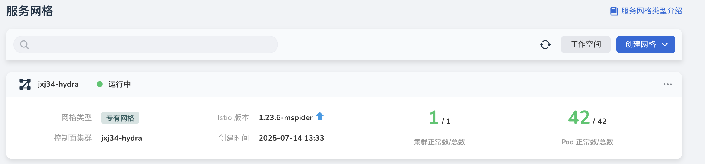
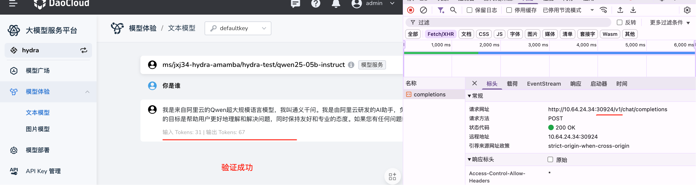

# 部署大模型服务平台（WS 模式）

*[Hydra]: 大模型服务平台的开发代号
*[Mspider]: 服务网格的开发代号

本文说明如何部署私有化 WS（Workspace）模式的大模型服务平台 Hydra，支持无卡进行推理。

## 全局服务集群

在[全局服务集群](../../kpanda/user-guide/clusters/cluster-role.md#_2)中，需要安装：

- Hydra：手动安装或通过安装器安装
- [服务网格](../../mspider/install/install.md)（依赖 Istio 创建网关进行路由）
- [MySQL](../../middleware/mysql/intro/offline-install.md)
- [Redis](../../middleware/redis/intro/offline-install.md)

!!! tip

    - 全局服务集群默认安装了通用的 MySQL 和 Redis。
    - 如果通过安装器安装 Hydra，则默认使用通用的 MySQL 和 Redis。
    - 如果手动安装 Hydra，需要在安装参数中指定 MySQL 和 Redis。

安装好的效果如下图：


## 工作集群

工作集群需要安装 Hydra Agent 和 metallb。

### 安装 Hydra Agent

1. 创建工作集群，用来部署 Hydra Agent（资源紧张时，也可以直接使用全局服务集群）

    

2. 在工作集群部署 Hydra Agent

    需要注意以下参数：

    ```yaml
    global:
      config:
        cluster_name: 'jxj31-mspider'
        agent_base_url: 'http:/cn-sh-a1' # 需要工作集群可访问的网关地址
        agent_server:
          address: example.com:443 # 全局服务集群 dce 地址
          plaintext: false
          insecure: true # 如果是测试环境，可以将其内置为 true，不走证书
    ```

    

    

3. 在工作集群部署 metallb（用于访问模型的路由），分配 LB

    

### 创建服务网格（Istio + Gateway API）

1. 在工作集群创建专有网格（创建网格时，参数全部默认即可）

    注意：托管网格当前不支持 gateway api。

    

1. 初始化 Gateway API CRD

    ```shell
    root@controller-node-1:~# kubectl kustomize "github.com/kubernetes-sigs/gateway-api/config/crd?ref=v1.2.1" | kubectl apply -f -;

    customresourcedefinition.apiextensions.k8s.io/gatewayclasses.gateway.networking.k8s.io created
    customresourcedefinition.apiextensions.k8s.io/gateways.gateway.networking.k8s.io created
    customresourcedefinition.apiextensions.k8s.io/grpcroutes.gateway.networking.k8s.io created
    customresourcedefinition.apiextensions.k8s.io/httproutes.gateway.networking.k8s.io created
    customresourcedefinition.apiextensions.k8s.io/referencegrants.gateway.networking.k8s.io created
    ```

1. 创建网关，路由规则

    ```shell
    root@controller-node-1:~# cat gateway.yaml
    ```
    ```yaml
    apiVersion: gateway.networking.k8s.io/v1
    kind: Gateway
    metadata:
      name: gateway
      namespace: default 
    spec:
      gatewayClassName: istio
      listeners:
      - allowedRoutes:
          namespaces:
            from: All
        name: default
        port: 80
        protocol: HTTP
    - allowedRoutes:
          namespaces:
            from: All
        hostname: 'cn-sh-a1'
        name: https
        port: 443
        protocol: HTTPS
        tls:
          certificateRefs:
          - group: ""
            kind: Secret
            name: cn-sh-a1
        mode: Terminate
    ```

    ```shell
    root@controller-node-1:~# kubectl apply -f gateway.yaml

    gateway.gateway.networking.k8s.io/gateway created
    ```

    ```shell
    root@controller-node-1:~# kubectl get po

    NAME                             READY   STATUS    RESTARTS   AGE
    gateway-istio-5c497d4b6d-9xmqp   1/1     Running   0          14s
    root@controller-node-1:~# kubectl  get svc
    NAME            TYPE           CLUSTER-IP     EXTERNAL-IP    PORT(S)                                      AGE
    gateway-istio   LoadBalancer   10.233.1.140   10.64.24.211   15021:32565/TCP,80:32053/TCP,443:32137/TCP   45s
    ```

    ```shell
    root@controller-node-1:~# cat httproute.yaml
    ```
    ```yaml
    apiVersion: gateway.networking.k8s.io/v1
    kind: HTTPRoute
    metadata:
      labels:
        app.kubernetes.io/managed-by: Helm
      name: hydra-agent-knoway
      namespace: hydra-system
    spec:
      parentRefs:
      - group: gateway.networking.k8s.io
        kind: Gateway
        name: gateway
        namespace: default 
      rules:
      - backendRefs:
        - group: ""
          kind: Service
          name: knoway-gateway
          port: 8080
          weight: 1
        filters:
        - responseHeaderModifier:
            add:
            - name: Access-Control-Allow-Headers
              value: '*'
            - name: Access-Control-Allow-Methods
              value: '*'
          type: ResponseHeaderModifier
        matches:
        - path:
            type: PathPrefix
            value: /v1
    ```
    ```shell
    root@controller-node-1:~# kubectl apply -f httproute.yaml

    httproute.gateway.networking.k8s.io/hydra-agent-knoway created
    ```

1. 配置域名解析，域名映射到 Ingress 网关的 LB，工作集群和浏览器的电脑 /etc/hosts 追加域名映射：

    ```shell
    echo "10.64.xx.xx cn-sh-a1" | sudo tee -a /etc/hosts
    ```

设置本地电脑信任证书：


## 工作集群初始化

操作数据库插入厂商数据。
对于新版本的 Hydra，可以不用操作，因为后续 Hydra 可以自动创建厂商。

实现（只有批量上传支持）时使用 mcamel-system 的 mcamel-common-mysql-cluster-mysql 工作负载。


示例：

```json
{"enUS": "Alibaba", "zhCN": "通义千问"}
```

### Hydra 运维平台上架模型

配置模型部署参数（根据实际情况调整模型部署参数）


### 安装 nfs drive

下载模型实体时需要用到 nfs drive。

```shell
wget http://example.com/nfs-install.tar # 改成你的下载地址
tar xvf nfs-install.tar
./install.sh
```

## 工作集群模型预热

模型预热指的是提前下载模型镜像。

在 Hydra 和 AI Lab 同时存在时，会同时存在两个 dataset CRD。
注意需要使用 `dataset.baizeai.io`

```shell
root@controller-node-1:~# cat dataset-qwen3-06b.yaml
```
```yaml
apiVersion: dataset.baizeai.io/v1alpha1 # 这里应该是 AI Lab 组
kind: Dataset
metadata:
  name: qwen3-0.6b
  namespace: public # 必须 public 命名空间
  labels:
    hydra.io/model-id: qwen3-0.6b # 需要与模型名称一致
spec:
  dataSyncRound: 1
  share: true
  source:
    type: HTTP
    uri: http://example.com:81/model/qwen3-06b/ # 需要改成你的地址
    options:
      repoType: MODEL
  mountOptions:
    uid: 1000
    gid: 1000
    mode: "0774"
    path: /
  volumeClaimTemplate:
    spec:
      storageClassName: nfs-csi
```

```shell
root@jxj:~/hydra-deploy# kubectl create ns public

namespace/public created
```

```shell
root@jxj:~/hydra-deploy# kubectl apply -f dataset-qwen3-06b.yaml

dataset.dataset.baizeai.io/qwen3-0.6b created
```

## 体验模型


## 模型部署


如果是无卡的情况，需要注意：

1. 无 GPU 进行模型部署（无卡情况，部署模型会检测到没有 GPU，无法部署）

    

    所以部署 gpu-operator-fake（拉取外网镜像需要设置代理）：

    1. 配置 Node

        ```shell
        kubectl label node <node-name> run.ai/simulated-gpu-node-pool=default
        ```

    1. 安装 fake-gpu-operator

        对于离线安装，可以先下载离线包一键部署：

        

        对于在线安装，运行以下命令：

        ```shell
        helm upgrade -i gpu-operator oci://ghcr.io/run-ai/fake-gpu-operator/fake-gpu-operator --namespace gpu-operator --create-namespace --version=0.0.63
        ```

        部署完成后，等待数分钟，查看 Node 存在 GPU 标签，刷新状态发现检测 GPU 通过。

        

        

1. 创建模型部署任务后修改部署参数：

    

    ```
    --dtype=half
    --device=cpu
    --max-model-len=8192
    release.daocloud.io/hydra/vllm-openai:0.8.5.dev940-cpu
    ```

1. 使用 CPU 推理时模型 Qwen3 0.6b 占用 7g 左右内存，给的 CPU 决定 token 速度

    

    

    !!! tip

        对于测试环境的模型流量，直接走 knoway-gateway 网关。

1. 创建网关的 NodePort 类型 svc 服务

    

    

1. 访问 DCE 时只能走 HTTP 端口

    
