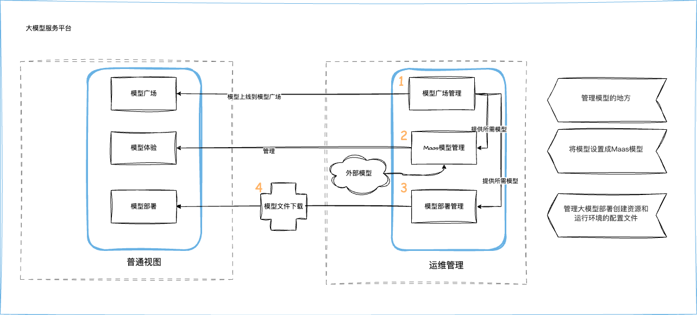

---
hide:
  - toc
---

# 什么是大模型服务平台

大模型服务平台是一个专为企业级用户打造的综合性人工智能模型服务管理平台，旨在解决企业在大模型应用过程中所面临的一系列核心挑战，
包括模型部署的复杂性、模型选择的困难性、运行稳定性不足以及潜在的安全风险等。通过提供从模型部署到运维管理的全生命周期服务，
该平台能够帮助企业和开发者高效地接入和使用各类大模型能力，从而加速企业数字化转型和智能化升级的进程。

**功能特性**

- 一键部署与简化运维

    - 图形化界面与 API 双支持：提供直观的 Web 界面和完整的 API 接口
    - 模型一键部署：支持主流大模型分钟级快速上线
    - 动态推理后端：支持 vLLM、SGLang 等多种推理引擎
    - 实时扩缩容：根据业务需求灵活调整实例数量
    - 多地域部署：支持按需选择部署地域，就近服务

- 流量治理与稳定性保障
    
    - 智能流量策略引擎：基于权重、QPS限制等多维度流量控制
    - 多层限流机制：
        - 全局限流：控制整体平台负载
        - API Key 限流：精细化管理不同应用访问频次
        - 租户级限流：企业级用户独立限流保障
 
- 分布式推理能力

    - 多机多卡部署：支持 DeepSeek、GLM 等超大参数模型
    - 异构 GPU 支持：兼容 NVIDIA、壁仞、沐曦、昇腾等多种GPU
    - 负载均衡策略：
        - 轮询策略：流量均匀分配
        - 随机策略：快速分散请求
        - 权重策略：基于权重分配策略

- 精准计费与统计

    - Token 精确计量：支持主流大模型的计费逻辑
    - 多维度统计：
        - 调用总量、输入/输出 Token 统计
        - 按 API Key、模型类型、时间维度筛选

- 多模态统一管理

    - 模型广场：提供文本、图像等各类模型的展示与介绍
    - 模型对比体验：一次输入，多模型同步响应对比
    - API 调用示例：提供丰富的 Demo 和接入文档

## 普通视图和运维管理使用逻辑

本平台通过“运维管理视图 + 普通用户视图”协同配合，实现模型的统一管理、试用体验和快速部署。如下图所示，模型的使用流程主要分为 **三个步骤 + 模型文件下载**

### 1️⃣ 模型广场管理：添加并上线模型

- **运维管理:** 
    - 在 **模型广场管理** 中导入或创建模型。
    - 模型上线后，自动同步到用户视图。
- **普通用户视图:** 
    - 在 **模型广场** 中可浏览已上线的模型，作为后续体验或部署的入口。

### 2️⃣ Maas 模型管理：配置模型试用服务

- **运维管理:** 
    - 将模型设置为 **MaaS模型**，配置其试用运行环境。
- **普通用户视图:** 
    - 在 **模型体验** 中选择配置好的模型进行在线试用，无需本地部署。

### 3️⃣ 模型部署管理：配置模型部署参数

- **运维管理:** 
    - 在 **模型部署管理** 中，为模型创建资源和环境的部署配置文件，如 GPU/内存/运行框架等。
- **普通用户视图:** 
    - 在 **模型部署** 页面中，选择模型快速完成部署。
    - 简化操作流程，无需手动填写复杂参数。
  
### 4️⃣ 模型文件下载：支持部署的底层基础

- 需由运维人员将模型文件下载到指定位置

## 审计功能

审计功能是大模型服务模块的核心组成部分，旨在提供全面的操作追踪与安全监控，以满足合规性、可追溯性和安全审计的需求。

审计功能通过记录关键操作事件，确保用户行为和系统变更可追溯。主要审计项包括：

- **模型管理:** 如创建、更新、删除模型（Model）、启用/禁用 MAAS 模型体验功能（EnabledMAASModel）、发布/下线模型（PublishModel/UnPublishModel）等。
- **部署模板管理:** 如添加、更新模型部署模板（AddDeployTemplates/UpdateDeployTemplates）。
- **模型提供商管理:** 如创建、更新、删除模型提供商（ModelProvider）。
- **工作空间 API 密钥管理:** 如创建、删除工作空间 API 密钥（CreateWSAPIKey/DeleteWSAPIKey）。
- **模型服务管理:** 如创建、删除工作空间模型服务（CreateWSModelServing/DeleteWSModelServing）、更新副本数（UpdateWSModelServingReplicas）、执行服务操作（DoModelWSServingAction）。

这些审计项涵盖了模型生命周期的各个方面，确保每个操作都有迹可循。
审计功能是保障大模型服务平台安全性、合规性和高效运营的关键工具。

有关审计项列表参见[大模型服务平台审计项](../../ghippo/user-guide/audit/gproduct-audit/hydra.md)。
