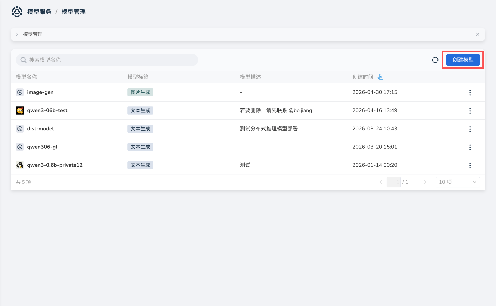
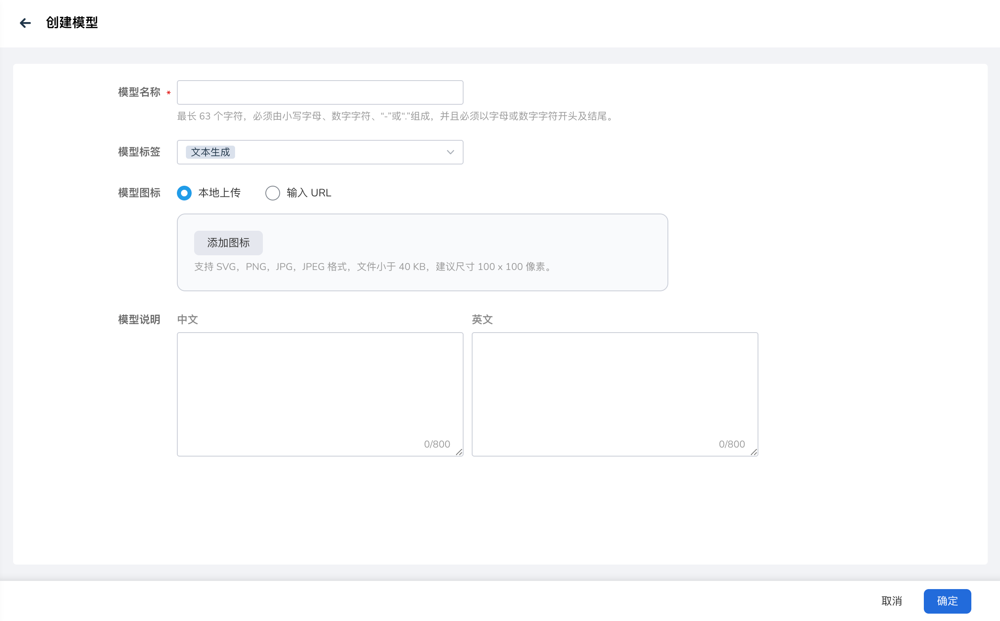
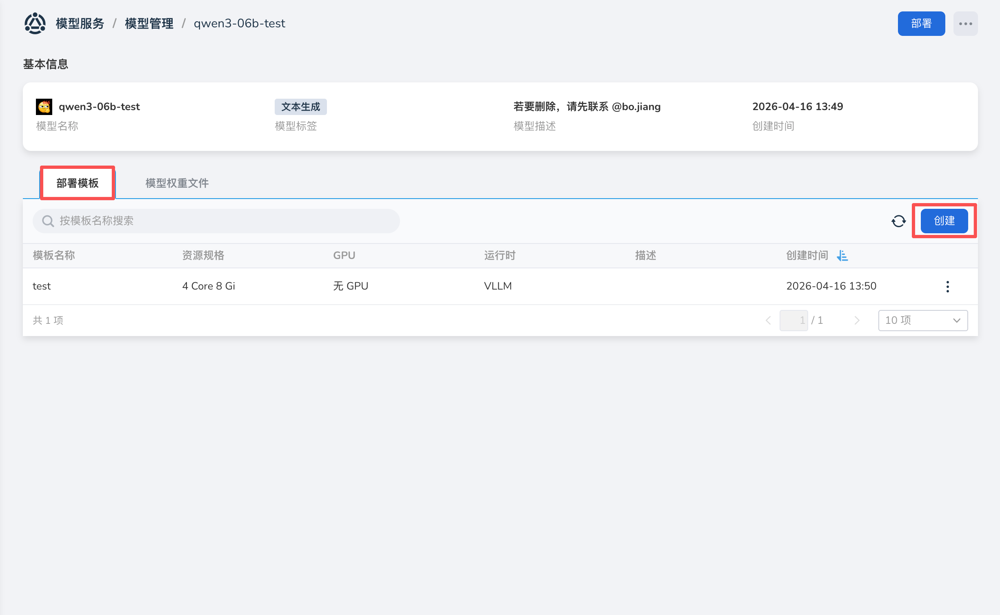
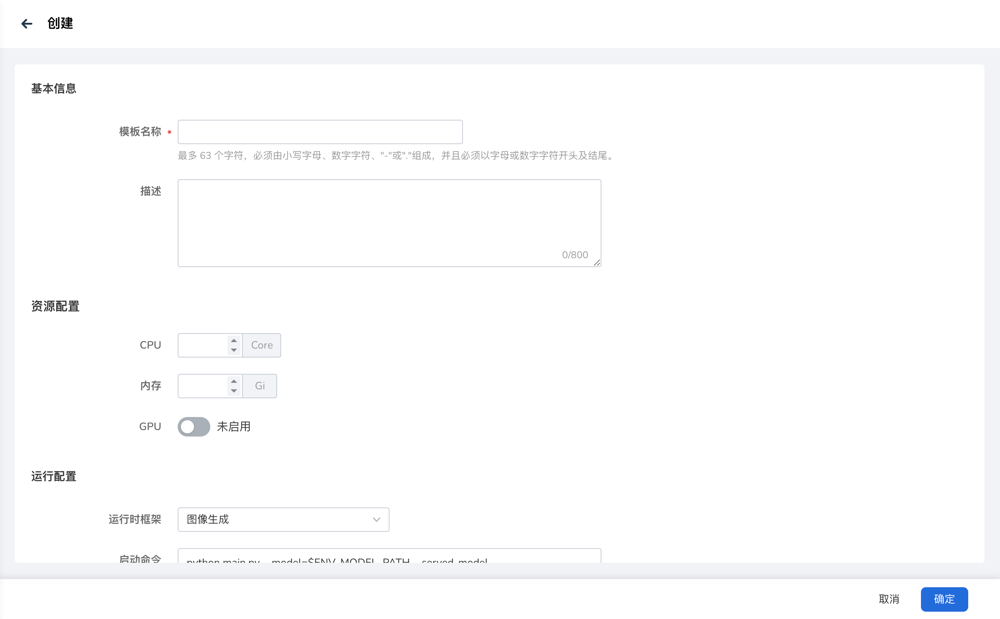
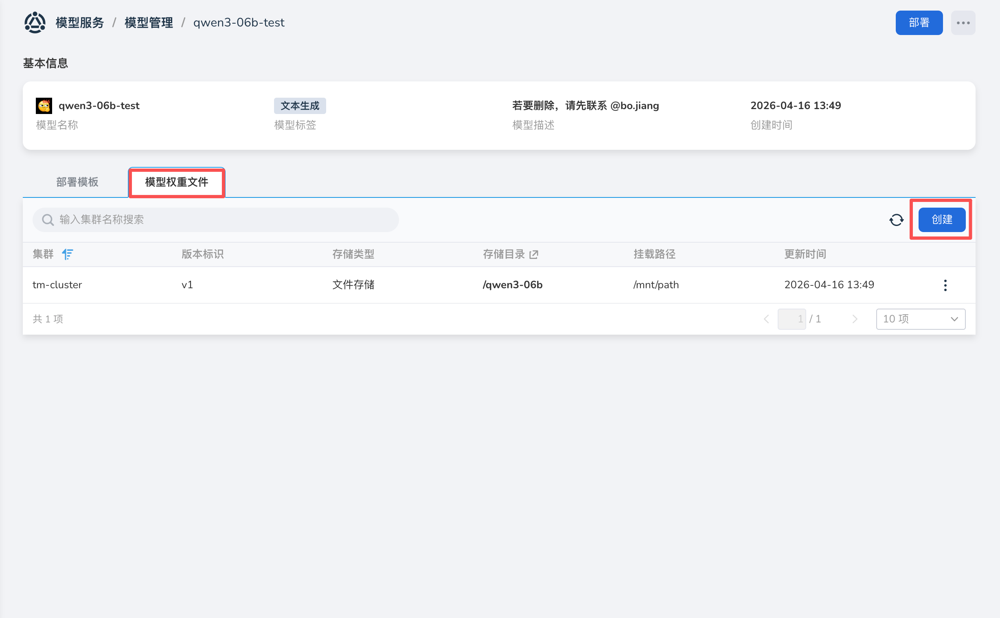
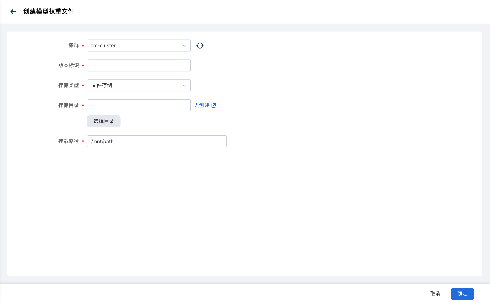

---
hide:
  - toc
---

# 创建模型

*[Hydra]: 大模型服务平台的开发代号

本文介绍如何在 **模型管理** 中创建自定义模型元数据，并在模型详情页管理部署模板和模型权重文件。

## 创建模型元数据

1. 进入大模型服务平台，在左侧导航栏展开 **模型服务**，点击 **模型管理**。

2. 在模型管理页面，点击 **创建模型**。

    

3. 在创建页面填写参数后，点击 **确定**，即创建模型成功。

    | 参数项 | 约束 / 说明 | 备注 |
    | --- | --- | --- |
    | 模型名称 | 必填 **长度**：最长 63 个字符 **字符**：仅支持小写字母、数字、短横线（-）或点（.） **规则**：必须以字母或数字开头和结尾 | |
    | 模型标签 | 必填，可多选 | 用于标识模型能力类型 |
    | 模型图标 | 可选 | 支持本地上传，或输入以 `https://` 开头的图片 URL；支持 SVG、PNG、JPG、JPEG 格式，文件小于 40 KB，建议尺寸 100 x 100 像素 |
    | 模型说明 | 可选 | 中文、英文各最多 800 字 |

    

## 管理部署模板

部署模板用于预置资源配置与运行配置。部署自定义模型时，可直接选用模板，减少重复填写。

### 创建部署模板

1. 在模型管理列表中点击目标模型名称，进入模型详情页面。

1. 选择 **部署模板** tab，在列表右上角点击 **创建**。

    

1. 依次填写 **基本信息**、**资源配置**、**运行配置** 后，点击 **确定**。

    | 参数项 | 约束 / 说明 | 备注 |
    | --- | --- | --- |
    | 模板名称 | 必填 **长度**：最多 63 个字符 **字符**：仅支持小写字母、数字、短横线（-）或点（.） **规则**：必须以字母或数字开头和结尾 | |
    | 描述 | 可选 | 最多 800 字 |
    | CPU / 内存 | 资源配置 | |
    | GPU | 可选 | 含 GPU 类型、物理卡数量、算力与显存 |
    | 运行时框架 | 选择推理运行时 | 切换框架时会自动带出默认启动命令 |
    | 启动命令 | 可按需修改 | |
    | 环境变量 | 可选 | 以键值对形式配置 |

    如需使用自定义推理运行时，请先在运维侧完成运行时配置，详见[自定义大模型推理运行时](../user-guides/custom-runtime.md)。

    

### 编辑与删除部署模板

1. 在 **部署模板** tab 中，点击目标模板右侧的 **┇** 菜单。

2. 选择 **编辑/删除** 按钮可修改/删除模板。

## 管理模型权重文件

模型权重文件用于将集群上的权重目录与容器内挂载路径关联到当前模型。部署自定义模型时，可根据此挂载路径找到对应权重文件。

### 创建模型权重文件

**前提条件**

- 目标集群需已安装 Hydra Agent，且已创建[文件存储](../file-storage/storage.md)。
- 权重文件需已上传到文件存储对应目录，或通过[远端文件预热](../file-storage/file-preheat.md)同步到集群。

**操作步骤**

1. 在模型详情页面，选择 **模型权重文件** tab，在列表右上角点击 **创建**。

    

1. 填写参数信息后，点击 **确定**。

    | 参数项 | 约束 / 说明 | 备注 |
    | --- | --- | --- |
    | 集群 | 必填 | 仅可选择已安装 Agent 且已创建文件存储的集群；若当前集群尚未创建文件存储，可点击 **去创建** 跳转至文件存储创建页面 |
    | 版本标识 | 必填 | 用于区分同一集群下的不同权重版本 |
    | 存储类型 | 必填 | 当前仅支持 **文件存储** |
    | 存储目录 | 必填 | 可手动输入，或点击 **选择目录** 从文件存储中选取；也可通过 **去创建** 跳转管理文件 |
    | 挂载路径 | 必填 | 权重在容器内的挂载路径，默认示例为 `/mnt/path` |

    

### 更新与删除模型权重文件

1. 在 **模型权重文件** tab 中，点击目标记录右侧的 **┇** 菜单。
2. 选择 **编辑/删除** 按钮可修改/删除记录。

## 下一步操作

- [管理模型](../model-manage/index.md)
