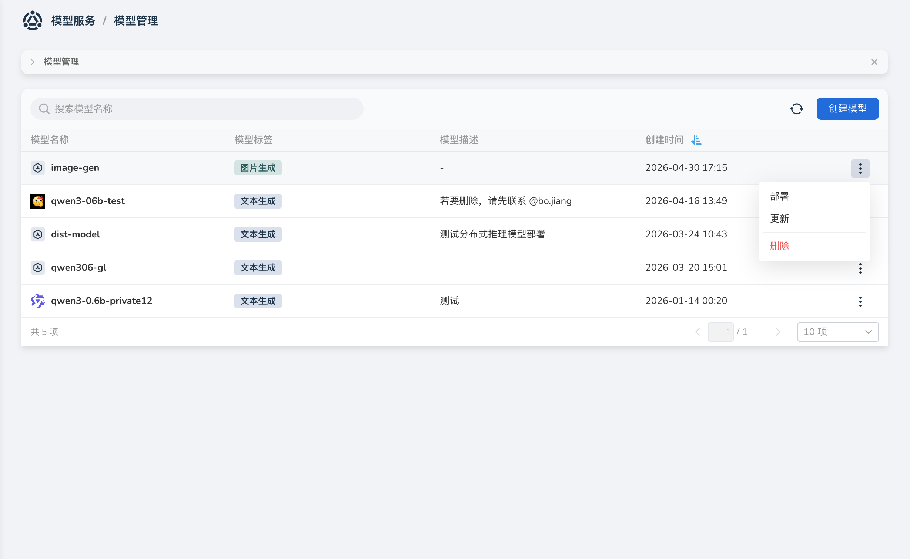

---
hide:
  - toc
---

# 管理模型

*[Hydra]: 大模型服务平台的开发代号

本文介绍如何在 **模型管理** 中查看模型列表，并执行部署、更新、删除等操作。
如需新建模型元数据、管理部署模板与模型权重文件，请参考[创建模型](./index.md)。

## 查看模型列表

1. 进入大模型服务平台，在左侧导航栏展开 **模型服务**，点击 **模型管理**。

2. 在列表右侧 **┇** 菜单中，可执行 **部署**、**更新**、**删除** 操作。

    

## 部署模型

1. 在模型管理列表中，点击目标模型右侧 **┇** 菜单，选择 **部署**。
2. 页面会跳转到 **部署新模型** 页面，继续完成部署表单配置。

部署参数说明请参考[部署新模型](../deploy/deploy.md)。

## 更新模型

1. 在模型管理列表中，点击目标模型右侧 **┇** 菜单，选择 **更新**。
2. 在编辑页面修改模型名称、模型标签、模型图标或模型说明后，点击 **确定** 保存变更。

也可在模型详情页右上角 **┇** 菜单中选择 **更新**，进入同一编辑页面。

## 删除模型

1. 在模型管理列表或模型详情页中，点击 **┇** 菜单，选择 **删除**。
2. 系统会校验当前模型是否存在关联的模型服务：

    - 若存在关联服务，请先删除对应模型服务，再删除模型；
    - 校验通过后，输入模型名称并确认删除。

!!! note

    删除后不可恢复，请谨慎操作。