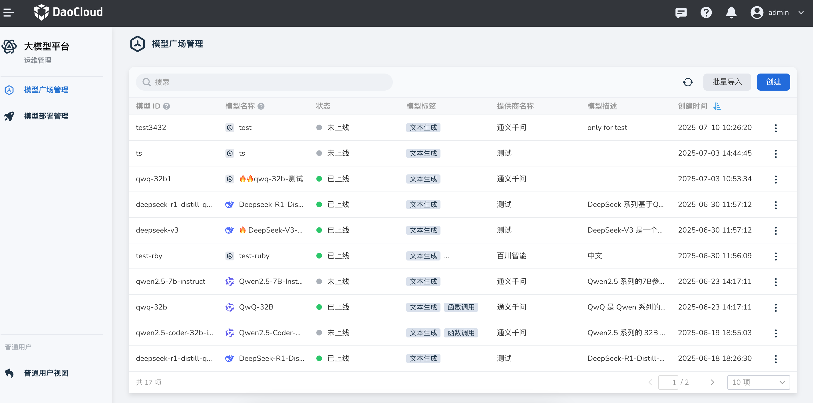
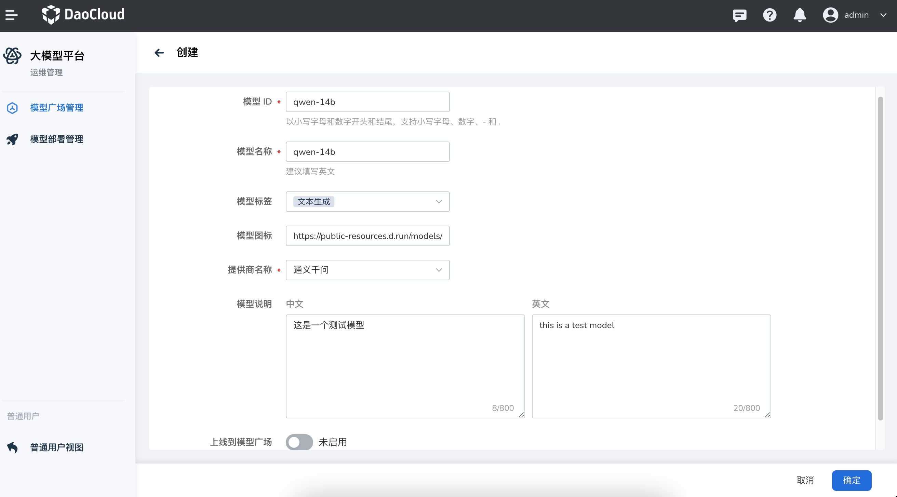
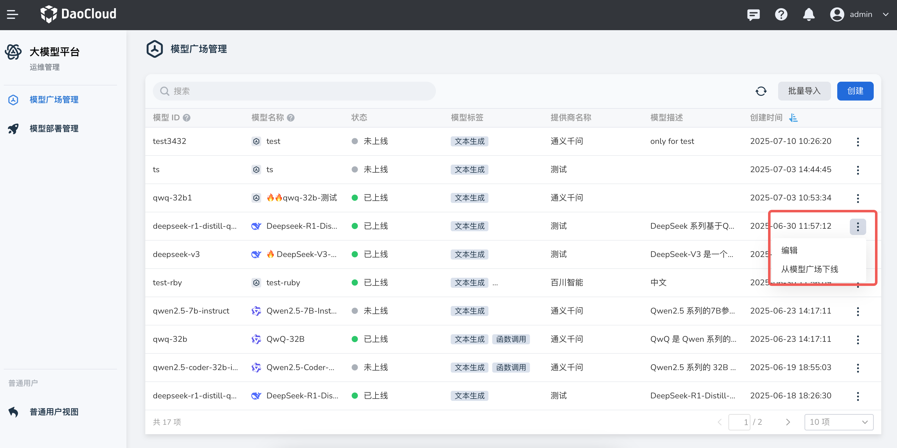

# 模型广场管理

平台管理员可以通过 **运维管理** 功能对模型广场中的大模型进行全面管理，
包括批量导入、模型创建、参数编辑、以及模型的上线和下线操作。
此功能可帮助平台管理员快速构建和维护模型生态，提升平台整体运营效率。

## 批量导入模型

支持通过远程 URL 批量导入多个模型，简化模型引入流程。

1. 在 **模型广场管理** 页面中，点击页面右上角的 **批量导入** 按钮。

    

2. 在弹出的导入窗口中：

    - 粘贴包含模型文件地址的 URL；
    - 平台会自动解析并展示可导入的模型列表；
    - 勾选一个或多个模型；
    - 点击 **导入** 按钮。

    

    !!! note

        已存在于系统中的模型无法重复导入。

3. 返回模型列表页面，新导入的模型会默认显示在列表的顶部，方便后续操作。

## 创建模型

如果需要手动添加模型，可以使用模型创建功能。

1. 在 **模型广场管理** 页面中，点击页面右上角的 **创建** 按钮。

    

2. 在弹出的创建模型窗口中，依次填写以下参数信息：

    - 模型ID；
    - 模型名称；
    - 模型标签；
    - 模型图标；
    - 提供商名称；
    - 模型说明（选填）等。

    填写完成后，点击 **确定** 以完成创建。

    

3. 返回模型列表页面，新创建的模型将显示在顶部。

## 编辑模型

管理员可以在模型创建后，随时编辑模型的参数信息，以满足实际运行或业务变更需求。

1. 在模型列表中，点击对应模型右侧的 **┇** 菜单图标，选择 **编辑** 选项。

    

2. 在弹出的编辑窗口中，根据需要修改模型的各项参数，点击 **确定** 保存变更。

    

3. 返回模型列表后，模型位置保持不变，已更新的参数立即生效。

    !!! tip

        修改模型参数不会影响模型当前的上线状态，但建议在空闲时段进行编辑操作。

## 模型上线/下线

管理员可根据运营策略或资源调度情况，手动控制模型在模型广场中的展示状态。

1. 在模型列表中，点击目标模型右侧的 **┇** 菜单，选择 **上线到模型广场** 或 **从模型广场下线**

    

2. 以下线模型为例，选择 **从模型广场下线** 后，页面将显示下线成功的提示，模型也会从模型广场的页面中隐藏。

    

    !!! note

        模型下线仅影响其在模型广场前台的可见性，不会删除模型本体或其配置。如需彻底移除，请使用“删除”功能。

---

通过以上操作，平台管理员可以高效地完成模型的导入、配置与发布，确保平台模型广场内容的更新及时、配置准确，满足多样化的业务需求。
