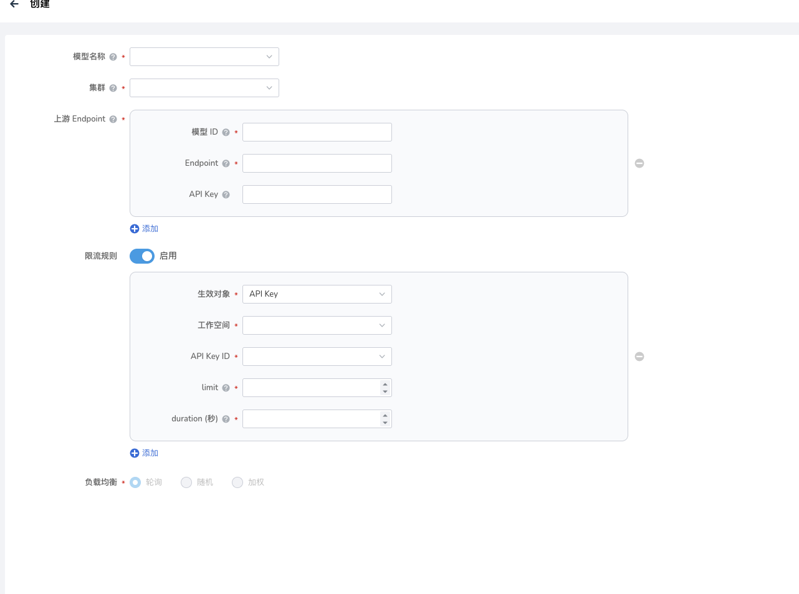

---
hide:
  - toc
---

# MaaS 模型管理

MaaS 模型管理 是大模型平台的核心模块，运维管理平台面向平台运维管理者，提供模型接入、启停、限流、负载均衡等全生命周期管理能力。通过本模块，管理员可将私有或开源模型快速接入平台，并以标准 API 形式对外提供服务。

## 创建 MaaS 模型

字段说明

| 字段名称 | 说明 | 是否必填 |
| ------ | ---- | ------- |
| 模型名称 | 从模型广场的模型列表中选择模型 | 是 |
| 集群 | 在配置 MaaS 模型时，必须为其选择一个"入口集群"，平台会根据这个集群自动生成模型的访问路径，供大模型服务平台、API 或外部系统调用 | 是 |
| 模型 ID | 这个上游 endpoint 所提供的模型的名称，例 deepseek-chat | 是 |
| Endpoint | 上游服务的完整 http(s) 地址，例 `https://api.deepseek.com` | 是 |
| API Key | 若上游服务需要 Token 认证，请填写 | 否 |

限流规则（可选）：

如需要限流，可打开该配置。

生效对象：可用于 API Key 或者现有工作空间。

!!! note

    生效对象为 API Key：工作空间下单个 API Key 对该模型的调用总量受以下限制。

    生效对象为现有工作空间：限制当前工作空间下所有 API Key 的模型调用总量。

- 工作空间：选择要生效的工作空间
- API Key ID：选择要生效的 API Key。
- limit：单个 Key 在 duration 秒内最大请求次数，例 100。
- duration：秒，例 60。
- 可添加多条规则

负载均衡策略：当前仅支持轮询策略

1. 轮询（默认）：顺序转发到多个 Endpoint
2. 随机：随机挑选
3. 加权：需在下拉框输入权重值，总和为 100

## MaaS 模型管理列表

在 MaaS 模型管理列表中，用户可以查看所有已创建的 MaaS 模型，包括模型名称、模型 ID、模型标签、启用状态、入口集群地址、网关状态等。
点击 **启用** 即可在 **普通用户视图** 中的模型广场查看到该模型。

!!! note

    前提条件：需要在运维管理平台的模型广场管理中将该模型 **上线到模型广场**

