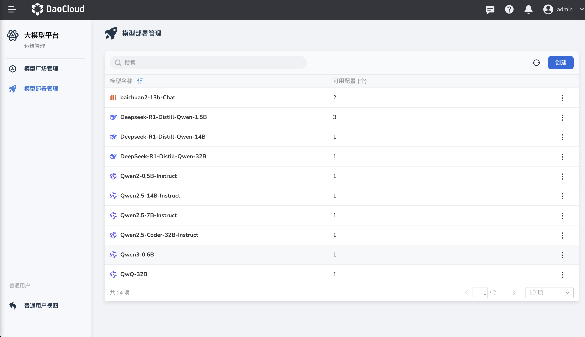
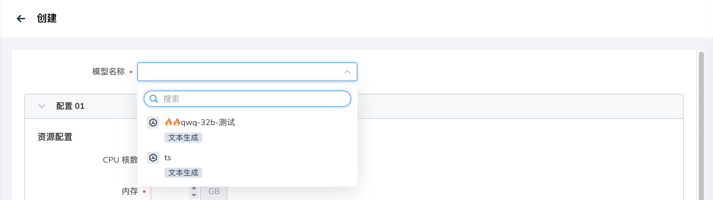
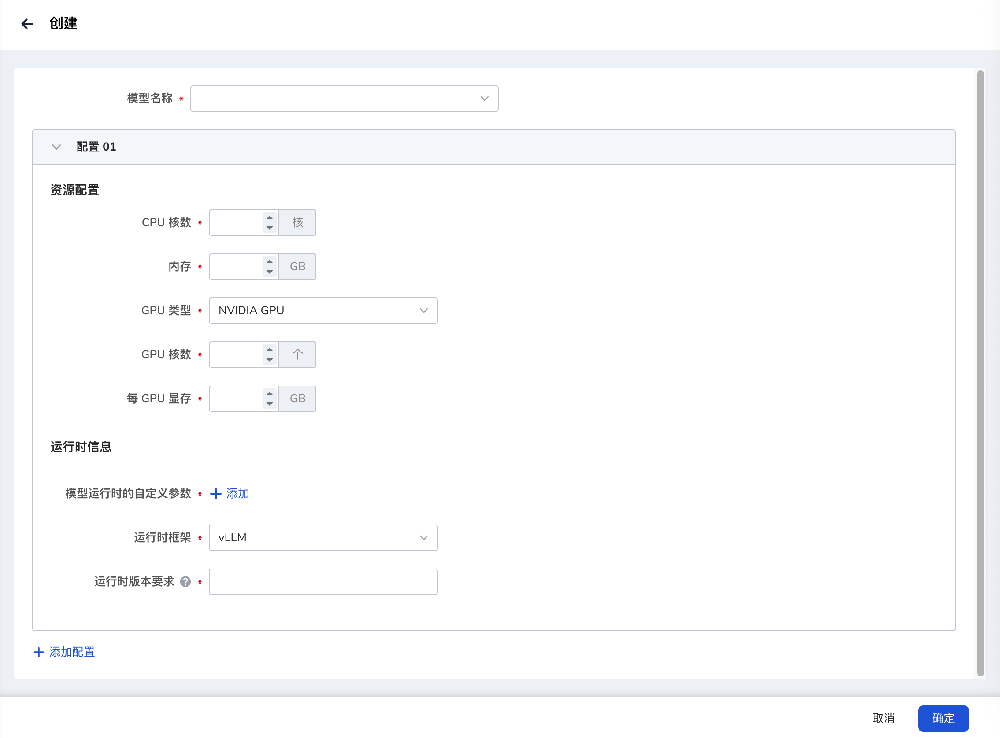
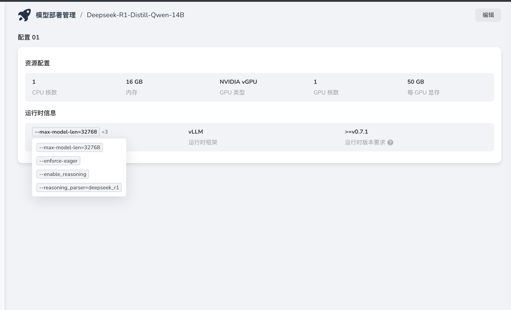

---
hide:
  - toc
---

# 模型部署管理

对普通用户视图中的模型部署进行管理，包括模型部署配置文件的创建、编辑、删除、启动、停止等。
!!! note

    此处创建的是模型部署所需的配置文件，并非模型文件，模型文件下载参考[使用 Dataset 管理模型文件](./index.md)。

模型部署管理列表：展示所有已创建部署配置的模型，包括模型名称和可用配置数量

创建
在模型部署管理主界面，点击右上角的“创建”按钮，进入模型创建界面。    
在创建界面中，用户需要选择模型（该模型列表与模型广场管理中模型列表相同，如需添加新模型，可通过模型广场管理进行添加），配置模型的资源配置和运行时信息。     
用户可同时为模型添加多个配置。    
配置完成后，点击“确定”按钮创建模型部署。    

用户可以查看和修改模型的资源配置（如CPU核数、内存、GPU类型、GPU核数、每GPU显存等）和运行时信息（如最大模型长度、运行时框架、运行时版本要求等）。

详情
查看已创建的模型配置详细信息

