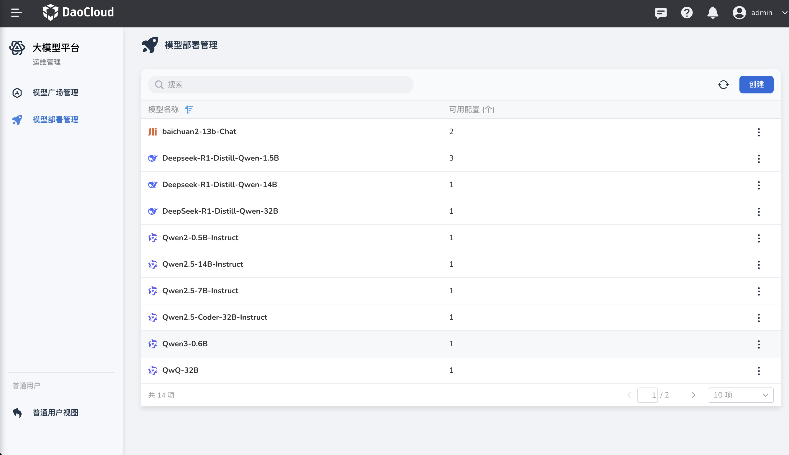
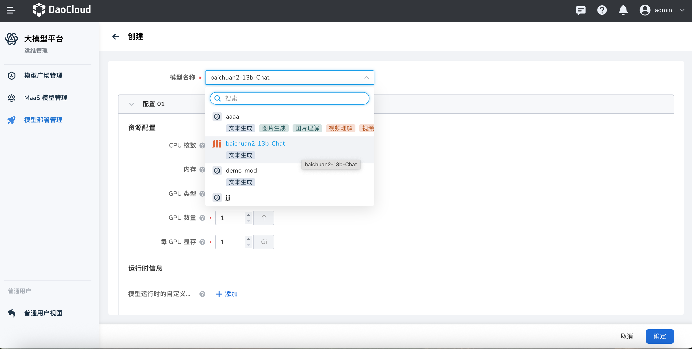
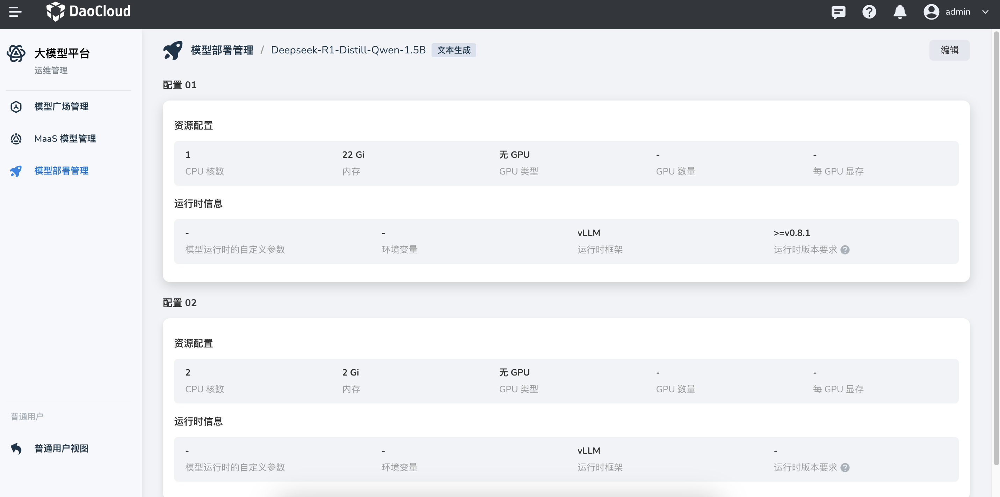

---
hide:
  - toc
---

# 模型部署管理

平台管理员可以在 **运维管理** 中管理模型部署，包括模型部署配置文件的创建、编辑、删除、启动和停止等操作。

!!! note

    此处创建的是 **模型部署的配置文件** ，并非模型本体文件。
    如需管理或下载模型文件，请参考[使用 Dataset 管理模型文件](../dataset.md)。

## 模型部署列表

列表展示了所有已创建的模型部署配置，包括模型名称及其对应的可用配置数量。

## 创建模型

在 **模型部署管理** 页面，点击右上角的 **创建** 按钮，进入模型部署配置创建页面。

在创建页面中，用户需要：

1. **选择模型** ：该模型列表与“模型广场管理”中的模型列表一致。如需新增模型，可前往“模型广场管理”添加。
2. **配置资源与运行时信息** ：包括资源配额（CPU 核数、内存大小、GPU 类型、GPU 数量、单卡显存等）和运行时参数（如最大模型长度、运行时框架、框架版本等）。
3. **支持多配置创建** ：用户可为同一个模型添加多个不同的部署配置。

配置完成后，点击 **确定** 即可完成创建。

## 查看模型详情

可点击列表中的某个模型名称，可以查看其配置信息，包括资源配置、运行时信息等。

