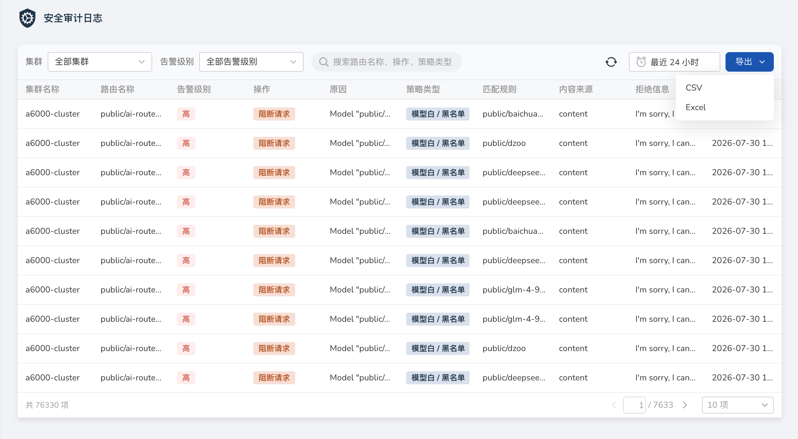

# 安全审计日志

安全审计日志用于查询大模型网关安全策略的触发记录，帮助运维人员追溯拦截、告警与内容替换等行为，并支持按当前筛选条件导出。

该能力与[安全策略管理](./security-policy.md)配合使用，依赖 Knoway 网关集成的 Higress（大模型服务平台 **v0.15.0** 及以上）。开启方式参见[升级注意事项](../intro/upgrade-notes.md)。

## 前提条件

- 当前用户具备平台管理员权限，可进入 **运维管理**。
- 相关工作集群已开启 Higress，并已配置至少一类安全策略。
- 审计数据采集正常；若长期无任何记录，请先确认策略是否启用以及网关与日志组件是否就绪。

## 入口

1. 登录平台后，进入 **运维管理**。
2. 在左侧导航中选择 **安全** → **安全审计日志**。

## 筛选条件

页面支持按以下条件过滤日志，默认时间范围为最近 **24 小时**：

| 筛选条件 | 说明 |
| -------- | ---- |
| 集群 | 选择某一工作集群，或选择 **全部集群** |
| 告警级别 | **全部告警级别** / **高** / **中** / **低** |
| 时间范围 | 起止时间；导出时也必须指定时间范围 |
| 搜索 | 可按 **路由名称**、**操作**、**策略类型** 进行搜索 |

其中，**操作** 对应策略触发后的执行动作（如阻断请求、记录日志、随机替换回复、脱敏替换），**策略类型** 对应已启用的各类安全策略。

## 列表字段

审计日志以表格展示，主要字段如下：

| 字段名称 | 说明 |
| -------- | ---- |
| 集群名称 | 触发记录所属的工作集群 |
| 路由名称 | 命中的网关路由 |
| 告警级别 | 高 / 中 / 低 |
| 操作 | 本次触发的执行动作 |
| 原因 | 触发原因说明 |
| 策略类型 | 命中的策略类型，例如正则表达式匹配、敏感词包含检测等 |
| 匹配规则 | 实际命中的规则内容 |
| 内容来源 | 匹配内容来自请求或响应等来源 |
| 拒绝信息 | 阻断或拒绝时返回的相关信息 |
| 操作时间 | 触发时间 |

## 导出日志

1. 先设置好筛选条件（集群、告警级别、时间范围及搜索条件）。
2. 点击页面上的 **导出**。
3. 选择导出格式：
    - **CSV**
    - **Excel**（`.xlsx`）

导出将沿用当前筛选条件。

!!! note

    导出必须指定起止时间，且时间跨度不超过 **30 天**。
