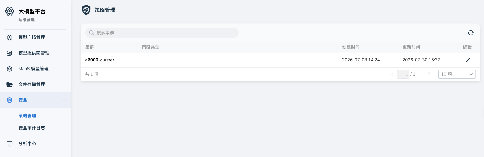
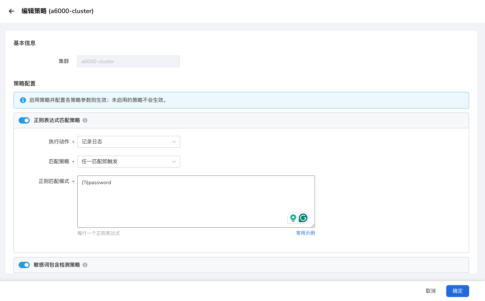

# 安全策略管理

安全策略管理面向平台运维管理员，用于按集群配置大模型网关的 AI 安全策略。
策略下发到工作集群的网关插件后，可对模型调用请求与响应进行检测，并按配置执行阻断、记录日志、随机替换回复或脱敏替换等动作。

!!! note

    该能力依赖 Knoway 网关集成的 Higress，需大模型服务平台 **v0.15.0** 及以上版本，并在工作集群中开启 Higress。开启方式参见[升级注意事项](../intro/upgrade-notes.md)。

## 前提条件

- 当前用户具备平台管理员权限，可进入 **运维管理**。
- 目标工作集群已安装 hydra-agent，并按升级说明开启 `knoway.higress.enabled`。
- 策略列表仅展示已存在网关安全插件配置的集群。若列表为空，请先完成 Higress 相关组件与 CRD 的安装与升级。

## 入口

1. 登录平台后，进入 **运维管理**。
2. 在左侧导航中选择 **安全** → **策略管理**。

## 查看策略列表

策略列表按集群展示网关安全配置，主要字段如下：

| 字段名称 | 说明 |
| -------- | ---- |
| 集群 | 工作集群名称 |
| 策略类型 | 当前已启用的策略类型，可同时启用多种 |
| 创建时间 | 该集群策略配置的创建时间 |
| 更新时间 | 最近一次更新时间 |

您可以在页面右上角的搜索框中按 **集群** 名称进行搜索。点击某一行的 **编辑**，进入该集群的策略编辑页。

!!! note

    界面不提供独立的「创建策略」入口。安全策略按集群编辑已有网关插件配置；未完成 Higress 安装的集群不会出现在列表中。

## 编辑策略

1. 在策略列表中，找到目标集群，点击 **编辑**。
2. 在 **编辑策略** 页面中，**集群** 为只读信息，不可修改。
3. 在 **策略配置** 区域，按需启用各类策略并填写参数，点击保存。

!!! note

    启用策略并配置各策略参数则生效；未启用的策略不会生效。

### 策略类型与字段说明

| 策略类型 | 说明 | 可配置项 | 执行动作 |
| -------- | ---- | -------- | -------- |
| 正则表达式匹配策略 | 对用户输入和响应输出内容，按行匹配正则，用于识别越狱话术、系统指令注入等风险模式 | **匹配策略**：任一匹配即触发 / 全部匹配才触发；**正则匹配模式**（每行一个正则表达式）；选择 **随机替换回复** 时需填写 **随机替换回复文本**（每行一条） | 阻断请求、记录日志、随机替换回复、脱敏替换 |
| 敏感词包含检测策略 | 检测输入和响应输出是否包含配置的敏感词，用于合规与内容安全 | **匹配策略**：任一词命中即触发 / 全部词命中才触发；**敏感词列表**（每行一个词）；选择 **随机替换回复** 时需填写 **随机替换回复文本** | 阻断请求、记录日志、随机替换回复、脱敏替换 |
| JSON Schema 验证策略 | 按 JSON Schema 校验请求体结构（字段类型、必填项等） | 启用开关与 **执行动作**。当前界面不提供 Schema 本体的在线编辑 | 阻断请求、记录日志 |
| JWT 令牌验证策略 | 从指定请求头读取 JWT 并校验合法性（签名、过期等） | **请求头名称**；**Token 必填**：必填 / 可选 | 阻断请求、记录日志 |
| 模型白 / 黑名单策略 | 按白名单仅允许指定模型，或按黑名单拒绝指定模型 | **模式**：白名单模式（仅允许列表中的模型）/ 黑名单模式（禁止列表中的模型）；**选择模型**（多选该集群已启用的 MaaS 模型）；**模型正则表达式**（每行一个正则，可用于批量匹配某一系列模型） | 阻断请求、记录日志 |

### 执行动作说明

| 执行动作 | 说明 |
| -------- | ---- |
| 阻断请求 | 命中策略后拒绝本次调用 |
| 记录日志 | 请求继续转发，同时写入安全审计日志，便于事后排查 |
| 随机替换回复 | 命中后不返回模型真实输出，而是从配置的回复文本中随机返回一条 |
| 脱敏替换 | 对命中内容进行脱敏处理后返回 |

### 配置校验

保存前请注意以下校验规则：

- 启用 **正则表达式匹配策略** 时，至少填写一条正则匹配模式。
- 启用 **敏感词包含检测策略** 时，至少填写一个敏感词。
- 执行动作为 **随机替换回复** 时，至少填写一条随机替换回复文本。
- 启用 **模型白 / 黑名单策略** 时，至少选择一个模型或填写一条模型正则表达式。

编辑页提供 **常用示例**，可参考常见正则与敏感词写法后按需调整。

## 注意事项

- 策略按集群生效。同一平台下不同工作集群的策略相互独立，需分别编辑。
- 策略变更保存后，对新的网关请求生效。建议先在测试环境验证规则与动作，再在生产集群启用 **阻断请求**。
- 触发记录可在 [安全审计日志](./security-audit-logs.md) 中查询与导出。
